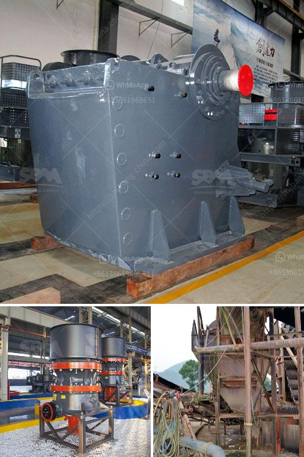

<h3>كسارة الحصى لمطحنة الطحن</h3>
تعتبر كسارة الحصى من أهم الأجهزة في عملية مطحنة الطحن، حيث تقوم بتكسير الحصى أو الصخور الكبيرة إلى قطع صغيرة بحجم يتناسب مع عملية الطحن. تُستخدم الحصى في العديد من الصناعات مثل صناعة البناء، والطرقات، والسكك الحديدية، والزراعة، وغيرها.

تتكون كسارة الحصى من عدة أجزاء رئيسية، بما في ذلك الفك المتحرك والثابت، وطبقة الحماية، والمخروط، والمخروط المُحكم، والمطحنة الدوارة. يتم تشغيل الكسارة بواسطة محرك يعمل على تشغيل الفك المتحرك للكسارة بحيث تقوم بالضغط على الحصى الموجودة داخل الكسارة لتتم تكسيرها.

تعتبر كسارة الحصى من أهم الأجهزة في مطحنة الطحن، حيث تؤثر على جودة وكفاءة الطحن. فعندما يتم تكسير الحصى بشكل جيد، فإن الحصى المكسور يتحول إلى قطع أصغر وأقل في الحجم، وهذا يساعد في تحسين عملية الطحن. كما أن الحجم الأصغر للحصى يتيح لها الخلط والمزج بشكل أفضل مع المواد الأخرى في عملية الطحن، وذلك يؤدي إلى تحسين جودة المنتج النهائي.

بالإضافة إلى ذلك، تعمل كسارة الحصى على إزالة الشوائب والمواد الغريبة الموجودة في الحصى. فعندما يتم تكسير الحصى، يتم فرزها وتصفيتها، حيث يتم إزالة الشوائب والأجسام الغريبة بشكل تلقائي، مما يعزز جودة المنتج النهائي.

وتعتبر الكسارة من الأجهزة ذات التصميم المتقدم والكفاءة العالية. فهي مصممة لتتحمل الضغط العالي والتحميل الثقيل أثناء عملية التكسير. كما تتميز الكسارة بقوتها ومتانتها، مما يجعلها قادرة على التعامل مع مختلف أنواع الحصى والصخور دون أي مشاكل.

باختصار، تعتبر كسارة الحصى لمطحنة الطحن أداة أساسية تسهم في تكسير الحصى وتحويله إلى قطع أصغر وأعداده لعملية الطحن. تحسن جودة وكفاءة الطحن، وتسمح بإزالة الشوائب والمواد الغريبة من الحصى، وتتميز بقوتها ومتانتها. إن استخدام كسارة الحصى يعتبر ضروريًا للحصول على نتائج جيدة في عملية مطحنة الطحن وتحسين جودة المنتج النهائي.
<h3>Contact us</h3><ul><li><strong>Whatsapp:&nbsp;<a href="https://wa.me/8613661969651">+8613661969651</a></strong></li><li><a href="https://swt.shibang-china.com/?git&amp;zhl&amp;كسارة الحصى لمطحنة الطحن"><strong>Online Service(chat now)</strong></a></li></ul><h3>Related</h3><ul><li><a href='فحص الشاشة التحجيم.md'>فحص الشاشة التحجيم</a></li><li><a href='عملية استخراج الحجر الجيري.md'>عملية استخراج الحجر الجيري</a></li><li><a href='سعر كسارة الفك 24x12.md'>سعر كسارة الفك 24x12</a></li><li><a href='مصنع تكسير الحجر في الهند بسعر مناسب.md'>مصنع تكسير الحجر في الهند بسعر مناسب</a></li><li><a href='كسارات تأثير ثانوية.md'>كسارات تأثير ثانوية</a></li></ul>