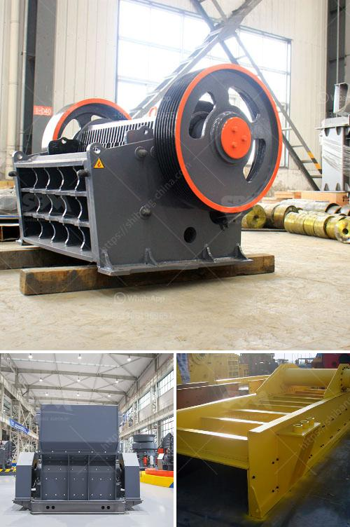

<h3>كسارة الحصى، سعر كسارة الحصى</h3>
كسارة الحصى هي أداة من المعدات الهندسية المستخدمة لتكسير الصخور والحصى إلى أحجام أصغر. وتعتبر كسارة الحصى أحد أهم الأدوات المستخدمة في صناعة البناء والبنى التحتية، حيث يتم استخدامها في إنتاج مواد البناء الخرسانية.

تتكون كسارة الحصى عادةً من وحدة تكسير رئيسية وناقل الحجر والشاشة. تقوم الوحدة بتكسير الحصى الخام بواسطة ضربات قوية، وتصفية الأجزاء الصغيرة والغبار من الحصى الناتج. تقوم وحدة التكسير والفرز بعد ذلك بفصل الحصى إلى أحجام مختلفة وفقًا لاحتياجات المشروع.

عند شراء كسارة الحصى، يعتبر سعرها أحد العوامل المهمة التي يجب أخذها في الاعتبار. يتفاوت سعر كسارة الحصى بناءً على عدة عوامل، مثل الحجم والقدرة والماركة. عادة ما يتراوح سعر كسارة الحصى بين 200 إلى 400 دولار، ولكن يمكن أن يكون أعلى أو أقل اعتمادًا على المواصفات والميزات المطلوبة.

ويجب أن يتم التوصية باختيار كسارة الحصى بعناية، حيث ينبغي النظر في الاحتياجات الفعلية للمشروع، مثل الحجم المتوقع والقدرة الإنتاجية، والفضاء المتاح لتركيب وتشغيل الكسارة، والصيانة وقطع الغيار المتاحة بسهولة. كما يحتمل أن تختلف الماركات المختلفة من حيث الجودة والمتانة والاعتمادية، ويجب النظر في المصنعين المعروفين والموثوق بهم.

بشكل عام، يمكن القول إن كسارة الحصى تعتبر استثمارًا جيدًا لمشروعات البناء والبنية التحتية، حيث تقدم فوائد عديدة. تتميز بالقدرة على تكسير الصخور والحصى بمستويات متنوعة من الحجم، مما يتيح استخدامها في مختلف المشاريع وتحقيق التوافق بين المواد المستخدمة. كما تزيد من كفاءة العمل وتقلل من الاعتماد على شراء المواد الجاهزة من السوق، مما يساهم في تقليل التكاليف وزيادة الربحية بشكل عام.

بالاختصار، فإن كسارة الحصى تعتبر أداة هامة في صناعة البناء، حيث تساهم في تحقيق التوافق وتوفير الموارد وتحسين الكفاءة. وعند الاختيار، يجب أن يتم اختيار الكسارة المناسبة والموثوقة وفقًا لاحتياجات المشروع، والتأكد من توفّر الصيانة وقطع الغيار اللازمة لضمان استمرارية العمل. سعر كسارة الحصى يتفاوت حسب الميزات والمواصفات المطلوبة، ويمكن شراؤها بسعر يتراوح بين 200 إلى 400 دولار.
<h3>Contact us</h3><ul><li><strong>Whatsapp:&nbsp;<a href="https://wa.me/8613661969651">+8613661969651</a></strong></li><li><a href="https://swt.shibang-china.com/?git&amp;zhl&amp;كسارة الحصى، سعر كسارة الحصى"><strong>Online Service(chat now)</strong></a></li></ul><h3>Related</h3><ul><li><a href='شراء كسارة حجرية صغيرة في الفلبين.md'>شراء كسارة حجرية صغيرة في الفلبين</a></li><li><a href='سعر مطحنة الكسارة سعر الحجر.md'>سعر مطحنة الكسارة سعر الحجر</a></li><li><a href='مطحنة تعدين.md'>مطحنة تعدين</a></li><li><a href='شركة تبيع آلة تكسير الخرسانة.md'>شركة تبيع آلة تكسير الخرسانة</a></li><li><a href='كسارات مخروط للإيجار في جنوب أفريقيا.md'>كسارات مخروط للإيجار في جنوب أفريقيا</a></li></ul>