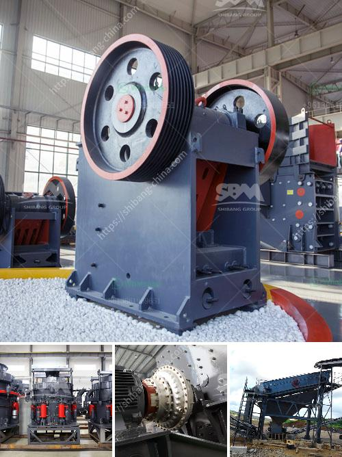

<h3>كسارة الخرسانة الصغيرة</h3>
كسارة الخرسانة الصغيرة: أداة فعالة لتكسير الخرسانة بالبناء

تعتبر كسارة الخرسانة الصغيرة أداة لا غنى عنها في صناعة البناء والهدم. فهي تستخدم لتكسير الخرسانة وتحويلها إلى قطع صغيرة قابلة للاستخدام في إعادة تدويرها أو التخلص منها بطريقة صحيحة. تتواجد هذه الكسارات عادة في مواقع البناء الصغيرة وفي الأماكن التي يكون من الصعب الوصول إليها بواسطة آلات الكسارة الكبيرة.

تتميز كسارة الخرسانة الصغيرة بعدة ميزات. فهي صغيرة الحجم وخفيفة الوزن، مما يجعلها سهلة النقل والتركيب في المواقع المختلفة. كما أنها سهلة التشغيل وليست بحاجة لفريق كبير للعمل بها. يمكن لشخص واحد تشغيلها بسهولة. ورغم صغر حجمها، إلا أنها قادرة على تكسير الخرسانة بكفاءة عالية.

تستطيع كسارة الخرسانة الصغيرة تكسير قطع الخرسانة بسرعة وبدقة عالية. فهي تحتوي على قوة تكسير قوية تساعدها على تكسير الخرسانة بسرعة وكفاءة عالية. يمكن أن تمتص هذه الكسارة الصدمات والاهتزازات التي تنشأ أثناء العمل، مما يجعل عملية التكسير سلسة وخالية من الاضطرابات.

تأتي كسارة الخرسانة الصغيرة مع مجموعة من الفوهات المتعددة، حيث يمكن استخدامها لتكسير الخرسانة بأحجام وأشكال مختلفة. بالإضافة إلى ذلك، يمكن ضبط حجم القطع التي تخرج من الكسارة حسب الحاجة. فهذا يسمح بتكسير الخرسانة إلى حجم محدد يمكن تناوله أو إعادة تدويره بسهولة.

تعد كسارة الخرسانة الصغيرة أيضًا خيارًا اقتصاديًا للبناء والهدم. إذ تحل محل آلات الكسارة الكبيرة والمكلفة، وتقدم نتائج مشابهة بتكلفة أقل. كما أنها تساعد في توفير الوقت، حيث أنها تكسر الخرسانة بسرعة ودقة، مما يمكن العمال من استكمال المشروع بأسرع وقت ممكن.

باختصار، تعتبر كسارة الخرسانة الصغيرة أداة أساسية في صناعة البناء والهدم. إنها توفر سهولة التشغيل والتنقل، وقوة التكسير العالية، ومرونة التحكم بحجم القطع. كما أنها اقتصادية وتوفر الوقت. لذلك، فإن آلة الكسارة الخرسانية الصغيرة هي خيار ممتاز لأي مشروع بناء.
<h3>Contact us</h3><ul><li><strong>Whatsapp:&nbsp;<a href="https://wa.me/8613661969651">+8613661969651</a></strong></li><li><a href="https://swt.shibang-china.com/?git&amp;zhl&amp;كسارة الخرسانة الصغيرة"><strong>Online Service(chat now)</strong></a></li></ul><h3>Related</h3><ul><li><a href='مطرقة الذهب المستخدمة للبيع في زيمبابوي.md'>مطرقة الذهب المستخدمة للبيع في زيمبابوي</a></li><li><a href='مزايا وعيوب مطحنة الطحن.md'>مزايا وعيوب مطحنة الطحن</a></li><li><a href='عملية كسارة الرمل والحصى في الفلبين.md'>عملية كسارة الرمل والحصى في الفلبين</a></li><li><a href='خدمات آلة التكسير.md'>خدمات آلة التكسير</a></li><li><a href='صيانة مطحنة ريموند.md'>صيانة مطحنة ريموند</a></li></ul>