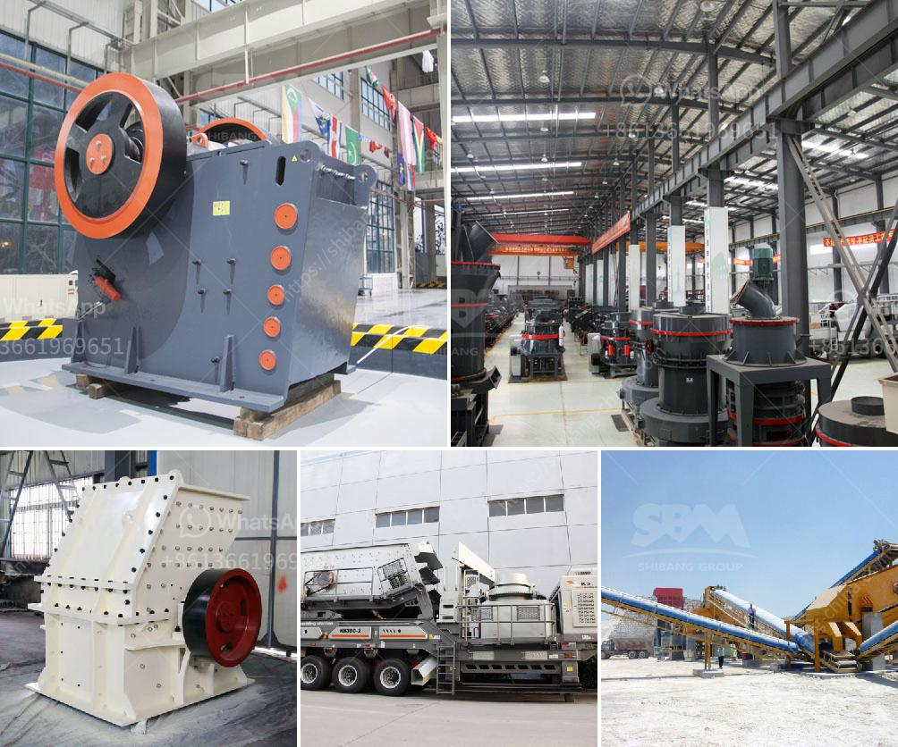

<h3>كسارة الخرسانة المدمجة</h3>
تعتبر كسارة الخرسانة المدمجة واحدة من الأدوات الهامة في صناعة البناء والهدم. تُستخدم هذه الكسارة لتحطيم الخرسانة القديمة أو الطوب القديم لإعادة استخدامها في أعمال البناء الجديدة. وتوجد بنوعين رئيسيين من كسارة الخرسانة المدمجة: الثابتة والمحمولة.

تتميز كسارة الخرسانة المدمجة الثابتة بأنها مثبتة في موقع ثابت وعادة ما تُستخدم في مشاريع البناء الكبيرة. تتكون هذه الكسارة من آلة تحطيم الخرسانة وناقلات الحزام الناقلة التي تسمح بنقل المواد المكسرة إلى أماكن التخزين المؤقت. تتطلب كسارة الخرسانة المدمجة الثابتة مساحة كبيرة ومؤهلين محترفين لتشغيلها وصيانتها.

بالمقابل، فإن كسارة الخرسانة المدمجة المحمولة تستخدم للمشاريع الصغيرة والمناطق الضيقة. وتعتبر متنقلة ويمكن نقلها بسهولة من موقع إلى آخر. وهي جزء من نظام الصخور المتنقلة ويتم توزيعها على أعجوبة وعجلات لكي تسهل عملية التحرك. تتيح كسارة الخرسانة المدمجة المحمولة للبنائين إعادة استخدام المواد المكسورة في المشاريع الجديدة بكل سهولة وراحة.

كلتا النوعين من كسارات الخرسانة المدمجة تتسم بالكفاءة العالية والقدرة على تحمل الأحمال الثقيلة. كما أنها توفر الوقت والجهد للبنائين، حيث يمكنهم توفير الموارد الطبيعية وتقليل النفايات البناء والهدم والحد من تكاليف إزالة المخلفات.

باختصار، تعتبر كسارة الخرسانة المدمجة أداة هامة في صناعة البناء والهدم، حيث تساهم في إعادة تدوير واستخدام المواد المكسورة بشكل فعال وصديق للبيئة. إنها حلاً مستدامًا يعزز الاستدامة البيئية والاقتصادية في صناعة البناء.
<h3>Contact us</h3><ul><li><strong>Whatsapp:&nbsp;<a href="https://wa.me/8613661969651">+8613661969651</a></strong></li><li><a href="https://swt.shibang-china.com/?git&amp;zhl&amp;كسارة الخرسانة المدمجة"><strong>Online Service(chat now)</strong></a></li></ul><h3>Related</h3><ul><li><a href='حجم كرات الطحن في مطحنة الكرة لطحن الكوارتز.md'>حجم كرات الطحن في مطحنة الكرة لطحن الكوارتز</a></li><li><a href='مطحنة طحن الفحم في الصين.md'>مطحنة طحن الفحم في الصين</a></li><li><a href='مصنع كسارة للبيع في باكستان.md'>مصنع كسارة للبيع في باكستان</a></li><li><a href='كسارة هيدروليكية.md'>كسارة هيدروليكية</a></li><li><a href='مصانع معالجة الذهب في الصين للبيع.md'>مصانع معالجة الذهب في الصين للبيع</a></li></ul>