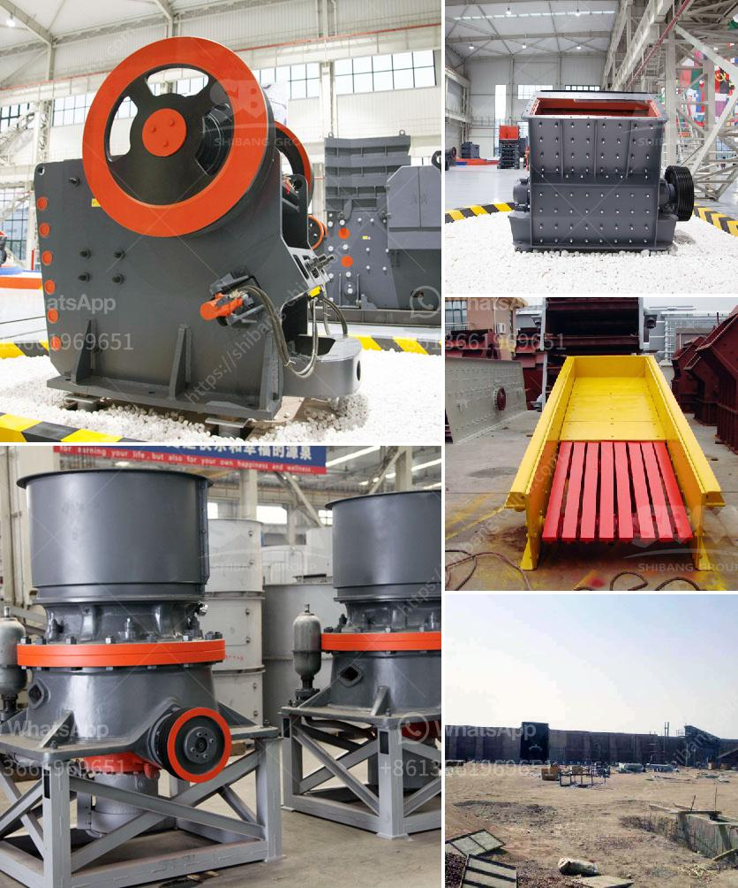

<h3>كسارة الخرسانة المستعملة للبيع</h3>
تعتبر كسارات الخرسانة من الأدوات الهامة في صناعة البناء والمقاولات، حيث تستخدم لسحق الخرسانة وتفتيتها إلى حجم مناسب يمكن إعادة استخدامه في أعمال البناء المستقبلية. يعتبر الحصان الهيدروليكي الخاص بالكسارة والذي يعد المحرك الرئيسي لها، أحد العوامل الرئيسية في قدرتها على دفع الخرسانة وتحطيمها بفعالية. تتوفر الكسارات المستعملة للبيع في السوق بتنوع كبير من الأحجام والقدرات، وتتحدد تلك الاحتياجات بناءً على حجم المشروع ومتطلباته.

بشكل عام، يمكن شراء كسارة خرسانة مستعملة بتكلفة أقل بكثير من شراء كسارة جديدة، مما يجعلها خيارًا اقتصادياً للعديد من المقاولين وأصحاب الشركات. قد يكون السبب وراء ذلك هو أن بعض الشركات الكبرى قد قامت بتجديد معداتها واستبدال الكسارات القديمة بهذه الجديدة. وفي معظم الأحيان، تكون هذه الكسارات المستعملة في حالة جيدة وقد تم الاعتناء بها بشكل جيد، مما يمنح المشتري ثقة في الحصول على كسارة ذات جودة عالية بسعر معقول.

عند البحث عن كسارة خرسانة مستعملة للبيع، ينبغي على المشتري أن يأخذ بعين الاعتبار بعض العوامل المهمة. قد تحتاج الكسارة إلى الصيانة أو بعض التحديثات، ولذلك يجب على المشتري معرفة تاريخ الصيانة والتصليحات التي تم إجراؤها على الكسارة قبل الشراء. يجب أيضًا التأكد من أن جميع الأجزاء والمكونات الرئيسية للكسارة متاحة وفعالة، وأنها لا تحتاج إلى استبدال فوري.

بالإضافة إلى ذلك، قد يحتاج المشتري إلى أخذ بعين الاعتبار أبعاد الكسارة وقدرتها على التنقل في الموقع. يجب أن تكون الكسارة قادرة على الانتقال بسهولة بين المواقع المختلفة وأن تكون صغيرة بما يكفي لدخول المساحات الضيقة.

باختيار كسارة الخرسانة المستعملة بعناية، يمكن للمشتري تحقيق أرباح كبيرة وتوفير رأس المال. يمكن أن تكون الكسارات المستعملة فرصة جيدة لبدء مشروع صغير أو توسيع شركة البناء الحالية. بالإضافة إلى ذلك، يمكن للمشتري أيضًا أن يساهم في الحفاظ على البيئة عن طريق إعادة استخدام الخرسانة المكسرة بدلاً من التخلص منها في المحاجر أو المواقع الأخرى.

باختيار كسارة الخرسانة المستعملة المناسبة، يمكن للمشتري توفير الوقت والمال والجهد. يرجى العلم أنه قبل الشراء، يجب على المشتري أن يقوم بفحص الكسارة وإجراء البحوث اللازمة للتأكد من أنها تلبي احتياجاته وتتوفر بها جميع المواصفات المطلوبة.
<h3>Contact us</h3><ul><li><strong>Whatsapp:&nbsp;<a href="https://wa.me/8613661969651">+8613661969651</a></strong></li><li><a href="https://swt.shibang-china.com/?git&amp;zhl&amp;كسارة الخرسانة المستعملة للبيع"><strong>Online Service(chat now)</strong></a></li></ul><h3>Related</h3><ul><li><a href='مطحنة عمودية للكالسيوم.md'>مطحنة عمودية للكالسيوم</a></li><li><a href='سعات مطحنة الأسطوانة العمودية.md'>سعات مطحنة الأسطوانة العمودية</a></li><li><a href='مطحنة للحجر الجيري في إيطاليا.md'>مطحنة للحجر الجيري في إيطاليا</a></li><li><a href='مواصفات خام الكروم.md'>مواصفات خام الكروم</a></li><li><a href='كثافة أحزمة الناقلات للتعدين.md'>كثافة أحزمة الناقلات للتعدين</a></li></ul>