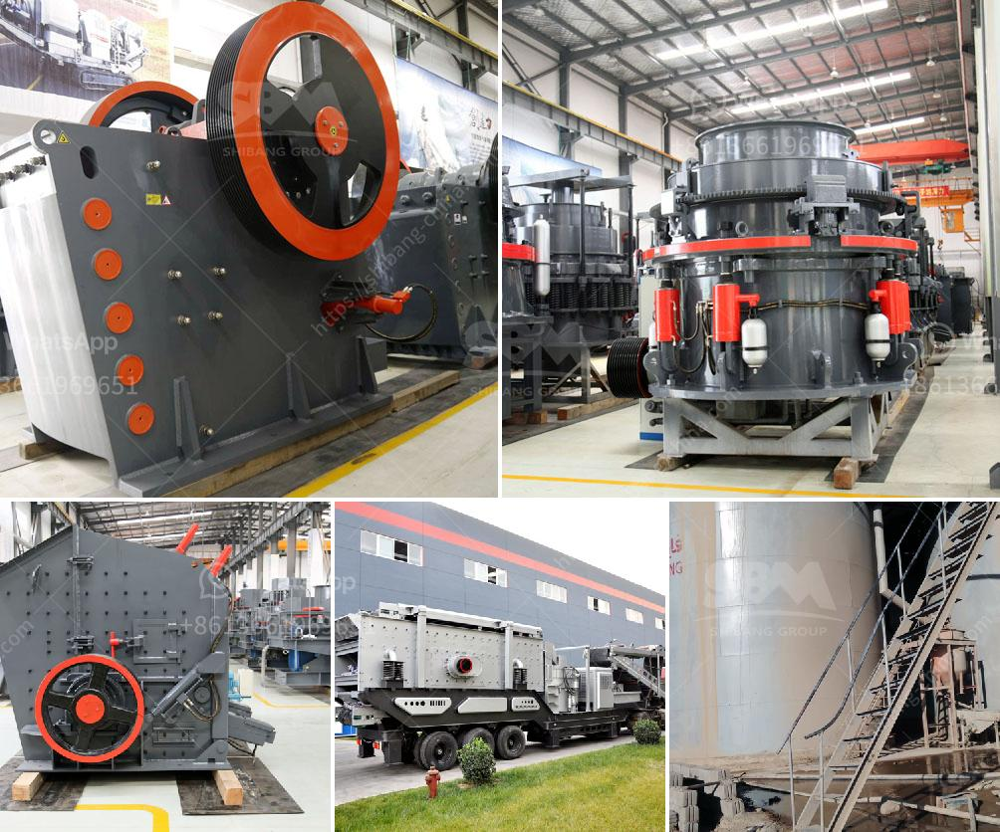

<h3>كسارة الخرسانة المصنوعة في اليابان</h3>
تعتبر كسارة الخرسانة من المعدات الهامة في صناعة البناء وتكسير الخرسانة وإعادة تدويرها للإستفادة منها مجددًا في عملية البناء. ومن بين البلدان المتقدمة في تكنولوجيا صناعة الكسارات، تأتي اليابان في المقدمة.

تتميز كسارات الخرسانة المصنوعة في اليابان بالجودة العالية والدقة في الصناعة. فهي تستخدم تقنيات حديثة ومواد ذات جودة عالية في تصنيعها، مما يضمن القدرة على التكسير الفعال والمستدام للخرسانة.

كما تتميز الكسارات اليابانية بالكفاءة العالية والأداء المتميز. فهي تتمتع بقدرة على تكسير الخرسانة بشكل سريع وفعال، وتساهم في تحسين عملية البناء وتوفير الوقت والجهد. بالإضافة إلى ذلك، يتم تصميم الكسارات بشكل متقدم يسهم في تقليل الضوضاء والاهتزازات المزعجة خلال عملية التكسير.

تعتبر أيضًا الكسارات اليابانية قوية ومتينة، مما يضمن الاستدامة والتحمل لفترة طويلة من الاستخدام. فهي مصنوعة من مواد عالية الجودة تتحمل ظروف العمل الصعبة والاستخدام المتكرر، مما يضمن الاستفادة منها على المدى الطويل.

تهتم الشركات اليابانية بالابتكار وتطوير التكنولوجيا المتعلقة بالكسارات، وذلك من خلال إجراء البحوث والتجارب المستمرة. تعتبر شركات مثل Kawasaki، Furukawa، وKomatsu أبرز الشركات اليابانية المختصة في صناعة الكسارات، حيث تقدم منتجات مبتكرة تلبي احتياجات صناعة البناء وتلبية التوجهات البيئية.

باختصار، فإن كسارات الخرسانة المصنوعة في اليابان تتمتع بالجودة العالية والأداء المتميز والقوة والاستدامة. تقدم الشركات اليابانية منتجات مبتكرة تلبي احتياجات الصناعة وتساهم في تحسين عملية البناء والحفاظ على البيئة.
<h3>Contact us</h3><ul><li><strong>Whatsapp:&nbsp;<a href="https://wa.me/8613661969651">+8613661969651</a></strong></li><li><a href="https://swt.shibang-china.com/?git&amp;zhl&amp;كسارة الخرسانة المصنوعة في اليابان"><strong>Online Service(chat now)</strong></a></li></ul><h3>Related</h3><ul><li><a href='أسعار مصنع معالجة الكولتان.md'>أسعار مصنع معالجة الكولتان</a></li><li><a href='كسارة الجرانيت المحمولة.md'>كسارة الجرانيت المحمولة</a></li><li><a href='تكلفة إنشاء مصنع الأسمنت الصغير في الهند.md'>تكلفة إنشاء مصنع الأسمنت الصغير في الهند</a></li><li><a href='شركات تصنيع آلات الكسارة في شنغهاي.md'>شركات تصنيع آلات الكسارة في شنغهاي</a></li><li><a href='آلات سحق الحجر اليابانية.md'>آلات سحق الحجر اليابانية</a></li></ul>