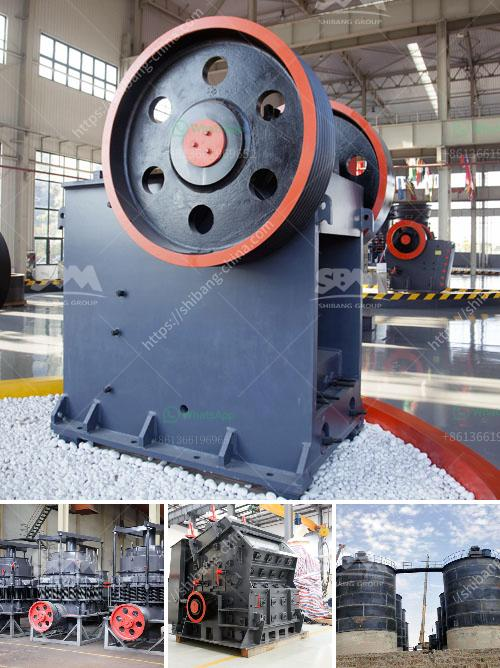

<h3>كسارة الخرسانة للبيع في نيجيريا</h3>
تعتبر كسارة الخرسانة أداة ضرورية في صناعة البناء والتشييد، وتستخدم لتكسير الخرسانة وتجهيزها لإعادة استخدامها في أعمال البناء القادمة. في نيجيريا، تتوفر العديد من كسارات الخرسانة المختلفة للبيع بأحجام وقوى متفاوتة، مما يتيح للمقاولين وأصحاب المشاريع اختيار الكسارة المناسبة لاحتياجاتهم.

تتميز كسارات الخرسانة المتاحة في نيجيريا بكونها مصممة بتقنيات حديثة ومواد عالية الجودة، مما يعزز كفاءتها ويجعلها مستدامة لفترة طويلة. تعمل هذه الكسارات على تحويل الخرسانة المكسورة إلى حجارة صغيرة بأحجام محددة، مما يسهل على المهندسين المدنيين والبنائين استخدامها في البناء.

واحدة من العوامل المهمة التي يجب مراعاتها عند شراء كسارة الخرسانة هي القدرة على التكيف مع مختلف أنواع الخرسانة. فمن المهم أن يتمكن المشتري من ضبط الكسارة وفقًا لقوة ومقاومة الخرسانة التي يرغب في تكسيرها. بالإضافة إلى ذلك، يجب أن تكون الكسارة قوية ومتينة بما يكفي للتعامل مع الأحمال الثقيلة المتوقعة والظروف القاسية في الموقع.

واحدة من الميزات المهمة لكسارات الخرسانة هي سهولة الصيانة. يجب أن يتمكن المشتري من الحصول على قطع الغيار بسهولة وبتكلفة معقولة، وأن يكون لديهم الوعي الكافي بكيفية صيانة وتنظيف الكسارة بشكل مناسب. المحافظة على أداء الكسارة الجيد يضمن عمرًا افتراضيًا أطول وتشغيلًا بكفاءة أعلى.

لا يمكن إغفال عوامل السلامة عند شراء كسارة الخرسانة. يجب أن تتوفر في الكسارة أجهزة أمان تحد من حدوث الحوادث وتحمي العمال في موقع العمل. بعض هذه الأجهزة تشمل حواجز الحماية، وقفل السلامة، ومقابض الطوارئ، وأضواء الإنذار.

بالإضافة إلى ذلك، يجب أن تكون الكسارة بسعر معقول ومتاحة بشكل جيد في السوق. يجب أن يتمتع المشتري بخيارات متعددة ذات قيمة جيدة للمال التي يصرفها. يمكن الاطلاع على عروض الأسعار من الشركات المصنعة مختلفة ومقارنتها للحصول على العرض الأفضل.

في الختام، يعتبر شراء كسارة الخرسانة في نيجيريا خطوة حاسمة لضمان استدامة وكفاءة أعمال البناء. يجب مراعاة العديد من العوامل مثل القدرة على التكيف، والصيانة، والسلامة، والسعر. تحقق هذه الاعتبارات، يمكن للمقاولين وأصحاب المشاريع الاستفادة من فوائد كسارة الخرسانة في نيجيريا وتحقيق نجاح في مشاريعهم.
<h3>Contact us</h3><ul><li><strong>Whatsapp:&nbsp;<a href="https://wa.me/8613661969651">+8613661969651</a></strong></li><li><a href="https://swt.shibang-china.com/?git&amp;zhl&amp;كسارة الخرسانة للبيع في نيجيريا"><strong>Online Service(chat now)</strong></a></li></ul><h3>Related</h3><ul><li><a href='آلة مطحنة الطحن المستخدمة.md'>آلة مطحنة الطحن المستخدمة</a></li><li><a href='كسارات الحجر للتأجير في شمال ويلز.md'>كسارات الحجر للتأجير في شمال ويلز</a></li><li><a href='شركات سيور النقل في المكسيك.md'>شركات سيور النقل في المكسيك</a></li><li><a href='خط إنتاج الجرانيت.md'>خط إنتاج الجرانيت</a></li><li><a href='سعر كسارة الحصى في رانشي.md'>سعر كسارة الحصى في رانشي</a></li></ul>