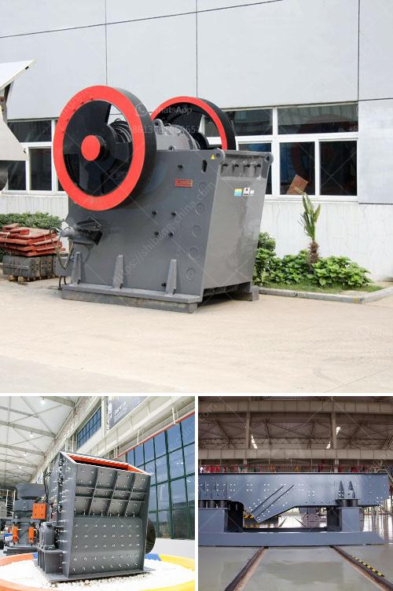

<h3>كسارة الخرسانة للبيع في نيو جيرسي</h3>
تعد كسارة الخرسانة أداة أساسية في صناعة البناء والهدم. فهي تستخدم لكسر الخرسانة وتحويلها إلى ركام قابل لإعادة الاستخدام. إذا كنت تبحث عن كسارة خرسانة للبيع في نيو جيرسي، فستجد العديد من الخيارات المتاحة لك.

إحدى الأمور الهامة التي يجب مراعاتها عند شراء كسارة الخرسانة هي القدرة. يحدد القدر القدرة القصوى للكسارة، وهو عامل حاسم يتوقف على حجم الأعمال التي تخطط للقيام بها. قد تجد كسارات خرسانة متنقلة صغيرة الحجم بسعة تتراوح بين 50 و 200 طن في الساعة، بينما تأتي الكسارات الثابتة بسعات أكبر تصل إلى الآلاف من الأطنان في الساعة. يجب أن يتم اختيار القدرة المناسبة وفقًا لاحتياجاتك ومتطلبات المشروع.

بالإضافة إلى القدرة، يجب أيضًا مراعاة الموثوقية والكفاءة العامة للكسارة. من المهم شراء كسارة خرسانة جيدة السمعة وموثوقة في العمل لفترة طويلة دون مشاكل تقنية. يجب أيضًا أن تكون كسارة الخرسانة كفاءة في استهلاك الطاقة وتلبي معايير البيئة لتقليل الانبعاثات الضارة.

ولا يمكننا نسيان السعر عند اتخاذ قرار الشراء. يتأثر سعر كسارة الخرسانة بالعديد من العوامل مثل القدرة والعلامة التجارية والحالة والميزات الاختيارية. قبل أن تشتري كسارة خرسانة، عليك أن تقارن الأسعار من مختلف المصادر وتختار الخيار الأنسب وفقًا لميزانيتك.

نيو جيرسي مدينة حيوية وتجارية مهمة في الولايات المتحدة الأمريكية، وبالتالي فإن احتياجات البناء والهدم قائمة بشكل دائم. لذا فإن الطلب على كسارات الخرسانة في نيو جيرسي عالٍ جدًا. تتوفر العديد من المواقع والشركات التي تقدم كسارات الخرسانة للبيع في نيو جيرسي. يمكنك البحث عنها عبر الإنترنت أو الاتصال بالموردين المحليين والمقاولين للحصول على معلومات عن العروض المتاحة.

في النهاية، يجب عليك أن تتذكر أن شراء كسارة الخرسانة يعتبر استثمارًا كبيرًا ويجب النظر في العديد من العوامل المختلفة قبل اتخاذ قرار الشراء. من المهم أن تحدد الاحتياجات الفعلية لمشروعك وتقارن بين الخيارات المتاحة لتحقيق أفضل قيمة ممكنة لمالكتك.
<h3>Contact us</h3><ul><li><strong>Whatsapp:&nbsp;<a href="https://wa.me/8613661969651">+8613661969651</a></strong></li><li><a href="https://swt.shibang-china.com/?git&amp;zhl&amp;كسارة الخرسانة للبيع في نيو جيرسي"><strong>Online Service(chat now)</strong></a></li></ul><h3>Related</h3><ul><li><a href='آلة صغيرة لصنع المسحوق.md'>آلة صغيرة لصنع المسحوق</a></li><li><a href='خطة التحكم في تصنيع مطحنة الكرة.md'>خطة التحكم في تصنيع مطحنة الكرة</a></li><li><a href='أفكار مشروع مصفاة النحاس صغيرة المقياس.md'>أفكار مشروع مصفاة النحاس صغيرة المقياس</a></li><li><a href='محرك مطحنة الإسمنت للبيع في المملكة المتحدة.md'>محرك مطحنة الإسمنت للبيع في المملكة المتحدة</a></li><li><a href='كم تكلفة بناء مصنع الأسمنت بسعة 100 طن.md'>كم تكلفة بناء مصنع الأسمنت بسعة 100 طن</a></li></ul>