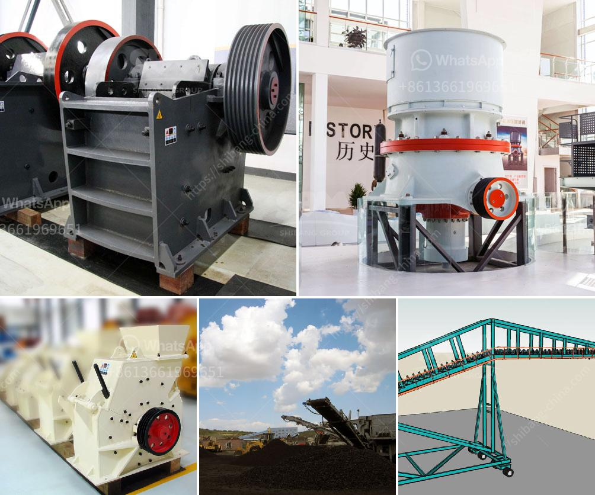

<h3>كسارة الذهب في جنوب أفريقيا</h3>
تعتبر جنوب أفريقيا واحدة من أكبر منتجي الذهب في العالم، وتعد كسارة الذهب فيها من أبرز الصناعات التعدينية في البلاد. تتواجد معظم كسارات الذهب في مناطق ذات تركيز كبير للمعادن الثمينة، مثل جيريكو وويتواترسراند.

تعود أهمية صناعة الذهب في جنوب أفريقيا إلى الاكتشافات التي تمت في القرن التاسع عشر، حيث تم اكتشاف أغنى وأكبر وديعة للذهب في العالم في جبال ويتواترسراند عام 1886. منذ ذلك الحين، توسعت صناعة التعدين في البلاد وأصبحت واحدة من أهم مصادر العمل ومساهمة كبيرة في الناتج المحلي الإجمالي للبلاد.

تتوجد في جنوب أفريقيا عدة شركات تعدين كبيرة تقوم بتشغيل كسارات الذهب، مثل شركة أنجلو غولد أشانتي وغولد فيلد معزز للتعدين، وهما من أكبر منتجي الذهب في العالم. تستخدم هذه الشركات تقنيات حديثة وآلات متطورة لاستخراج وتجهيز الذهب، مما يساهم في زيادة الإنتاجية وتحسين جودة المنتج النهائي.

بالإضافة إلى الاقتصاد، تلعب صناعة الذهب في جنوب أفريقيا دورًا هامًا في توفير فرص العمل للكثير من الشباب وتحسين المستوى المعيشي للكثير من العائلات. تشكل هذه الصناعة قطاعًا استراتيجيًا للاقتصاد الوطني وتعزز التنمية المستدامة في المناطق التي توجد فيها كسارات الذهب.

على الرغم من أهمية صناعة الذهب في جنوب أفريقيا، إلا أنها تواجه تحديات عديدة. من بين هذه التحديات نقص الموارد المائية والطاقة، العمالة غير المدربة، والتلوث البيئي الناتج عن عمليات التعدين. تعمل الحكومة الجنوب أفريقية والشركات التعدينية على تطوير استراتيجيات لمواجهة هذه التحديات والحفاظ على استدامة هذا القطاع الحيوي.

باختصار، تعد كسارة الذهب في جنوب أفريقيا أحد أبرز ركائز الاقتصاد الوطني. تعتمد الصناعة على تقنيات حديثة وتوفر فرص عمل للشباب وتحسن المستوى المعيشي للعديد من العائلات. ومع التحديات التي تواجهها، فإن هناك حاجة إلى استمرار التعاون بين الحكومة والشركات لتحقيق التنمية المستدامة وحماية البيئة.
<h3>Contact us</h3><ul><li><strong>Whatsapp:&nbsp;<a href="https://wa.me/8613661969651">+8613661969651</a></strong></li><li><a href="https://swt.shibang-china.com/?git&amp;zhl&amp;كسارة الذهب في جنوب أفريقيا"><strong>Online Service(chat now)</strong></a></li></ul><h3>Related</h3><ul><li><a href='استفادة من خام الحديد بوسائل جافة.md'>استفادة من خام الحديد بوسائل جافة</a></li><li><a href='مصنع تكسير محمول للبيع في جنوب أفريقيا.md'>مصنع تكسير محمول للبيع في جنوب أفريقيا</a></li><li><a href='كم من الأرض مطلوبة لكسارة الحجر.md'>كم من الأرض مطلوبة لكسارة الحجر</a></li><li><a href='مطحنة طحن في ألمانيا.md'>مطحنة طحن في ألمانيا</a></li><li><a href='أسعار مطاحن الكرة في جنوب أفريقيا.md'>أسعار مطاحن الكرة في جنوب أفريقيا</a></li></ul>