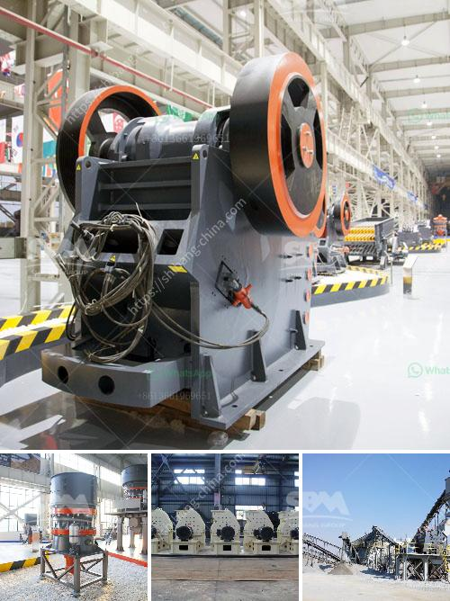

<h3>كسارة الرأس الصغيرة للبيع في الصين</h3>
إذا كنت تبحث عن كسارة صغيرة الحجم وعالية الأداء للبيع في الصين، فإن السوق الصيني يقدم العديد من الخيارات. كسارة الرأس الصغيرة تعتبر واحدة من أبرز الخيارات التي يمكن أن تفكر فيها.

تعتبر كسارة الرأس الصغيرة واحدة من أجهزة الكسارة الأكثر شيوعًا في صناعة التعدين ومعالجة الصخور. تم تصميمها خصيصًا لمعالجة المواد الصلبة والمتوسطة والغريبة، وتستخدم على نطاق واسع في العديد من الصناعات مثل بناء الطرق والمباني والتعدين وصناعة السكك الحديدية والكيماويات ومواد البناء والمزارع الصغيرة وغيرها الكثير.

تتميز كسارة الرأس الصغيرة بصغر حجمها وقدرتها العالية على التحطيم. يتم تغذية المواد إلى الكسارة عن طريق الإدخال، ثم تتم عملية التحطيم عن طريق رأس الكسارة الذي يدور بسرعة عالية. المواد تتحطم بين رأس الكسارة وغطاء التكسير، مما يؤدي إلى تحويل المواد إلى قطع صغيرة وتناسبها للاستخدام المقبل.

تحتوي الكسارة الصغيرة على العديد من الميزات التي تجعلها مثالية للاستخدام. فهي صغيرة الحجم وخفيفة الوزن، مما يجعل من السهل تركيبها وتشغيلها. بالإضافة إلى ذلك، يمكن تعديل حجم التفريغ وفقًا لاحتياجاتك المحددة. تضمن الكسارة الصغيرة كفاءة عالية في التحطيم ودقة عملية التحكم.

السوق الصيني يتميز بتوفير العديد من الكسارات الصغيرة للبيع. يمكنك العثور على كسارة الرأس الصغيرة بمجموعة متنوعة من الأحجام والمواصفات، وكذلك القدرة على التكيف مع عمليات معالجة مختلفة. بغض النظر عن احتياجاتك، ستجد بالتأكيد الكسارة الصغيرة المثالية التي تلبي متطلباتك.

أما بالنسبة للسعر، فإن معظم الكسارات الصغيرة متاحة بأسعار تتراوح بين 200-400 دولار أمريكي. وبالطبع، فإن الأسعار قابلة للتفاوض وقد يختلف السعر بناءً على علامة التجارية ومواصفات الكسارة والموردين.

أخيرًا، قبل شراء كسارة الرأس الصغيرة من الصين، يجب عليك أن تأخذ بعين الاعتبار بعض الجوانب الهامة. على سبيل المثال، يجب التحقق من سمعة المورد قبل القيام بأي صفقة. تحقق أيضًا من معايير الجودة والموثوقية للكسارة التي ترغب في شرائها.

وبهذا، يمكن القول أن كسارة الرأس الصغيرة للبيع في الصين هي اختيار ممتاز لأولئك الذين يبحثون عن كسارة صغيرة الحجم وعالية الأداء بأسعار معقولة. تأكد من اختيار الكسارة المناسبة وتقديمها من مورد موثوق به للحصول على أفضل النتائج والاستفادة القصوى من الجهاز.
<h3>Contact us</h3><ul><li><strong>Whatsapp:&nbsp;<a href="https://wa.me/8613661969651">+8613661969651</a></strong></li><li><a href="https://swt.shibang-china.com/?git&amp;zhl&amp;كسارة الرأس الصغيرة للبيع في الصين"><strong>Online Service(chat now)</strong></a></li></ul><h3>Related</h3><ul><li><a href='فرق بين مطحنة ريموند وضغط عالي.md'>فرق بين مطحنة ريموند وضغط عالي</a></li><li><a href='سعر مصنع كسارة الحجر بسعة 200 طن في الساعة.md'>سعر مصنع كسارة الحجر بسعة 200 طن في الساعة</a></li><li><a href='كسارة متنقلة صغيرة الخرسانة.md'>كسارة متنقلة صغيرة الخرسانة</a></li><li><a href='مطحنة أسطوانية صينية.md'>مطحنة أسطوانية صينية</a></li><li><a href='آلة طحن الكلنكر الإسمنتية.md'>آلة طحن الكلنكر الإسمنتية</a></li></ul>