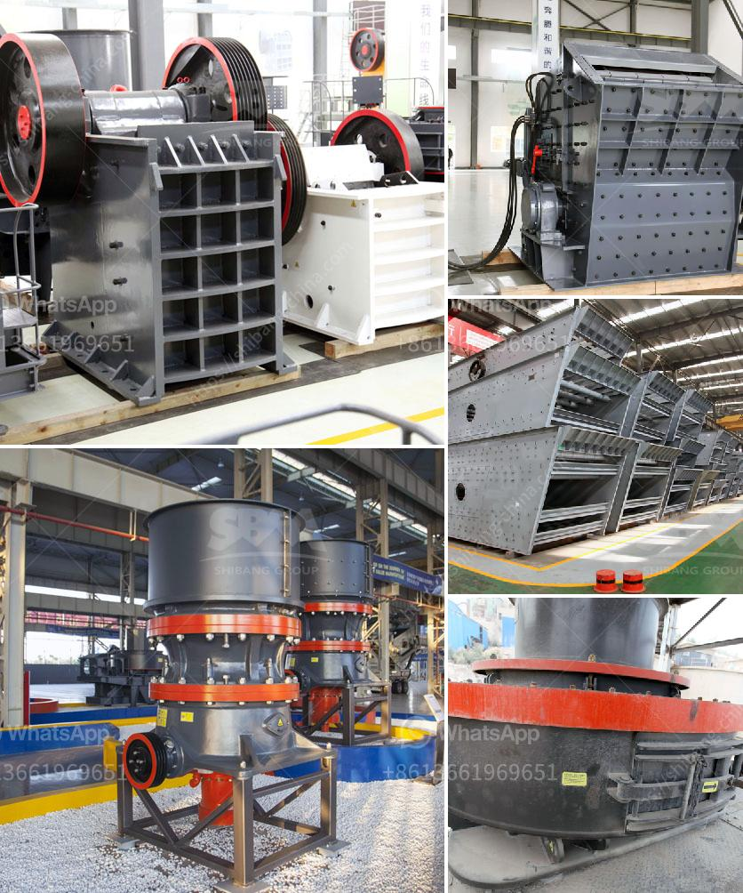

<h3>كسارة الرخام إيطاليا</h3>
تعتبر إيطاليا واحدة من أكبر الموردين للرخام في العالم، حيث تمتاز بصخورها الفريدة والجميلة التي تستخدم في بناء المباني الفخمة والقصور حول العالم. ومن أهم الأدوات والمعدات التي تساهم في إنتاج وتحويل الرخام، تأتي كسارة الرخام في المقدمة.

تقع العديد من مصانع الرخام في إيطاليا في مناطق معروفة بغناها بالموارد الطبيعية، مثل "كارير دى ماربلو" الواقعة في مقاطعة كرارا. وتشتهر هذه المنطقة بإنتاج الرخام الأبيض الشهير منذ العصور القديمة. ومن المثير للاهتمام أن هذه المناطق ما زالت تستخدم فيها تقنيات قديمة لاستخراج الرخام، لكنها تعتمد اليوم أيضًا على التكنولوجيا الحديثة في عملية التحويل والتصنيع.

تمتاز كسارات الرخام في إيطاليا بأحدث التقنيات والمعدات والآلات المتطورة. وتهدف هذه الآلات إلى تحسين جودة وكفاءة إنتاج الرخام، بالإضافة إلى زيادة السرعة لتلبية الطلب المتزايد. ويتم استخدام المعدات الآلية في العديد من مراحل تصنيع الرخام، بدءًا من قطع الصخور وتصنيع القطع النهائية وصولًا إلى مرحلة العبء والتعبئة.

بفضل استخدام التكنولوجيا الحديثة، أصبحت عمليات تشكيل الرخام أكثر دقة وفعالية. فعلى سبيل المثال، يتم استخدام الروبوتات الموجهة بالحاسوب لقطع الرخام بشكل متقن ودقيق. بالإضافة إلى ذلك، تستخدم آلات تلميع الرخام بالرمال والماء لإعطاء الأحجار لمعانًا ولمسة جمالية رائعة.

إلى جانب الجودة والدقة العالية، يجمع مصنعو الرخام في إيطاليا بين التقنية والفن في جميع مراحل تصنيع الرخام. يعمل الحرفيون والفنانون الماهرون على تصميم الأشكال والأنماط المعمارية المعقدة والمزخرفة، سواء على الأحجار الكرارة الكبيرة أو القطع المستهلكة. وبفضل هذه العملية المنسقة بين الآلات والعقول الإبداعية، يكتسب الرخام تفرده وجماله اللافت.

باختصار، فإن كسارات الرخام في إيطاليا تمثل التوازن المثالي بين التقنية الحديثة والروح الفنية. فهي تعكس الجمال العميق والثقافة التاريخية للبلاد، بينما تلبي الاحتياجات الحديثة لصناعة البناء والتصميم.
<h3>Contact us</h3><ul><li><strong>Whatsapp:&nbsp;<a href="https://wa.me/8613661969651">+8613661969651</a></strong></li><li><a href="https://swt.shibang-china.com/?git&amp;zhl&amp;كسارة الرخام إيطاليا"><strong>Online Service(chat now)</strong></a></li></ul><h3>Related</h3><ul><li><a href='موردي مطاحن الأسطوانة في المكسيك.md'>موردي مطاحن الأسطوانة في المكسيك</a></li><li><a href='كسارة الإسمنت في تركيا.md'>كسارة الإسمنت في تركيا</a></li><li><a href='طاحونة الكرة الرطبة في الصين.md'>طاحونة الكرة الرطبة في الصين</a></li><li><a href='إجراء بدء التشغيل لمطحنة الكرة.md'>إجراء بدء التشغيل لمطحنة الكرة</a></li><li><a href='مصنع كسارة متنقلة للبيع.md'>مصنع كسارة متنقلة للبيع</a></li></ul>