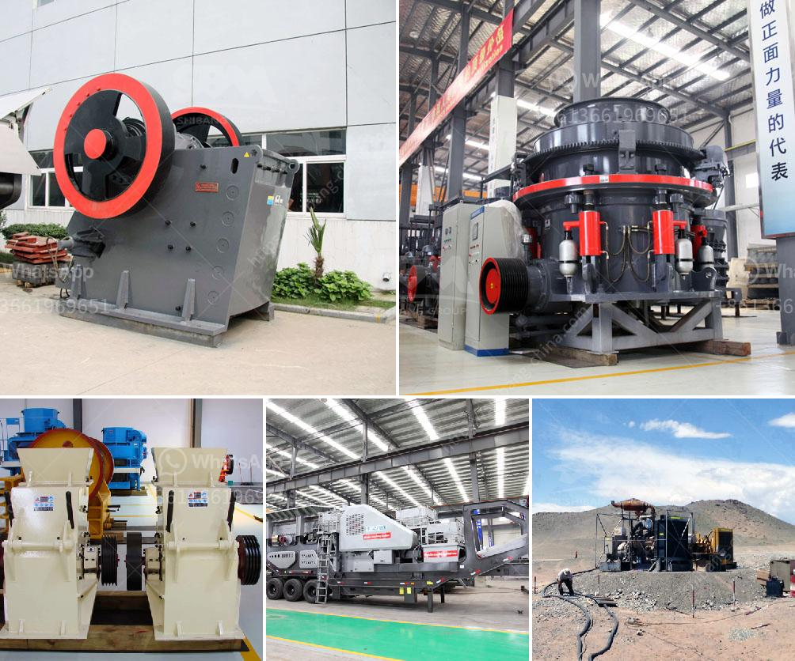

<h3>كسارة الرخام في الصين</h3>
تعد الصين واحدة من أكبر الدول المنتجة للرخام في العالم، وتتمتع بسمعة قوية في صناعة الرخام. تتمتع الصين بموارد طبيعية غنية من الرخام على مدار السنوات، وهذا ما دفعها إلى بناء كسارات رخامية حديثة وتجهيزها بأحدث التقنيات لاستخراج وتصنيع هذا المواد الثمينة.

توجد العديد من كسارات الرخام المنتشرة في مختلف مناطق الصين، وتتمتع بتقنيات عالية في عملية استخراج الرخام وتكسيره وتجهيزه. توفر هذه الكسارات رواسب ضخمة من الرخام عالي الجودة، وتنتج مجموعة واسعة من المنتجات المصقولة وغير المصقولة.

تعتبر كسارات الرخام في الصين من أفضل الأماكن لشراء الرخام، حيث يتم استخدام التقنيات المتطورة للحفاظ على الجودة العالية للمنتجات. بالإضافة إلى ذلك، تمتلك الصين خبرة كبيرة في إنتاج وصقل الرخام، مما يعطيها القدرة على تلبية احتياجات العملاء في الأسواق المحلية والعالمية.

تستخدم الكسارات في الصين أيضًا تكنولوجيا حديثة في عملية استخراج الرخام وتصنيعه. يتم استخدام الآلات المتطورة مثل الحفارات والآلات الثقيلة في عمليات الاستخراج، مما يجعل العملية أكثر كفاءة وسهولة. بالإضافة إلى ذلك، تستخدم الكسارات أكثر من طريقة وسيلة لاستخلاص المواد الصخرية، وهذا يعزز استدامة العملية وتقليل التأثير البيئي.

يتم استخدام منتجات الرخام الصينية في العديد من التطبيقات مثل بلاط الأرضيات والجدران والمطابخ والحمامات والقوائم والمنحوتات والتماثيل. يعتبر الرخام الصيني منتجًا ذو جودة عالية بأسعار معقولة، مما يجذب العديد من المشترين في الأسواق العالمية.

بشكل عام، يُعتبر قطاع الرخام في الصين منتجًا اقتصاديًا مهمًا ومصدرًا للتوظيف والنمو. يعد هذا القطاع حجر الزاوية في صناعة البناء والديكور، ويساهم في تحسين البنية التحتية وتطور الاقتصاد المحلي.

باختصار، تعد كسارات الرخام في الصين مرجعًا عالميًا لصناعة الرخام. تتميز بتوفر الموارد الطبيعية والتقنيات المتطورة والجودة العالية للمنتجات. تلبي الكسارات احتياجات العملاء في الأسواق المحلية والعالمية، وتسهم في الاقتصاد المحلي والتنمية الاجتماعية.
<h3>Contact us</h3><ul><li><strong>Whatsapp:&nbsp;<a href="https://wa.me/8613661969651">+8613661969651</a></strong></li><li><a href="https://swt.shibang-china.com/?git&amp;zhl&amp;كسارة الرخام في الصين"><strong>Online Service(chat now)</strong></a></li></ul><h3>Related</h3><ul><li><a href='وزن كسارة الحجر.md'>وزن كسارة الحجر</a></li><li><a href='أفضل مورد لمعدات التعدين في جنوب أفريقيا.md'>أفضل مورد لمعدات التعدين في جنوب أفريقيا</a></li><li><a href='مصنعي مطاحن الرايموند في الهند.md'>مصنعي مطاحن الرايموند في الهند</a></li><li><a href='مطاحن فائقة الدقة في الصين.md'>مطاحن فائقة الدقة في الصين</a></li><li><a href='مصانع الغسيل للفحم المتنقلة والقابلة للتحجيم.md'>مصانع الغسيل للفحم المتنقلة والقابلة للتحجيم</a></li></ul>