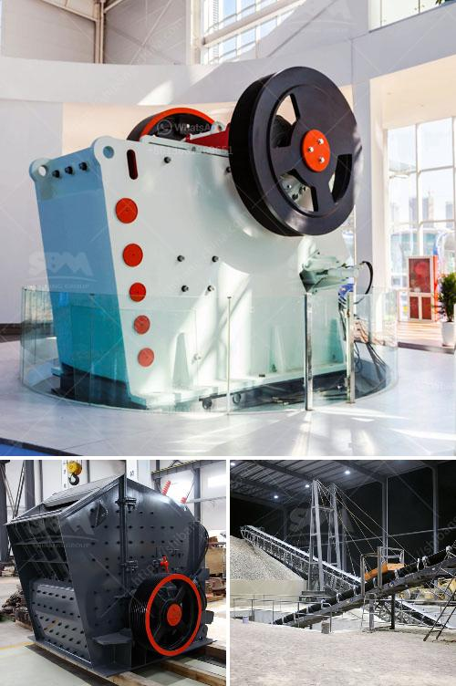

<h3>كسارة الرخام وآلات الطحن</h3>
تعتبر كسارة الرخام وآلات الطحن أدوات أساسية في صناعة التعدين والبناء، حيث تستخدم في تحويل الأحجار الضخمة من الرخام إلى الحجارة الصغيرة والرمادية التي تستخدم في مجموعة واسعة من التطبيقات. تتكون كسارة الرخام من جزءين رئيسيين، الفك الثابت والفك المتحرك، حيث يتم تكسير الحجارة بين هاتين الوحدتين بفضل حركة الفك المتحرك.

وتأتي آلات الطحن لتعاون في تحويل الحجارة الرخامية المكسورة والمكبسة إلى مساحيق دقيقة ورمادية. هذه الآلات تعمل عن طريق مبدأ الضغط والطرق، حيث يتم وضع الحجارة الرخامية داخل ما يسمى بالبرميل، ثم يتم دوران البرميل وطحن الحجارة بواسطة كرات من الحديد أو السيراميك.

توجد العديد من التقنيات والتصاميم المستخدمة في كسارة الرخام وآلات الطحن لتلبية متطلبات العملاء المختلفة. وعمومًا، تكون هذه الآلات قادرة على طحن الحجر بأحجام مختلفة، مما يمنح العملاء المرونة في اختيار الحجم الملائم لاحتياجاتهم. كما أنها قادرة على إنتاج مجموعة متنوعة من المساحيق، مما يجعلها مثالية للاستخدام في صناعة الرخام والبناء.

تتميز كسارة الرخام وآلات الطحن بعدة مزايا. فمن بينها الكفاءة العالية في العمل، حيث تستطيع تحويل الحجارة الكبيرة إلى حجارة صغيرة في وقت قصير جدًا. كما توفر هذه الآلات الدقة في الطحن، مما يساعد على الحصول على مساحيق رخامية ناعمة وذات جودة عالية. بالإضافة إلى ذلك، تعد الآلات أيضًا سهلة الصيانة والتشغيل، مما يجعلها مناسبة للاستخدام المستدام والمستمر.

باختصار، كسارة الرخام وآلات الطحن هي أدوات ضرورية في صناعة التعدين والبناء. تتميز هذه الآلات بالكفاءة والدقة في الطحن، مما يمكنها من تحويل الحجارة الرخامية إلى مساحيق رمادية دقيقة وعالية الجودة. بفضل تصاميمها المتنوعة وسهولة الصيانة والتشغيل، تعد كسارة الرخام وآلات الطحن خيارًا مثاليًا للعملاء في صناعة الرخام والبناء.
<h3>Contact us</h3><ul><li><strong>Whatsapp:&nbsp;<a href="https://wa.me/8613661969651">+8613661969651</a></strong></li><li><a href="https://swt.shibang-china.com/?git&amp;zhl&amp;كسارة الرخام وآلات الطحن"><strong>Online Service(chat now)</strong></a></li></ul><h3>Related</h3><ul><li><a href='أسعار كسارة رمل السيليكا.md'>أسعار كسارة رمل السيليكا</a></li><li><a href='مطحنة الأسطوانة العمودية للإسمنت.md'>مطحنة الأسطوانة العمودية للإسمنت</a></li><li><a href='كسارة الحجر من النوع الصغير.md'>كسارة الحجر من النوع الصغير</a></li><li><a href='آلة كسارة الصخور في ماليزيا.md'>آلة كسارة الصخور في ماليزيا</a></li><li><a href='مطاحن الهامر.md'>مطاحن الهامر</a></li></ul>