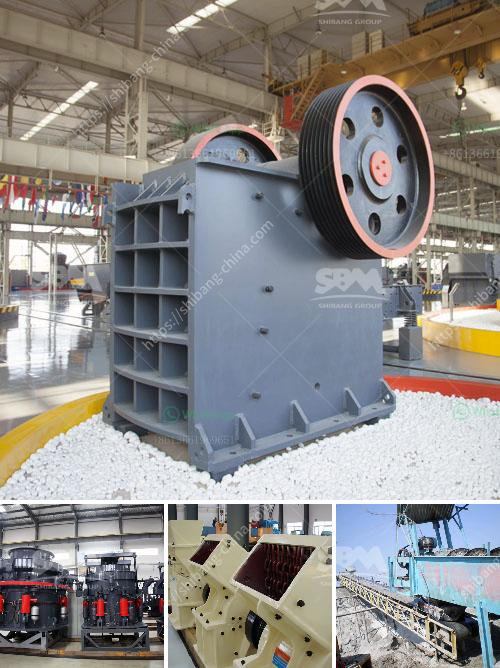

<h3>كسارة السيليكون الوافر</h3>
تُعتبر كسارة السيليكون من الآلات الهامة في عمليات التعدين وصناعة الرمال، حيث تقوم بطحن خام السيليكون إلى جسيمات أصغر، مما يُسهم في إنتاج رمال السيليكا ذات الجودة العالية. تستخدم هذه الآلة في العديد من الصناعات مثل صناعة الزجاج والسيراميك والبناء والكيماويات.

تعمل كسارة السيليكون الوافر على طحن خام السيليكون بواسطة تثبيت العينة في فتحة الآلة وتقوم بتحطيمها ودقها ضد سطح صلب، مما يؤدي إلى تفتيت الصخور وتكسيرها إلى جزيئات أصغر. يتم تنفيذ هذه العملية باستخدام آلية تموج معدنية تعمل بواسطة محرك كهربائي.

يوفر استخدام كسارة السيليكون الوافر العديد من المزايا، حيث يتم تحسين كفاءة العملية وإنتاجية الإنتاج. بفضل قدرتها على تكسير الخام بسرعة وفعالية، تُستخدم هذه الآلة في صناعات تحتاج إلى كميات كبيرة من السيليكون مثل صناعة الزجاج. بالإضافة إلى ذلك، فإن كسارة السيليكون الوافر قادرة على طحن الصخور بأحجام متعددة، مما يُسمح بإنتاج رمال السيليكا المختلفة حسب الاحتياجات الصناعية المحددة.

من الناحية البيئية، تُعتبر كسارة السيليكون الوافر آلة صديقة للبيئة، حيث تُقلل من الحاجة لاستخدام المواد الكيميائية الضارة في عمليات الطحن. كما أنها مصممة لتُعمل بكفاءة عالية وتوفير الطاقة، مما يُساهم في تقليل تكاليف الإنتاج والحفاظ على الموارد الطبيعية.

وبصفة عامة، يُعتبر إنتاج رمال السيليكا عالية الجودة أمرًا بالغ الأهمية في العديد من الصناعات. فالسيليكا هي المادة الخام التي تستخدم في إنتاج الزجاج والسيراميك والمواد المعدنية، وعنصر أساسي في صناعة التكنولوجيا الحديثة مثل الإلكترونيات والألياف البصرية. لذلك، فإن وجود كسارة السيليكون الوافر يعد أمرًا حيويًا لتلبية الطلب المتزايد على رمال السيليكا عالية الجودة.

تُعتبر كسارة السيليكون الوافر آلة هامة في صناعة الرمل وتعدين السيليكون. تعد هذه الآلة حلاً فعالًا وصديقًا للبيئة لطحن خام السيليكون وتفتيته إلى جزيئات صغيرة. تساهم هذه الآلة في إنتاج رمال السيليكا ذات الجودة العالية المطلوبة في صناعة الزجاج والسيراميك والبناء والكيماويات. يجب استخدامها بشكل مناسب وفقًا للإرشادات الفنية للحفاظ على عمليات التشغيل الآمنة والمستدامة لتوفير موارد الطبيعة وتلبية احتياجات الصناعة المتزايدة.
<h3>Contact us</h3><ul><li><strong>Whatsapp:&nbsp;<a href="https://wa.me/8613661969651">+8613661969651</a></strong></li><li><a href="https://swt.shibang-china.com/?git&amp;zhl&amp;كسارة السيليكون الوافر"><strong>Online Service(chat now)</strong></a></li></ul><h3>Related</h3><ul><li><a href='نظام مصنع البنتونيت.md'>نظام مصنع البنتونيت</a></li><li><a href='آلة تكسير الفحم.md'>آلة تكسير الفحم</a></li><li><a href='بيع كسارة الحجر للبيع.md'>بيع كسارة الحجر للبيع</a></li><li><a href='مصنع معالجة الحجر الجيري.md'>مصنع معالجة الحجر الجيري</a></li><li><a href='آلة الكوك البترولية.md'>آلة الكوك البترولية</a></li></ul>