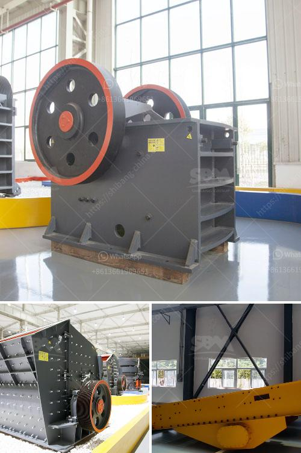

<h3>كسارة الصخور 250 طن في الساعة</h3>
كسارة الصخور هي آلة تستخدم لسحق الصخور والحجارة إلى قطع صغيرة أو حصى صغيرة يمكن استخدامها في مجموعة متنوعة من التطبيقات الصناعية والإنشائية. يعد استخدام كسارة الصخور ذات السعة البالغة 250 طن في الساعة من بين أكبر وأكثر الكسارات فعالية وقوة في السوق.

إن كسارة الصخور بسعة 250 طن في الساعة هي آلة تعمل على هضم الصخور الكبيرة وتحويلها إلى قطع صغيرة بأحجام مختلفة. يتم تشغيل الكسارة بواسطة محرك كهربائي قوي ومتين يقوم بتوجيه الطاقة إلى الجزء الميكانيكي للكسارة. وتتكون الكسارة عادة من ثلاثة أجزاء رئيسية: مغذي الصخور، الجاوز الأولي والجاوز الثانوي.

تعمل عملية التشغيل بالطريقة التالية: تُحمل الصخور في المغذي حتى يتم نقلها بواسطة حزام ناقل إلى الجاوز الأولي حيث يتم سحقها بواسطة مطرقة هيدروليكية ثقيلة. ومن ثم، يتم إرسال الصخور المسحوقة إلى الجاوز الثانوي حيث يتم إعادة سحقها إلى قطع أصغر بواسطة صفيح الفك المتحرك. تتكرر هذه العملية حتى يتم تحقيق الحجم المطلوب وتحويل الصخور الكبيرة إلى حصى صغيرة وجاهزة للاستخدام في المشاريع الإنشائية أو لغرض تجهيز المواد الخام.

تعتبر كسارة الصخور بسعة 250 طن في الساعة مناسبة في عدة صناعات، بما في ذلك صناعة التشييد والبناء وصناعة الركام وتعدين الفحم وتعدين المعادن. فمع قدرتها على سحق الصخور بكميات هائلة في وقت قصير، فإن هذه الكسارة لا توفر فقط الوقت والجهد، بل تزيد من كفاءة الإنتاج والأرباح المحتملة للشركات والمنشآت. بالإضافة إلى ذلك، فإن كسارة الصخور بسعة 250 طن في الساعة معروفة بقوتها ومتانتها، مما يجعلها تلائم البيئات الصعبة والظروف الصناعية القاسية.

بشكل عام، تعتبر كسارة الصخور بسعة 250 طن في الساعة أداة مهمة لعمليات التكسير والتحطيم في عدة صناعات مهمة. تعد من الآلات الفعالة والقوية التي تمكن الشركات من معالجة كميات كبيرة من الصخور بكفاءة وفي وقت أقصر مما يمكن أن يتطلبه غيرها من الأساليب. من خلال استخدام كسارة الصخور القوية والمتينة، يمكن للشركات تعظيم إنتاجيتها وعملياتها بطريقة قوية وفعالة.
<h3>Contact us</h3><ul><li><strong>Whatsapp:&nbsp;<a href="https://wa.me/8613661969651">+8613661969651</a></strong></li><li><a href="https://swt.shibang-china.com/?git&amp;zhl&amp;كسارة الصخور 250 طن في الساعة"><strong>Online Service(chat now)</strong></a></li></ul><h3>Related</h3><ul><li><a href='مطحنة الهامر من إيديبيسا.md'>مطحنة الهامر من إيديبيسا</a></li><li><a href='مطحنة مسحوق الحجر الجيري.md'>مطحنة مسحوق الحجر الجيري</a></li><li><a href='آلة حبيبات الجبس في الهند.md'>آلة حبيبات الجبس في الهند</a></li><li><a href='شاشة اهتزازية للبيع في الفلبين.md'>شاشة اهتزازية للبيع في الفلبين</a></li><li><a href='سحق الكلي ٢٠٠ طن في الساعة بمرحلتين.md'>سحق الكلي ٢٠٠ طن في الساعة بمرحلتين</a></li></ul>