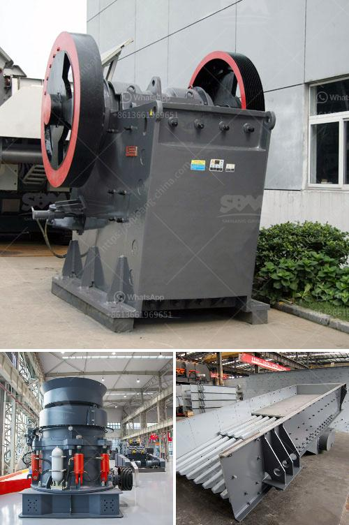

<h3>كسارة الصخور الصين</h3>
تشتهر الصين بصناعتها القوية وتطورها التكنولوجي السريع في مختلف المجالات. ومن بين الصناعات التي تلعب دورًا حاسمًا في التنمية الصناعية والبنية التحتية، تبرز صناعة كسارات الصخور الصينية.

على مر العقود، تعتبر الصين من أكبر البلدان المصدرة للصخور والمعادن المستخدمة في مجالات مختلفة مثل البناء والطرق والتعدين. ولتلبية هذه الطلبات المتزايدة، تتمتع الكسارات الصينية بسمعة قوية في السوق العالمية.

تشتهر الكسارات الصينية بأدائها القوي والمتفوق وأسعارها المناسبة. تتميز هذه الكسارات بالدقة والكفاءة في عملية سحق الصخور المختلفة، وتوفر وفرة في الإنتاج وقدرة على التكيف مع أنواع مختلفة من الصخور والمعادن.

تعزز التكنولوجيا المستخدمة في صناعة الكسارات الصينية الأداء والمتانة ، مما يزيد من عمر الخدمة ويقلل من التكاليف التشغيلية. بالإضافة إلى ذلك، فإن تصميم الكسارات الصينية يعكس الاهتمام بعملية الصيانة وسهولة الوصول، وهو ما يجعلها أكثر فعالية في تشغيلها.

واحدة من أبرز العوامل التي تجعل الكسارات الصينية مفضلة لدى العديد من العملاء العالميين هي الموثوقية والتوفر العالي للغيار. فمع توفر الغيار الأصلية وخدمة ما بعد البيع الجيدة، يمكن للزبائن الاعتماد على الحصول على الأداء المستدام والموثوقية في العمليات اليومية.

تشكل الكسارات الصينية جزءًا من استراتيجية الصين لتعزيز الابتكار والتنمية الصناعية. يدفع الاهتمام المستمر بالبحث والتطوير وتحسين التكنولوجيا الصينية نحو الأمام في هذا القطاع. وعلى الرغم من أن السوق العالمية تشهد منافسة شديدة في هذا المجال، فإن الكسارات الصينية ما زالت تحتل مكانة مرموقة في السوق العالمية.

لخلاصة، فإن الكسارات الصينية تعد رمزًا للتقدم التكنولوجي الصيني في صناعة سحق الصخور. بفضل أدائها الممتاز وقوتها وكفاءتها، تستمر الكسارات الصينية في كسب ثقة عملائها وتوسيع وجودها في السوق العالمية. ومع استمرار التركيز على الجودة والابتكار، يمكن أن تأخذ الكسارات الصينية صناعة سحق الصخور إلى مستويات جديدة من الريادة في المستقبل.
<h3>Contact us</h3><ul><li><strong>Whatsapp:&nbsp;<a href="https://wa.me/8613661969651">+8613661969651</a></strong></li><li><a href="https://swt.shibang-china.com/?git&amp;zhl&amp;كسارة الصخور الصين"><strong>Online Service(chat now)</strong></a></li></ul><h3>Related</h3><ul><li><a href='مورد كسارة الرخام.md'>مورد كسارة الرخام</a></li><li><a href='كسارة الفك تركيا.md'>كسارة الفك تركيا</a></li><li><a href='سعر مصنع الكسارة الهندسي الجديد 200 طن في الساعة.md'>سعر مصنع الكسارة الهندسي الجديد 200 طن في الساعة</a></li><li><a href='كم يكلف كسارة الحجر.md'>كم يكلف كسارة الحجر</a></li><li><a href='مورد معدات الكسارة في غانا.md'>مورد معدات الكسارة في غانا</a></li></ul>