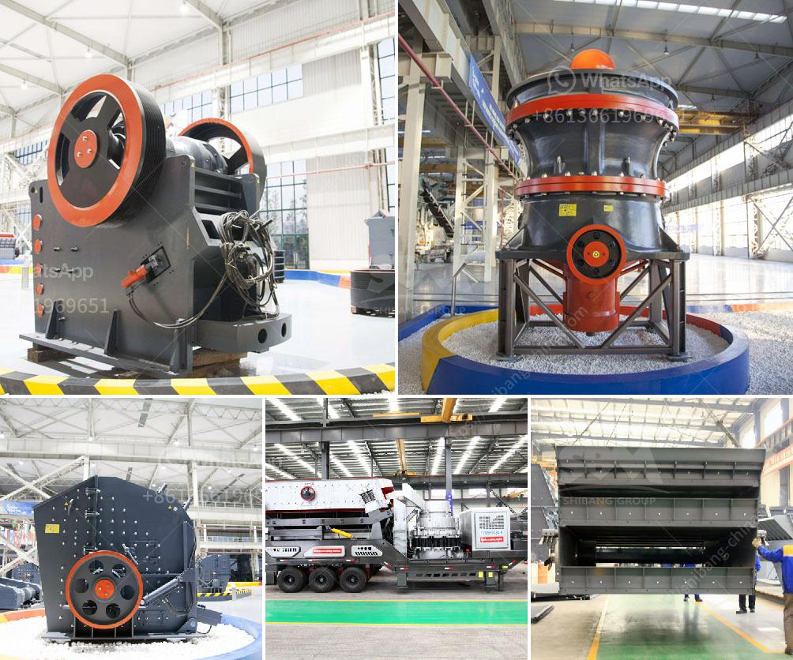

<h3>كسارة الصخور المحمولة</h3>
تعدّ كسارة الصخور المحمولة من الأدوات الحديثة التي أصبحت رائجة في صناعة التكسير والتعدين. فهي تسمح بتكسير الصخور والمواد الصلبة بسهولة وفعالية دون الحاجة إلى محطات ثابتة أو كسارات ثقيلة. تصمم هذه الكسارات لتكون محمولة وسهلة النقل، مما يجعلها مثالية للعمل في المواقع النائية أو المناطق التي تفتقر إلى البنية التحتية الجيدة.

تتميز كسارات الصخور المحمولة بعدة مزايا. أحدها هو القدرة على التخلص من الحاجة إلى نقل المواد إلى موقع الكسارة، حيث يمكن تشغيلها على الفور داخل الموقع نفسه. وبالتالي، يتم الحصول على الصخور المكسورة فوراً، مما يوفر الكثير من الوقت والجهد. يتم تشغيل كسارات الصخور المحمولة بواسطة محركات قوية، مما يسهل عملية التكسير ويحسن كفاءتها.

بفضل تطور التكنولوجيا، تم تصميم كسارات الصخور المحمولة لتكون قابلة للتكيف مع مجموعة متنوعة من المواد والصخور المختلفة. فهي تستخدم في تكسير العديد من المواد مثل الحجر الجيري، والجرانيت، والبازلت، وحتى الخرسانة القوية. وباستخدام إعدادات مختلفة، يمكن تكييف الكسارة لتلبية الاحتياجات المحددة للعملاء.

كما أن كسارات الصخور المحمولة قابلة للنقل بسهولة والتنقل بين المواقع المختلفة. فهي مجهزة بمحاور متحركة، وعجلات قوية، ونظام هيدروليكي يعمل بكفاءة. وبالتالي، يمكن نقلها بسهولة عبر الطرق والتضاريس الوعرة. إن هذه المرونة في التنقل تجعل من السهل نقل الكسارة إلى الموقع القادم وبدء عملية التكسير بسرعة.

في النهاية، يمكن القول إن كسارة الصخور المحمولة أداة متعددة الاستخدامات تجعل عملية التكسير أكثر سهولة وفعالية. إن تصميمها المحمول والمتنقل يمنحها ميزة التنقل السهل والسريع بين المواقع، مما يجعلها الخيار المثالي لمشاريع البناء والتعدين التي تتطلب تكسير الصخور في مواقع متعددة. بفضل هذا التطور التكنولوجي، فإن كسارة الصخور المحمولة تعتبر تقدماً نوعياً في صناعة التكسير وتعزز من كفاءة عمليات التعدين.
<h3>Contact us</h3><ul><li><strong>Whatsapp:&nbsp;<a href="https://wa.me/8613661969651">+8613661969651</a></strong></li><li><a href="https://swt.shibang-china.com/?git&amp;zhl&amp;كسارة الصخور المحمولة"><strong>Online Service(chat now)</strong></a></li></ul><h3>Related</h3><ul><li><a href='غربال الحصى للبيع كريغزليست.md'>غربال الحصى للبيع كريغزليست</a></li><li><a href='تكلفة كسارة الأسطوانة.md'>تكلفة كسارة الأسطوانة</a></li><li><a href='مكاتب CAD لمعدات التعدين.md'>مكاتب CAD لمعدات التعدين</a></li><li><a href='كسارة حجر في الهند.md'>كسارة حجر في الهند</a></li><li><a href='آلة غسيل الرمال للبيع.md'>آلة غسيل الرمال للبيع</a></li></ul>