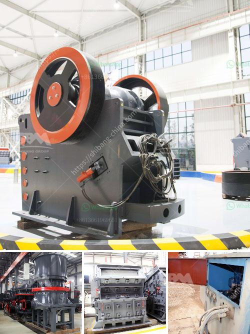

<h3>كسارة الصخور بوسطن</h3>
تعد كسارة الصخور في بوسطن واحدة من المعالم السياحية الشهيرة في المدينة. تقع الكسارة في منطقة جميلة تحتوي على مناظر طبيعية خلابة وصخور ضخمة.

تم بناء الكسارة في بداية القرن العشرين، وتجذب الآن الكثير من الزوار من مختلف أنحاء البلاد وحتى من دول أخرى. تم استغلالها في السابق كمحجر للصخور واستخراج المواد الخام منها، وهذا ما جعلها تصبح معلماً شهيراً.

توفر الكسارة تجربة فريدة من نوعها للزوار. يمكن للأفراد تجربة التنزه حول الكسارة والاستمتاع بالمناظر الرائعة للصخور والمنطقة المحيطة بها. توفر الكسارة أيضاً فرصة لمحبي المغامرة للقفز من الصخور العالية، مما يجعلها مكاناً شهيراً لممارسة رياضة الباش جامبينغ.

بالإضافة إلى ذلك، يمكن للزوار استكشاف الكهوف الواقعة تحت الكسارة. تلك الكهوف تعتبر أماكن رائعة للاستكشاف والمغامرة، حيث يمكن للأفراد اكتشاف تكوينات الصخور المدهشة والنواقل الجميلة.

تتوفر العديد من الأنشطة الترفيهية الأخرى في كسارة بوسطن، مثل التسلق على الجدران الصخرية وجولات المشي لمسافات طويلة. كما يمكن استئجار الدراجات للتجول حول الكسارة والاستمتاع بجمال الطبيعة المحيطة.

لا يزال الزوار يستغلون أيضاً الكسارة للصيد والتخييم، حيث توفر مناطق مخصصة لهذه الأنشطة. يمكن للزوار التمتع بطعم الشواء وإقامة نزهات للمدينة المحيطة بالكسارة.

لتكملة الرحلة، يقع عدد من المتاجر والمطاعم القريبة من الكسارة حيث يمكن للزوار الاستراحة والتمتع بوجبة لذيذة بعد يوم مليء بالمغامرات.

باختصار، تُعد كسارة الصخور في بوسطن وجهة سياحية شهيرة تقدم تجربة فريدة من نوعها للزوار. يمكن للأفراد استكشاف المناظر الطبيعية الخلابة والمشاركة في العديد من الأنشطة الترفيهية المثيرة. إنها واحدة من تلك الأماكن التي يجب على الزائرين زيارتها عندما يكونون في بوسطن.
<h3>Contact us</h3><ul><li><strong>Whatsapp:&nbsp;<a href="https://wa.me/8613661969651">+8613661969651</a></strong></li><li><a href="https://swt.shibang-china.com/?git&amp;zhl&amp;كسارة الصخور بوسطن"><strong>Online Service(chat now)</strong></a></li></ul><h3>Related</h3><ul><li><a href='فاصل رمل وحجر لغسيل الشمندر.md'>فاصل رمل وحجر لغسيل الشمندر</a></li><li><a href='أسعار كسارات الجرانيت.md'>أسعار كسارات الجرانيت</a></li><li><a href='كسارة أولية مستخدمة في جنوب أفريقيا.md'>كسارة أولية مستخدمة في جنوب أفريقيا</a></li><li><a href='خطة عمل محجر الحجر.md'>خطة عمل محجر الحجر</a></li><li><a href='سعر كسارة الفك في جنوب أفريقيا.md'>سعر كسارة الفك في جنوب أفريقيا</a></li></ul>