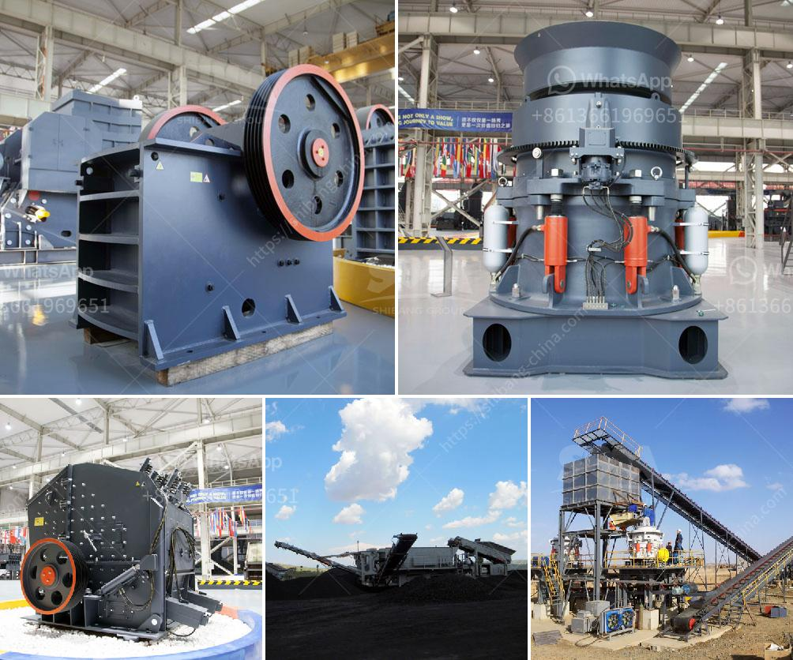

<h3>كسارة الصخور كرات الحديد</h3>
تعتبر كسارة الصخور كرات الحديد واحدة من الأدوات الهامة في صناعة التعدين ومعالجة المواد الصخرية. يتم استخدامها لكسر الصخور الكبيرة إلى أحجام أصغر تتناسب مع عملية الإنتاج أو المعالجة اللاحقة.

تعمل كسارات الصخور بنظام الضغط والثني، حيث يتم تحويل الضغط العالي إلى صدمة قوية تساعد على تفتيت الصخور بفعل القوة العالية عند التصادم. وتتكون كرات الحديد الداخلية في كسارة الصخور من قضبان حديدية صلبة معدنية، وتثبت على الدوار الداخلي للكسارة. وتعمل الكرات الداخلية على تحطيم وتفتيت الصخور عن طريق الطحن والاحتكاك المستمر.

تتوفر كسارات الصخور كرات الحديد بعدة أحجام تناسب الاحتياجات المتنوعة للعملاء. وتختلف قوة الكسارة وقدرتها على تحمل الصخور الكبيرة والمتوسطة حسب نوع الكسارة واحتياجات العملاء. تستخدم كسارات الصخور عادة في صناعة التعدين، وخاصة في تعدين المعادن مثل الذهب والحديد والنحاس والماس والفحم، حيث يتم استخراج هذه المواد من الصخور الصلبة.

تتميز كسارات الصخور كرات الحديد بعدة مزايا، فهي تعمل بكفاءة عالية وتحقق نتائج دقيقة ومتسقة. كما أنها توفر وقتًا وجهدًا في عملية التكسير والفحص، وتقلل من العمل اليدوي المكلف. بالإضافة إلى ذلك، فإن كثافة الحديد تساعد على تحقيق قوة ضغط أكبر وتحسن من عملية الكسر.

تعد كسارة الصخور كرات الحديد أداة أساسية في صناعة التعدين والبناء، حيث تساعد في تفتيت الصخور الكبيرة وتحويلها إلى أحجام أصغر استخدامًا في العديد من العمليات الصناعية المختلفة. بفضل تطور التكنولوجيا، أصبحت كسارات الصخور كرات الحديد أكثر فعالية وكفاءة، وتلبي احتياجات العملاء وتساهم في تطور صناعات التعدين والبناء.

لذا، يمكن القول إن كسارة الصخور كرات الحديد تلعب دورًا حاسمًا في عملية تحطيم الصخور وتفتيتها للاستفادة منها في صناعات مختلفة، وهي تمثل أحد أهم الأدوات التي يعتمد عليها في تعدين المواد الصخرية.
<h3>Contact us</h3><ul><li><strong>Whatsapp:&nbsp;<a href="https://wa.me/8613661969651">+8613661969651</a></strong></li><li><a href="https://swt.shibang-china.com/?git&amp;zhl&amp;كسارة الصخور كرات الحديد"><strong>Online Service(chat now)</strong></a></li></ul><h3>Related</h3><ul><li><a href='صناعة سحق الركام في تنزانيا.md'>صناعة سحق الركام في تنزانيا</a></li><li><a href='شركة تصنيع فيلت فيلت للحزام الناقل.md'>شركة تصنيع فيلت فيلت للحزام الناقل</a></li><li><a href='صيغة بسيطة لناقل الحزام.md'>صيغة بسيطة لناقل الحزام</a></li><li><a href='مصنعي آلات المحجر.md'>مصنعي آلات المحجر</a></li><li><a href='آلات الطحن لتكلفة مطحنة الدال.md'>آلات الطحن لتكلفة مطحنة الدال</a></li></ul>