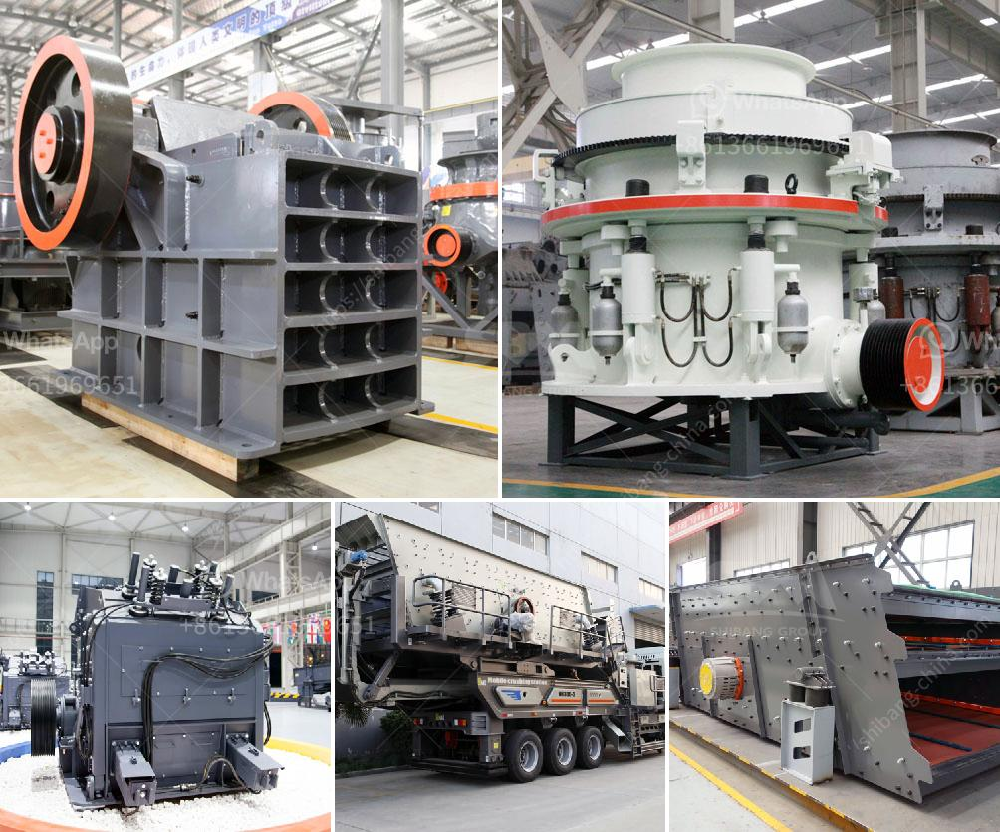

<h3>كسارة الصخور للبيع في الفلبين</h3>
تُعتبر كسارة الصخور أداة أساسية في عملية تكسير وسحق الصخور والأحجار الكبيرة لاستخدامها في البناء والإنشاءات. غالبًا ما تستخدم في مشاريع البناء الكبيرة مثل الطرق والجسور والمباني. في الفلبين، تعتبر المعدات الثقيلة محورًا رئيسيًا في صناعة البناء المتنامية بسرعة. ومن بين هذه المعدات، كسارة الصخور تلعب دورًا حاسمًا.

تتوفر كسارات الصخور للبيع في الفلبين بمجموعة واسعة من الأحجام والطاقات التي تلبي احتياجات المشاريع المختلفة. تختلف تكلفة هذه الكسارات اعتمادًا على الحجم والقدرة والعلامة التجارية. عادةً ما تتراوح تكلفة كسارة الصخور الجديدة في الفلبين بين 20000 إلى 40000 دولار أمريكي، في حين أنه يمكن العثور على نماذج مستعملة بأسعار أقل.

تتميز كسارات الصخور في الفلبين بأنها قوية وفعالة في تكسير الصخور بجميع الأحجام والصلابات، سواءً كانت ناعمة أو صلبة. تتميز أيضًا بأنها تعمل بكفاءة وتحقق نسبة عالية من الإنتاجية والأداء. هذه الكسارات تحتوي على أنظمة ضبط مناسبة لتحقيق الحجم النهائي المطلوب للصخور المكسورة.

إلى جانب الأداء الممتاز، فإن كسارات الصخور للبيع في الفلبين تأتي بمزايا إضافية. فهي عملية وسهلة الاستخدام، وتتميز بأنها مصممة للتحمل الشديد والاستخدام المستمر. كما تتوفر بأحجام مدمجة مما يجعلها قابلة للتحرك والنقل بسهولة إلى موقع العمل المطلوب.

تقدم بعض الشركات المُصنِعة لكسارات الصخور في الفلبين خدمات ما بعد البيع، بما في ذلك التوصيل والتركيب والتدريب على الاستخدام لضمان تشغيل صحيح وسلس للمعدات. كما يتم توفير الضمان والدعم الفني لضمان استدامة الأداء العالي للكسارة على المدى الطويل.

في النهاية، يجب على المشترين المحتملين للكسارات الصخرية في الفلبين مراعاة الاحتياجات الخاصة بمشروعهم والمواصفات المطلوبة. يجب التحقق من سمعة الشركة المُصنعة والتأكد من جودة المنتجات التي تُقدم. بعد اختيار الكسارة المناسبة، يمكن أن يؤدي استخدام هذه المعدات إلى زيادة الإنتاجية وتقليل التكاليف في عملية تكسير الصخور وتصنيع المواد الخام اللازمة للبناء والإنشاءات.
<h3>Contact us</h3><ul><li><strong>Whatsapp:&nbsp;<a href="https://wa.me/8613661969651">+8613661969651</a></strong></li><li><a href="https://swt.shibang-china.com/?git&amp;zhl&amp;كسارة الصخور للبيع في الفلبين"><strong>Online Service(chat now)</strong></a></li></ul><h3>Related</h3><ul><li><a href='مصانع الكسارات للبيع.md'>مصانع الكسارات للبيع</a></li><li><a href='كسارة الحجر في المملكة المتحدة.md'>كسارة الحجر في المملكة المتحدة</a></li><li><a href='آلة صنع الرمل في جنوب أفريقيا.md'>آلة صنع الرمل في جنوب أفريقيا</a></li><li><a href='تكلفة معدات التكسير والطحن في إثيوبيا.md'>تكلفة معدات التكسير والطحن في إثيوبيا</a></li><li><a href='تكلفة مصنع الأسمنت 200 طن في اليوم.md'>تكلفة مصنع الأسمنت 200 طن في اليوم</a></li></ul>