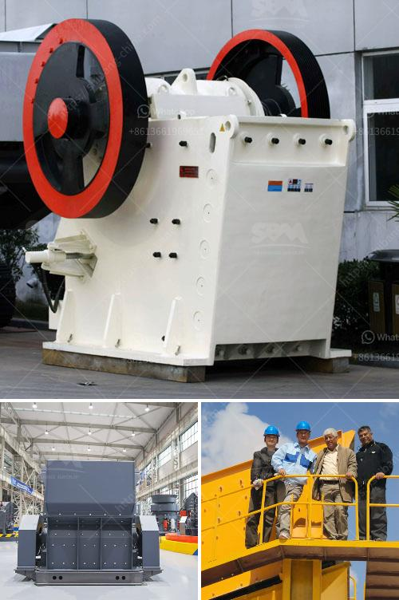

<h3>كسارة الصخور للكوارتز</h3>
تعتبر كسارة الصخور للكوارتز أحد الأدوات الهامة في عملية استخراج وتجهيز الكوارتز. يعود استخدام الكوارتز إلى قرون طويلة، حيث استخدم في العديد من التطبيقات المختلفة بفضل خصائصه المميزة. ويتم استخراج الكوارتز بشكل رئيسي من الصخور النارية والرمل، وهو يعتبر أحد المعادن الأكثر وفرة على وجه الأرض.

تعتبر الكسارة الصخور للكوارتز أداة مهمة في عملية تكسير الصخور إلى أحجام صغيرة قابلة للاستخدام في العديد من التطبيقات المختلفة. وتتميز الكسارة الصخور للكوارتز بكفاءتها العالية في تكسير الصخور، حيث تستخدم قوة هائلة لتحطيم الصخور إلى قطع صغيرة. كما أنها مصممة بطريقة تضمن تقليل الاهتزاز والضوضاء خلال عملية التكسير.

تُستخدم منتجات الكسارة الصخور للكوارتز في العديد من الصناعات، مثل صناعة الزجاج والسيراميك والالكترونيات وصناعة البلاط والخزف. فالكوارتز يعتبر مادة حجرية ذات تركيب متين وقوة ضغط عالية، مما يجعله مناسبًا للاستخدام في العديد من التطبيقات التجارية والصناعية.

يمكن استخدام الكوارتز المكسور الناتج من عملية التكسير في صنع الزجاج، حيث يتم استخدامه كمادة خام لإنتاج الزجاج وتحسين خصائص الزجاج مثل المتانة والشفافية. كما أن الكوارتز يستخدم في صناعة السيراميك لإضافة قوة ومتانة للأجزاء السيراميكية. كما يلعب الكوارتز دورًا هامًا في صناعة البلاط والخزف، حيث يستخدم كمادة خام لتحسين قوة ومقاومة البلاط والخزف.

بالإضافة إلى استخداماته في الصناعات المشار إليها، يُستخدم الكوارتز بشكل شائع في صناعة الالكترونيات، حيث يُستخدم كعنصر أساسي في صناعة الرقائق الإلكترونية والمكونات الإلكترونية الأخرى. وتعود جودة ونقاوة الكوارتز إلى استخدام الكسارات الفعالة للصخور في عملية التجهيز والتكسير.

باختصار، تعتبر كسارة الصخور للكوارتز أداة هامة في عملية تجهيز واستخراج الكوارتز. يتم استخدام الكسارة لتكسير الصخور إلى جزيئات صغيرة يمكن استخدامها في العديد من التطبيقات المختلفة. منتجات الكسارة الصخور للكوارتز تستخدم في العديد من الصناعات مثل صناعة الزجاج والسيراميك والبلاط والخزف وصناعة الالكترونيات، وتلعب دورًا هامًا في تحسين جودة ونقاوة الكوارتز المنتج.
<h3>Contact us</h3><ul><li><strong>Whatsapp:&nbsp;<a href="https://wa.me/8613661969651">+8613661969651</a></strong></li><li><a href="https://swt.shibang-china.com/?git&amp;zhl&amp;كسارة الصخور للكوارتز"><strong>Online Service(chat now)</strong></a></li></ul><h3>Related</h3><ul><li><a href='مطحنة للحجر الجيري في إيطاليا.md'>مطحنة للحجر الجيري في إيطاليا</a></li><li><a href='كسارة مخروطية في الشرق الأوسط.md'>كسارة مخروطية في الشرق الأوسط</a></li><li><a href='كسارة حجر مستعملة للبيع في أوروبا.md'>كسارة حجر مستعملة للبيع في أوروبا</a></li><li><a href='كسارة الفك في أوغندا.md'>كسارة الفك في أوغندا</a></li><li><a href='آلة كسارة الحجر الصغيرة.md'>آلة كسارة الحجر الصغيرة</a></li></ul>