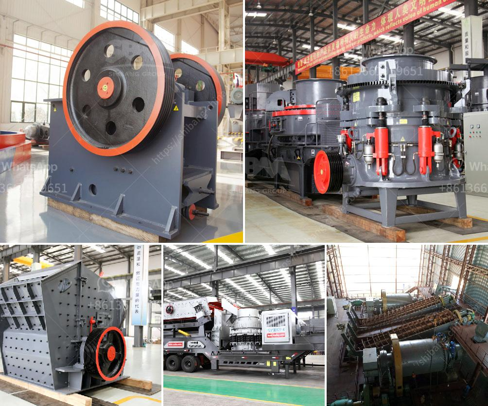

<h3>كسارة الصخور</h3>
كسارة الصخور هي أداة أساسية في صناعة التعدين والبناء، فهي تستخدم لتحطيم وسحق الصخور الكبيرة إلى جزيئات صغيرة ومناسبة للاستخدام في مختلف الأعمال الإنشائية. تعمل الكسارة على تجزئة الصخور باستخدام قوة ميكانيكية عالية المستوى، سواء كانت تعمل بواسطة محرك كهربائي أو البخار.

تتكون الكسارة الصخرية من عدة أجزاء رئيسية، بما في ذلك الفك الثابت والفك المتحرك. يتم تحريك الفك المتحرك بحركة دائرية تمكن الصخور الكبيرة من دخول الفجوة بين الفكين وتحطيمها بواسطة القوة الميكانيكية العالية. تعد كسارة الصخور نوعًا من أنواع المطاحن الكبيرة التي تعمل على تحطيم الصخور بعد ضغطها وتجميعها.

تستخدم كسارات الصخور على نطاق واسع في مجالات متعددة مثل التعدين، وخامات الحجر، والبناء، والطرق، والسكك الحديدية، وهندسة السدود، والطاقة الكهرومائية، والصناعات الكيماوية، وغيرها من التطبيقات الصناعية. فهي تستخدم لتحطيم الصخور الكبيرة وتجميعها في حجم ملائم يتم تطبيقه في تلك الأعمال. بفضل قدرتها على تكسير الصخور بسرعة وفعالية، تساعد كسارات الصخور على زيادة إنتاجية العمل وتوفير الوقت والجهد اللازم للحصول على المواد اللازمة.

وبفضل التطور التكنولوجي السريع، تتوفر اليوم كسارات الصخور بتصميمات وموديلات مختلفة تناسب احتياجات مختلفة. تستخدم بعض الكسارات نظام الكسر بالضغط العالي، بينما تعتمد أخرى على الصدمات الكبيرة لتحطيم الصخور. تعتمد اختيار الكسارة المناسبة على نوع وصلابة الصخور المستخدمة، بالإضافة إلى حجم وكمية المواد المطلوبة.

في الختام، تعتبر كسارة الصخور أداة أساسية في عمليات التعدين والبناء، وتساهم في زيادة إنتاجية العمل وتوفير الوقت والجهد. باستخدام التكنولوجيا الحديثة وتحسين الأداء، يمكن تحسين كفاءة الكسارة وتشغيلها بكفاءة أكبر واستخدامها في تلبية احتياجات الصناعة المختلفة.
<h3>Contact us</h3><ul><li><strong>Whatsapp:&nbsp;<a href="https://wa.me/8613661969651">+8613661969651</a></strong></li><li><a href="https://swt.shibang-china.com/?git&amp;zhl&amp;كسارة الصخور"><strong>Online Service(chat now)</strong></a></li></ul><h3>Related</h3><ul><li><a href='مصنع كسارة الكسارات للبيع في جنوب أفريقيا.md'>مصنع كسارة الكسارات للبيع في جنوب أفريقيا</a></li><li><a href='تحسين مصنع التكسير.md'>تحسين مصنع التكسير</a></li><li><a href='عرض مصنع معالجة الجير.md'>عرض مصنع معالجة الجير</a></li><li><a href='آلة تكسير الحجر للبيع.md'>آلة تكسير الحجر للبيع</a></li><li><a href='مصنع DMS للماس المستعمل للبيع في كيمبرلي.md'>مصنع DMS للماس المستعمل للبيع في كيمبرلي</a></li></ul>