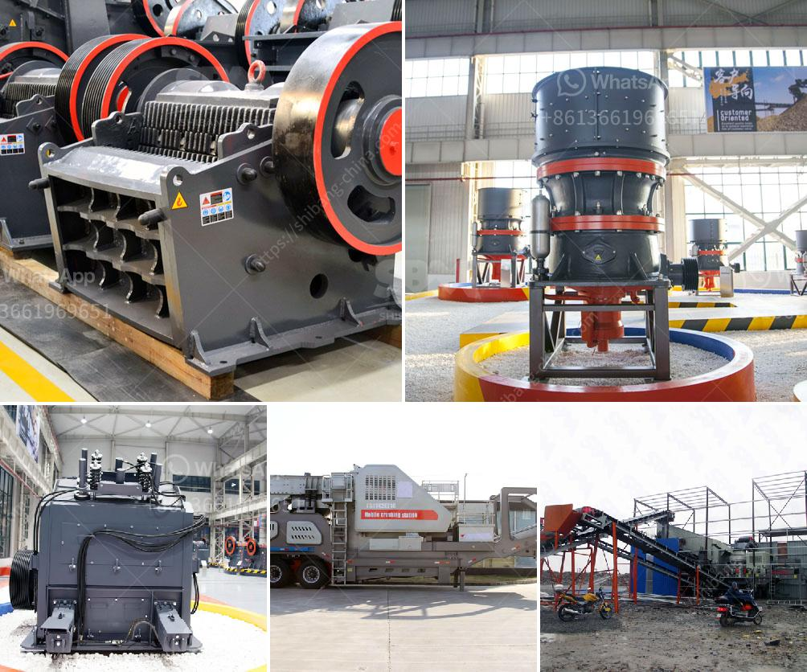

<h3>كسارة الصدم المحمولة في إثيوبيا</h3>
تعتبر كسارة الصدم المحمولة جهازًا حديثًا وعمليًا يستخدم في صناعة التعدين والبناء والهندسة المدنية في إثيوبيا. تم تصميم هذه الكسارات لتكون متنقلة وسهلة التركيب والتشغيل في المواقع البعيدة والمناطق الجبلية والمناطق النائية.

تتميز كسارة الصدم المحمولة بالعديد من الفوائد والميزات التي تجعلها اختيارًا شائعًا في صناعة التعدين والبناء في إثيوبيا. أولاً وقبل كل شيء، فإنها قادرة على سحق الصخور الكبيرة والحجارة بفعالية وكفاءة. تعمل هذه الكسارات عن طريق ضرب المادة بقوة عالية ، مما يسبب تفتيتها وتكسيرها إلى قطع أصغر. بالإضافة إلى ذلك ، فإن كسارة الصدم المحمولة قادرة على التعامل مع الصخور ذات القساوة المختلفة ، مما يجعلها قوية ومتينة في أداء المهام المختلفة.

ثانيًا ، فإن كسارة الصدم المحمولة مصممة بشكل محمول ، مما يسهل نقلها وتركيبها في العديد من المواقع. هذا يعني أنه يمكن نقلها بسهولة إلى المناطق النائية التي يصعب الوصول إليها بشكل تقليدي. بالإضافة إلى ذلك ، فإنها توفر أيضًا مرونة في تعديل موقعها بسرعة ، وذلك بفضل تصميمها المحمول. هذا يعني أنها يمكن أن تكون قادرة على معالجة المناطق الجبلية التي قد تصعب الوصول إليها بواسطة معدات ثقيلة أخرى.

بالإضافة إلى ذلك ، فإن كسارة الصدم المحمولة تشتهر بأنها صديقة للبيئة وتوفر استدامة بيئية. حيث تعمل على تقليل استخدام المواد الكيميائية الضارة والحد من الانبعاثات الضارة للهواء والصوت. يمكن أن يؤدي استخدام هذه الكسارات الصديقة للبيئة إلى تحسين البيئة المحيطة والحفاظ على النظام البيئي في إثيوبيا.

بشكل عام ، فإن كسارة الصدم المحمولة تعد اختراعًا هامًا في صناعة التعدين والبناء في إثيوبيا. يمكن أن تساهم في تسهيل العمليات وزيادة الإنتاجية وتقليل التكاليف. يمكن استخدام هذه الكسارات في مجموعة متنوعة من التطبيقات مثل سحق الحجارة لإنتاج الركام وإعادة تدوير المواد البنائية. تعد كسارة الصدم المحمولة خيارًا موثوقًا وفعالًا للمشاريع الكبيرة والصغيرة في إثيوبيا.
<h3>Contact us</h3><ul><li><strong>Whatsapp:&nbsp;<a href="https://wa.me/8613661969651">+8613661969651</a></strong></li><li><a href="https://swt.shibang-china.com/?git&amp;zhl&amp;كسارة الصدم المحمولة في إثيوبيا"><strong>Online Service(chat now)</strong></a></li></ul><h3>Related</h3><ul><li><a href='معدات غسيل الذهب في غانا.md'>معدات غسيل الذهب في غانا</a></li><li><a href='مصانع الكسارات الصينية.md'>مصانع الكسارات الصينية</a></li><li><a href='مستعملة vsi كسارة للبيع في الهند.md'>مستعملة vsi كسارة للبيع في الهند</a></li><li><a href='شركة تصنيع معدات التكسير.md'>شركة تصنيع معدات التكسير</a></li><li><a href='وكيل وارد ريموند مطحنة إندونيسيا.md'>وكيل وارد ريموند مطحنة إندونيسيا</a></li></ul>