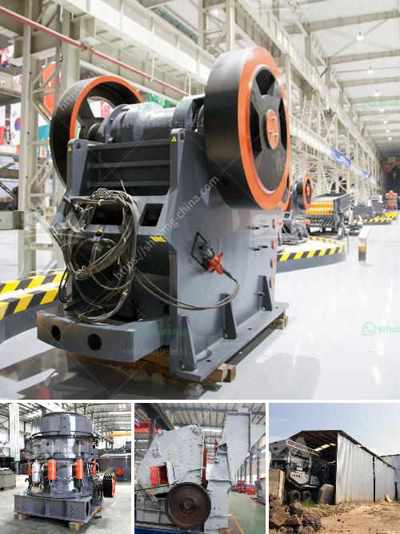

<h3>كسارة الصدم من نوع مانسبرجر</h3>
تُستخدم كسارات الصدم في صناعة البناء والتعدين لتكسير المواد الخام المختلفة. واحدة من أشهر أنواع كسارات الصدم هي كسارة الصدم من نوع مانسبرجر (Mansberger). تعد هذه الكسارة من بين أكثر الكسارات شيوعًا في جميع أنحاء العالم بفضل قدرتها الفعالة على تكسير المواد الصلبة.

تم تطوير كسارة الصدم من نوع مانسبرجر بمبدأ الصدم الدائري. وهذا يعني أن المواد المستهدفة ستتعرض لسلسلة من الصدمات السريعة عبر التفاعل بين المطرقة الدوارة والمواد المستهدفة. تم تصميم الكسارة لتكسير كتل المواد الكبيرة إلى قطع صغيرة أكثر تجانسًا، مما يسهل عملية النقل والتحميل.

تتميز كسارة الصدم من نوع مانسبرجر بالعديد من المزايا. فبفضل قوة الصدمة العالية والطاقة الكامنة في المطرقة الدوارة، يتم الحصول على تأثير تكسير مثالي. هذا يعني أن الكسارة قادرة على تكسير المواد القوية بشكل فعال دون الحاجة إلى تكسيرها مرارًا وتكرارًا. علاوة على ذلك، تتميز كسارة الصدم من نوع مانسبرجر بتوفير الوقت والجهد، حيث يمكن للكسارة تكسير كميات كبيرة من المواد بسرعة.

تم تصميم الكسارة أيضًا لتوفير السلامة والحماية للعمال المشغلين. فهي تحتوي على مصدات قوية لتفادي أي تلف يمكن أن يسببه تأثير الصدمة. كما أن الكسارة مزودة بنظام تحكم عالي الدقة لضبط حجم المخرجات وفقًا لاحتياجات المشروع.

بفضل كفاءتها العالية وسرعتها وقوتها، تستخدم كسارة الصدم من نوع مانسبرجر في مجموعة متنوعة من التطبيقات. فهي مثالية لتكسير الأحجار الكبيرة والخشنة لإنتاج الحصى والركام. بالإضافة إلى ذلك، يمكن استخدامها في تكسير المواد الصلبة مثل الحديد والنحاس والألمنيوم لتحضيرها قبل المعالجة اللاحقة.

وفي الختام، تُعد كسارة الصدم من نوع مانسبرجر أداة حيوية في صناعة البناء والتعدين. تم تصميمها لتكسير المواد القوية والصلبة بفعالية وفي وقت قصير. وبفضل قدرتها على تحقيق تأثير التكسير المثالي، هي اختيار مثالي لتلبية احتياجات المشاريع الكبيرة وتحقيق الإنتاجية العالية.
<h3>Contact us</h3><ul><li><strong>Whatsapp:&nbsp;<a href="https://wa.me/8613661969651">+8613661969651</a></strong></li><li><a href="https://swt.shibang-china.com/?git&amp;zhl&amp;كسارة الصدم من نوع مانسبرجر"><strong>Online Service(chat now)</strong></a></li></ul><h3>Related</h3><ul><li><a href='الأحجار الكريمة الموجودة في نيجيريا.md'>الأحجار الكريمة الموجودة في نيجيريا</a></li><li><a href='كسارة مخروطية في الشرق الأوسط.md'>كسارة مخروطية في الشرق الأوسط</a></li><li><a href='عملية كسارة الرمل والحصى في الفلبين.md'>عملية كسارة الرمل والحصى في الفلبين</a></li><li><a href='سعر كسارة الحجر.md'>سعر كسارة الحجر</a></li><li><a href='آلات كسارة للبيع.md'>آلات كسارة للبيع</a></li></ul>