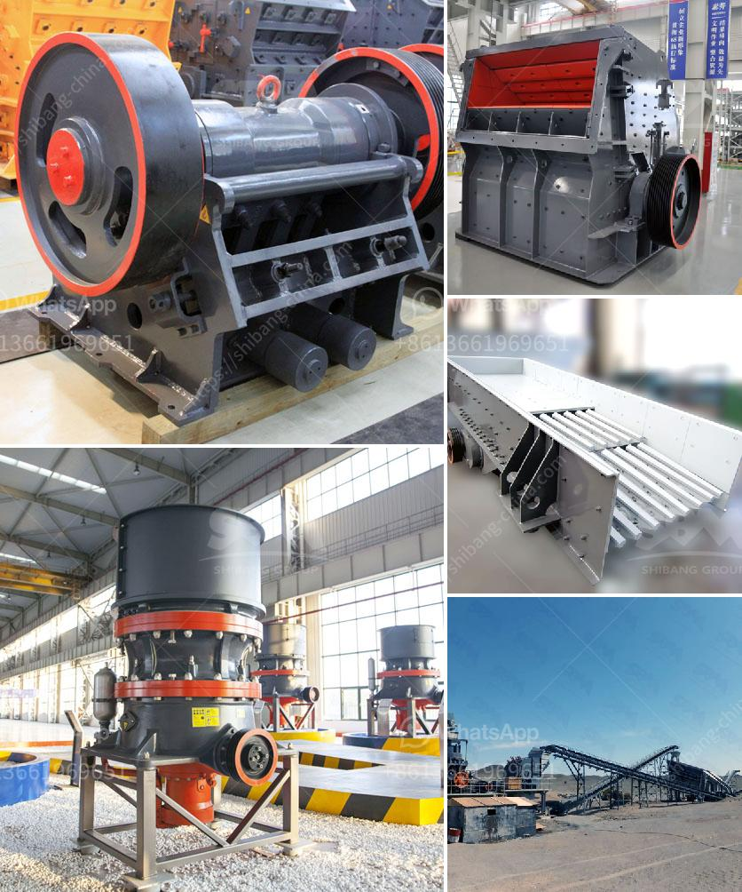

<h3>كسارة الفحم 10 مم</h3>
تعتبر كسارة الفحم ذات الحجم 10 مم أحد المعدات المهمة في صناعة التعدين وتحويل الفحم إلى مواد صالحة للاستخدام في العديد من الصناعات. تستخدم كسارة الفحم لتفتيت قطع الفحم إلى حجم صغير قبل استخلاص الفحم المرغوب منه. ويعتبر الفحم الوقود الأساسي في العديد من الصناعات مثل توليد الطاقة والحديد والصلب، وأيضًا في العديد من العمليات الصناعية الأخرى.

تأتي كسارة الفحم بأحجام مختلفة تعتمد على طلب واحتياجات الصناعة المستخدمة فيها. وتعتبر كسارة الفحم ذات الحجم 10 مم مناسبة للفحم الخام الذي يتراوح حجمه بين 30-50 مم. تعمل الكسارات الفحمية عادة بنظام الكسر الأولي أو الثانوي، حيث تضمن فرز الفحم الكبير إلى حجم أصغر لاحقًا.

تعمل كسارة الفحم بواسطة دفع الفحم إلى الداخل باستخدام الأسطوانة الدوارة، وتستخدم الأسطوانة الثابتة في الجزء العلوي لضغط الفحم وتفتيته. يتم تعديل فجوة الكسارة بين الأسطوانة الدوارة والثابتة وفقًا لحجم الفحم المطلوب. يتم تحويل الفحم إلى أحجام صغيرة جدًا بواسطة الأسطوانة الدوارة ويتم استخراج الغبار والشوائب المنتجة خلال العملية بواسطة نظام تنظيف وتصفية الهواء.

تستخدم كسارات الفحم في صناعة المناجم الفحمية، حيث تعمل على تفتيت الفحم الخام لجعله أقل حجمًا وأكثر قابلية للحرق. وبالتالي، يتم تحسين كفاءة حرق الفحم وزيادة قيمة استخدامه. تسهم كسارات الفحم في زيادة إنتاجية المناجم وتقليل تكلفة العمليات اللاحقة في تحويل الفحم إلى وقود صالح للاستخدام.

وفي النهاية، يمكن القول إن كسارة الفحم ذات الحجم 10 مم تعتبر جزءًا أساسيًا في صناعة التعدين وتحويل الفحم. تتيح تحويل قطع الفحم إلى حجم صغير لاستخدامها في العديد من الصناعات المختلفة. تساهم في زيادة إنتاجية المناجم وتحسين كفاءة حرق الفحم. وتعد من الأدوات الحيوية في صناعة الطاقة والحديد والصلب، وتلبي الطلب المتزايد على الفحم كوقود أساسي في العديد من الدول.
<h3>Contact us</h3><ul><li><strong>Whatsapp:&nbsp;<a href="https://wa.me/8613661969651">+8613661969651</a></strong></li><li><a href="https://swt.shibang-china.com/?git&amp;zhl&amp;كسارة الفحم 10 مم"><strong>Online Service(chat now)</strong></a></li></ul><h3>Related</h3><ul><li><a href='شركات تصنيع آلات الكسارة في شنغهاي.md'>شركات تصنيع آلات الكسارة في شنغهاي</a></li><li><a href='تكلفة مجفف الرمال في ولاية كيرالا.md'>تكلفة مجفف الرمال في ولاية كيرالا</a></li><li><a href='آلة سحق الأسفلت بسعة 15 طن في الساعة.md'>آلة سحق الأسفلت بسعة 15 طن في الساعة</a></li><li><a href='كتلة الآلات وكسارة في AutoCAD.md'>كتلة الآلات وكسارة في AutoCAD</a></li><li><a href='تطبيق محطة الكسارة.md'>تطبيق محطة الكسارة</a></li></ul>