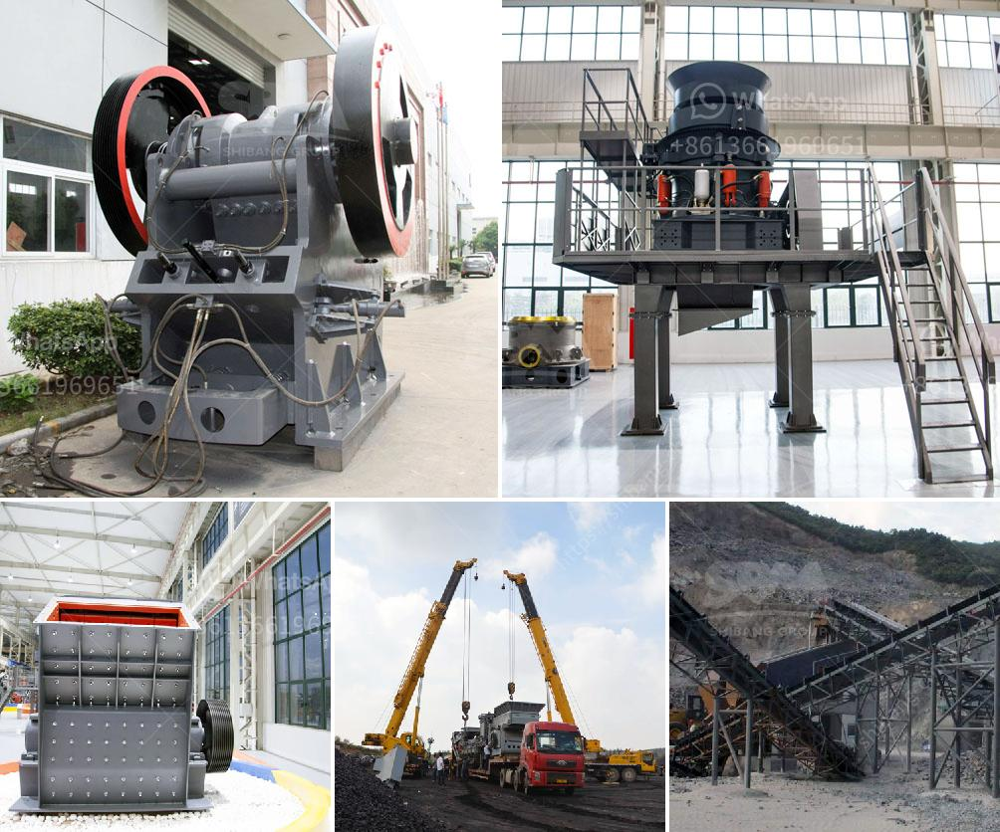

<h3>كسارة الفحم بالمطرقة</h3>
تعتبر كسارة الفحم بالمطرقة واحدة من الأدوات المستخدمة في صناعة الفحم. وتعتبر الفحم من المصادر الأساسية للطاقة في العالم، حيث يستخدم في توليد الكهرباء والتدفئة وفي العديد من الصناعات.

تعمل كسارة الفحم بالمطرقة على سحق الفحم إلى قطع صغيرة باستخدام القوة الضاربة للمطارق المتحركة. وتتألف الكسارة من جزئين رئيسيين: الجزء العلوي والجزء السفلي. يتم تحميل الفحم في الجزء العلوي من الكسارة، ثم تدفع المطارق المتحركة الفحم للأسفل بشكل سريع وقوي، مما يؤدي إلى تكسيره بفعالية وسحقه إلى قطع صغيرة.

تعمل الكسارة بسرعة عالية جدًا، مما يتيح سحق الفحم بكفاءة وفي وقت قصير. كما أن الكسارة تتميز بقدرتها على معالجة كميات كبيرة من الفحم في وقت قصير، مما يعزز إنتاجية الصناعة.

وتستخدم كسارة الفحم بالمطرقة في الصناعة لعدة أسباب، فهي تساهم في زيادة كفاءة حرق الفحم، حيث يسهل حرق الفحم الناتج عن الكسارة بفضل حجمه الصغير وتجانسه. كما يتيح سحق الفحم الكبير إلى قطع أصغر استخدامه في العديد من العمليات الصناعية.

بالإضافة إلى ذلك، تساهم كسارة الفحم بالمطرقة في تقليل تكاليف النقل والتخزين، حيث يتطلب الفحم بحجم كبير مساحة كبيرة للتخزين ويحتاج إلى وسائل نقل أكبر. وباستخدام الكسارة، يمكن تقليل حجم الفحم وبالتالي تقليل تكاليف النقل والتخزين.

وفي الختام، تعتبر كسارة الفحم بالمطرقة أداة أساسية في صناعة الفحم، حيث تعزز كفاءة حرقه وتقلل تكاليف النقل والتخزين. كما تساهم في تعزيز إنتاجية الصناعة بفضل قدرتها على معالجة كميات كبيرة من الفحم في وقت قصير.
<h3>Contact us</h3><ul><li><strong>Whatsapp:&nbsp;<a href="https://wa.me/8613661969651">+8613661969651</a></strong></li><li><a href="https://swt.shibang-china.com/?git&amp;zhl&amp;كسارة الفحم بالمطرقة"><strong>Online Service(chat now)</strong></a></li></ul><h3>Related</h3><ul><li><a href='سلسلة SCM لطحن المساحيق الدقيقة.md'>سلسلة SCM لطحن المساحيق الدقيقة</a></li><li><a href='كم تكلفة مصنع الكرة؟.md'>كم تكلفة مصنع الكرة؟</a></li><li><a href='معدات طحن رفيعة جداً رطبة.md'>معدات طحن رفيعة جداً رطبة</a></li><li><a href='كسارات متنقلة في أبوجا.md'>كسارات متنقلة في أبوجا</a></li><li><a href='تحسين الجرافيت.md'>تحسين الجرافيت</a></li></ul>