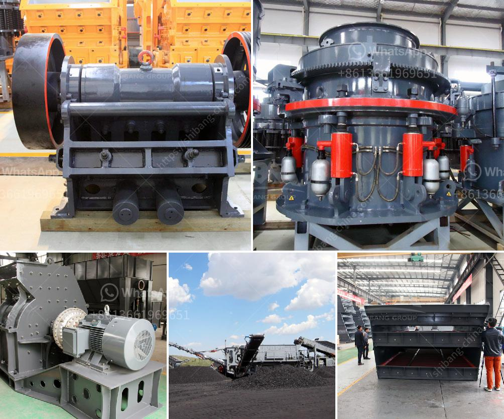

<h3>كسارة الفك 100 طن في الساعة للبيع</h3>
تُعتبر كسارة الفك من أكثر المعدات المستخدمة في صناعة التعدين والبناء، فهي تستخدم لتكسير المواد الصلبة وإعادة تدويرها بشكل مستدام. واحدة من الكسارات الفكية الأكثر شهرة وانتشارًا هي كسارة الفك بسعة 100 طن في الساعة. وتأتي هذه الكسارة مع العديد من الميزات والمواصفات التي تجعلها مناسبة لمختلف التطبيقات والمواد المختلفة.

تتميز كسارة الفك 100 طن في الساعة بقدرتها العالية على الإنتاج، فهي قادرة على تكسير ما يصل إلى 100 طن في الساعة، مما يجعلها خيارًا مناسبًا للعديد من المشاريع الكبيرة. تأتي هذه الكسارة مع فكين قويين يسمحان بتحقيق تكسير فعال وسريع للمواد الصلبة.

تعتبر قوة القدرة على التحمل والتحميل من أكثر الخصائص المميزة لكسارة الفك 100 طن في الساعة. فهي قادرة على التعامل مع مجموعة واسعة من المواد الصلبة بشكل فعال، بما في ذلك المواد الصخرية والحجارة والخرسانة والمواد الصناعية الأخرى. سعة التحميل العالية تجعل من السهل تشغيل هذه الكسارة في الظروف الصعبة والمحيطات القاسية.

تتميز هذه الكسارة بتصميم مدمج وخفيف الوزن، مما يجعلها سهلة النقل والتركيب في الموقع الذي تحتاجه. وبالتالي، فإنها تُعتبر حلاً مثاليًا للمشاريع المتنقلة أو المؤقتة التي تتطلب نقل الكسارة بين المواقع. بالإضافة إلى ذلك، فإن صيانة وتشغيل هذه الكسارة بسيطة ومريحة، مما يقلل من وقت التوقف ويزيد من الكفاءة.

من الشائع أيضًا أن تتضمن كسارة الفك 100 طن في الساعة أنظمة تحكم فعالة وتقنيات متقدمة لتخفيف الاهتزاز والضوضاء. هذا يساعد على تحسين أداء الكسارة والحفاظ على البيئة العامة في المكان الذي تعمل فيه.

وفي الختام، يمكن القول أن كسارة الفك 100 طن في الساعة هي اختيار مثالي لأي مشروع يتطلب تكسير الصخور والحجارة بكمية كبيرة في وقت قصير. تتميز بالقوة والكفاءة والسهولة في الصيانة، وهي تعد استثمارًا جيدًا للشركات البنائية وشركات التعدين والمناجم التي تبحث عن تحسين أداء التعدين وتدوير المواد الخام. إذا كنت تبحث عن كسارة الفك ذات القدرة العالية، فإن كسارة الفك 100 طن في الساعة تستحق النظر فيها.
<h3>Contact us</h3><ul><li><strong>Whatsapp:&nbsp;<a href="https://wa.me/8613661969651">+8613661969651</a></strong></li><li><a href="https://swt.shibang-china.com/?git&amp;zhl&amp;كسارة الفك 100 طن في الساعة للبيع"><strong>Online Service(chat now)</strong></a></li></ul><h3>Related</h3><ul><li><a href='كسارة فكية 10x.md'>كسارة فكية 10x</a></li><li><a href='سحق الكلي ٢٠٠ طن في الساعة بمرحلتين.md'>سحق الكلي ٢٠٠ طن في الساعة بمرحلتين</a></li><li><a href='سعر كسارة حجر الركام في جنوب أفريقيا.md'>سعر كسارة حجر الركام في جنوب أفريقيا</a></li><li><a href='كسارات الخرسانة المصغرة.md'>كسارات الخرسانة المصغرة</a></li><li><a href='مصنع معالجة ملح الصخور.md'>مصنع معالجة ملح الصخور</a></li></ul>