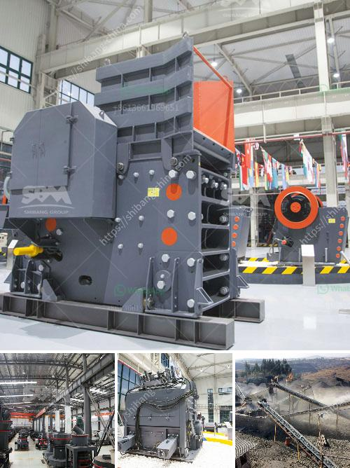

<h3>كسارة الفك 1200 طن في الساعة</h3>
تعتبر كسارة الفك بقدرة 1200 طن في الساعة من أحدث التكنولوجيات المستخدمة في صناعة الكسارات، وتستخدم بشكل رئيسي في مجال التعدين ومحطات الكسارات الكبيرة. تعتبر هذه الكسارة منتجًا فريدًا بناءً على معايير الجودة والأداء، وتعد الحل الأمثل للشركات التي تبحث عن كسارة قوية وفعالة.

تعتبر كسارة الفك بقدرة 1200 طن في الساعة من بين كسارات الفك الضخمة التي تستخدم في عمليات التكسير الأساسية والثانوية. يتميز هذا الطراز بقدرته الكبيرة على تكسير المواد الصلبة والمتوسطة الصلابة مثل الحجر والفحم والخامات المعدنية والخرسانة والأسفلت.

تتميز كسارة الفك 1200 طن في الساعة بتصميمها القوي والمتين، وتستخدم أحدث التقنيات لضمان الأداء العالي والاستخدام الطويل الأمد. تم تجهيز الكسارة بمحرك كهربائي قوي يوفر القدرة الكافية لتشغيلها، بالإضافة إلى نظام هيدروليكي متقدم لتعديل فتحة التفريغ وضمان الحصول على الحجم المناسب للمواد المكسورة.

تحقق كسارة الفك 1200 طن في الساعة منتجية عالية جدًا، حيث تستطيع تكسير كمية كبيرة من المواد في وقت قصير، مما يجعلها مثالية للمواقع التي تتطلب تجهيز كميات كبيرة من المواد بشكل سريع. يتميز هذا الطراز بكفاءة الطاقة وانخفاض استهلاك الوقود، مما يساهم في تقليل التكاليف التشغيلية والحفاظ على البيئة.

تعمل كسارة الفك 1200 طن في الساعة بطريقة بسيطة وموثوقة، حيث يتم تزويد الكسارة بمكبس يعمل على دفع المواد إلى الفك الثابت والمتحرك. يتم تكسير المواد بين الفكين بسبب حركة الفك المتحرك التي تتحرك صعودًا وهبوطًا. وتتميز الكسارة بفتحة تفريغ قابلة للتعديل، مما يتيح التحكم في حجم المواد المكسورة وفقًا لاحتياجات المشروع.

يمكن استخدام كسارة الفك 1200 طن في الساعة في مجموعة متنوعة من التطبيقات، بما في ذلك إنتاج الركامات لمشروعات البناء والطرق، وتكسير خامات المعادن لمصانع التصنيع، وتكسير الفحم لمحطات توليد الطاقة. وبفضل تصميمها المتين والموثوق به، فإن كسارة الفك تعد استثمارًا آمنًا وموثوقًا به لتحقيق الإنتاجية العالية.

باختصار، تلعب كسارة الفك 1200 طن في الساعة دورًا حاسمًا في صناعة الكسارات الكبيرة، حيث توفر قدرة عالية وأداء ممتاز. تعتبر هذه الكسارة حلا فعالًا للتعدين وتجهيز المواد، وتوفر العديد من المزايا مثل الموثوقية والفعالية العالية والتكلفة المنخفضة للتشغيل. إذا كنت تبحث عن كسارة قوية وموثوقة، فإن كسارة الفك 1200 طن في الساعة هي الخيار الأمثل.
<h3>Contact us</h3><ul><li><strong>Whatsapp:&nbsp;<a href="https://wa.me/8613661969651">+8613661969651</a></strong></li><li><a href="https://swt.shibang-china.com/?git&amp;zhl&amp;كسارة الفك 1200 طن في الساعة"><strong>Online Service(chat now)</strong></a></li></ul><h3>Related</h3><ul><li><a href='كسارة لسحق الكوارتز.md'>كسارة لسحق الكوارتز</a></li><li><a href='مطحنة هامر للتركيز.md'>مطحنة هامر للتركيز</a></li><li><a href='معدات إنتاج الأسمنت في ألمانيا.md'>معدات إنتاج الأسمنت في ألمانيا</a></li><li><a href='نظام مصنع البنتونيت.md'>نظام مصنع البنتونيت</a></li><li><a href='كم تكلفة كسارة الفك.md'>كم تكلفة كسارة الفك</a></li></ul>