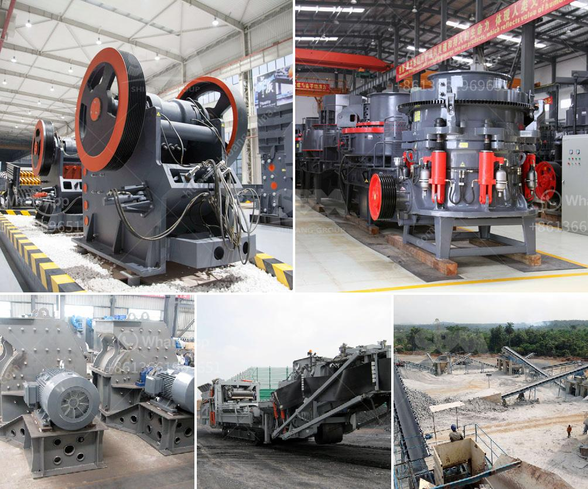

<h3>كسارة الفك 150 250 للبيع</h3>
تعد كسارة الفك 150×250 واحدة من أكثر الكسارات شيوعًا في صناعة التعدين ومواد البناء. تقدم هذه الكسارة أداءً ممتازًا وفعالية عالية في سحق المواد الصلبة بأحجام مختلفة. يتم استخدامها على نطاق واسع في المناجم ومحاجر الحجر ومصانع الأسمنت ومحطات التكسير ومحطات الشحن ومحطات توليد الطاقة والبناء وغيرها من الصناعات ذات الصلة.

تتميز كسارة الفك 150×250 بتصميم قوي وهيكل متين مصنوع من مواد عالية الجودة مثل الصلب المقاوم للصدأ. يتيح هذا الهيكل المتين تحمل الصدمات والتحميل الثقيل بشكل فعال، مما يجعلها مثالية للاستخدام في الظروف القاسية. بالإضافة إلى ذلك، فإن الهندسة المتقدمة للجهاز تجعل عملية التشغيل سهلة ومريحة للمشغل.

تتميز كسارة الفك 150×250 بفتحة الفك الكبيرة التي تسمح بسهولة إدخال المواد وتغذيتها إلى الكسارة. تجهيزاتها الفعالة تساعد في زيادة سرعة الإنتاج وتحسين كفاءة العمل. يتم تشغيل الكسارة بواسطة محرك كهربائي قوي يعمل بتيار متردد، ويتم التحكم فيه بواسطة نظام كهروهيدروليكي موفر للطاقة. يتيح هذا النظام تعديل فتحة الفك وضبط حجم الإخراج بسهولة وسرعة.

تعتبر كسارة الفك 150×250 مثالية لسحق المواد الصلبة مثل الحجر الجيري والجرانيت والرخام والبازلت والخام المعدنية والفحم والخرسانة والزجاج والسيراميك والخرسانة المسلحة والقواعد. يمكن أن يكون الحجم القصوى للمواد الداخلة حوالي 125 مم والحجم النهائي للإخراج بين 10-40 مم، وهذا يجعلها مناسبة لمجموعة متنوعة من تطبيقات الاستخدام.

بالإضافة إلى الأداء العالي والفعالية الجيدة، تتميز كسارة الفك 150×250 بتكلفة التشغيل المنخفضة وانخفاض استهلاك الطاقة. توفر هذه السمات ميزة تنافسية كبيرة للمشترين. بالإضافة إلى ذلك، يتوفر العديد من الموديلات المختلفة والمواصفات للكسارة، مما يسمح للمشترين بتلبية متطلباتهم الفردية واحتياجاتهم الخاصة.

وأخيرًا، تعد كسارة الفك 150×250 خيارًا ممتازًا للاستثمار في معدات الكسارة. فهي توفر أداءً عاليًا وجودة تصنيع ممتازة وتكلفة تشغيل منخفضة، مما يجعلها خيارًا مثاليًا للعديد من المشترين المهتمين بتحقيق أقصى استفادة من معداتهم وتحقيق الأرباح المرجوة.
<h3>Contact us</h3><ul><li><strong>Whatsapp:&nbsp;<a href="https://wa.me/8613661969651">+8613661969651</a></strong></li><li><a href="https://swt.shibang-china.com/?git&amp;zhl&amp;كسارة الفك 150 250 للبيع"><strong>Online Service(chat now)</strong></a></li></ul><h3>Related</h3><ul><li><a href='كيفية جعل مسحوق الحجر الجيري.md'>كيفية جعل مسحوق الحجر الجيري</a></li><li><a href='كسارة الحجر في أوغندا.md'>كسارة الحجر في أوغندا</a></li><li><a href='معلومات عن مصنع كسارة الحجر.md'>معلومات عن مصنع كسارة الحجر</a></li><li><a href='ما هو مطحنة الكرة.md'>ما هو مطحنة الكرة</a></li><li><a href='صيغة حساب قدرة كسارة الفك.md'>صيغة حساب قدرة كسارة الفك</a></li></ul>