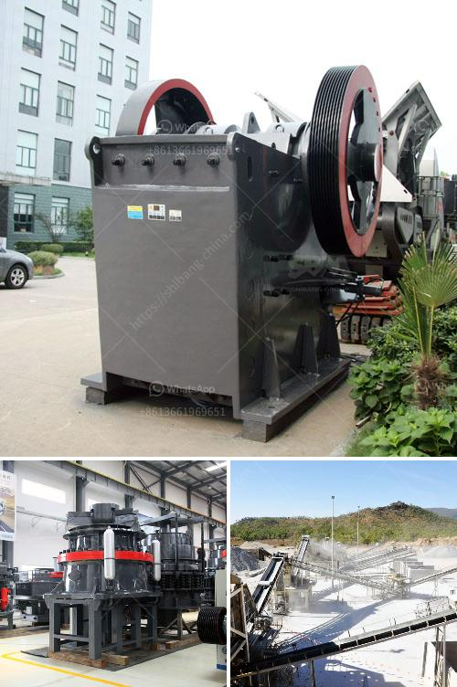

<h3>كسارة الفك 400 ×</h3>
كسارة الفك 400 × 200-400 هي واحدة من أنواع الكسارات المستخدمة في صناعة التعدين ومعالجة المواد الخام. تم تصميمها لسحق المواد الكبيرة إلى قطع صغيرة بفضل حركة الفك المتحرك والثابت.

تتألف كسارة الفك 400 × 200-400 من مجموعة من الأجزاء الرئيسية المهمة التي تعمل معًا لضمان سرعة وكفاءة سحق المواد. وتشمل هذه الأجزاء الرئيسية الفك المتحرك، والفك الثابت، ورمح الدوران، ومحرك الدفع، والحزام الناقل، والأسطوانة المدعمة والتي تعمل بنظام التعليق الهيدروليكي لحماية الكسارة من الأحمال الزائدة وتقليل الاهتزاز الناتج عن عملية السحق.

يتم استخدام كسارة الفك 400 × 200-400 لسحق مجموعة متنوعة من المواد الصلبة والصلبة المتوسطة ، مثل الحجر الجيري والغرانيت والخامات المعدنية والفحم والخرسانة المسلحة وغيرها من المواد. يتم تغذية المواد إلى الكسارة عن طريق الفم العلوي ، والتي تقوم بسحقها بفضل قوة الضغط التي تنشأ عند تحريك الفك المتحرك نحو الفك الثابت. يتم ضبط حجم الفتحة بين الفك المتحرك والثابت وفقًا لحجم المواد النهائي المطلوب.

تعتبر كسارة الفك 400 × 200-400 مميزة بسبب قدرتها على العمل بكفاءة عالية والحصول على نتائج دقيقة لعملية السحق. كما يمكنها أيضًا التعامل مع مواد ذات قوة ضغط عالية ومقاومة للاهتزاز. وبفضل التحكم الهيدروليكي والتكنولوجيا المتقدمة ، توفر هذه الكسارة تجربة سحق آمنة وموثوقة للعملاء.

بالنظر إلى الطلب المتزايد على المواد البناء والمعادن في العالم ، فإن كسارة الفك 400 × 200-400 تلبي بشكل كبير الاحتياجات المتزايدة للصناعة. تستخدم على نطاق واسع في مجالات مثل التعدين والبناء والهندسة الكيميائية وصناعة السكك الحديدية والطرق والأنفاق.

في الختام ، يمكن القول أن كسارة الفك 400 × 200-400 هي أداة مهمة في صناعة التعدين ومعالجة المواد الخام. توفر الكسارة أداءً عاليًا وكفاءة سحق ممتازة ، مما يساهم في تحسين إنتاجية الصناعات المختلفة وتلبية الطلب المتزايد على المواد البناء والمعادن.
<h3>Contact us</h3><ul><li><strong>Whatsapp:&nbsp;<a href="https://wa.me/8613661969651">+8613661969651</a></strong></li><li><a href="https://swt.shibang-china.com/?git&amp;zhl&amp;كسارة الفك 400 ×"><strong>Online Service(chat now)</strong></a></li></ul><h3>Related</h3><ul><li><a href='صيانة مطحنة ريموند.md'>صيانة مطحنة ريموند</a></li><li><a href='سعر كسارة الحجر.md'>سعر كسارة الحجر</a></li><li><a href='سعر المطحنة للمعادن في بوليفيا.md'>سعر المطحنة للمعادن في بوليفيا</a></li><li><a href='كسارة تعدين الحجر الجيري في فيتنام.md'>كسارة تعدين الحجر الجيري في فيتنام</a></li><li><a href='كسارة المطرقة بسعة ١٠ طن في الساعة وحجمها.md'>كسارة المطرقة بسعة ١٠ طن في الساعة وحجمها</a></li></ul>