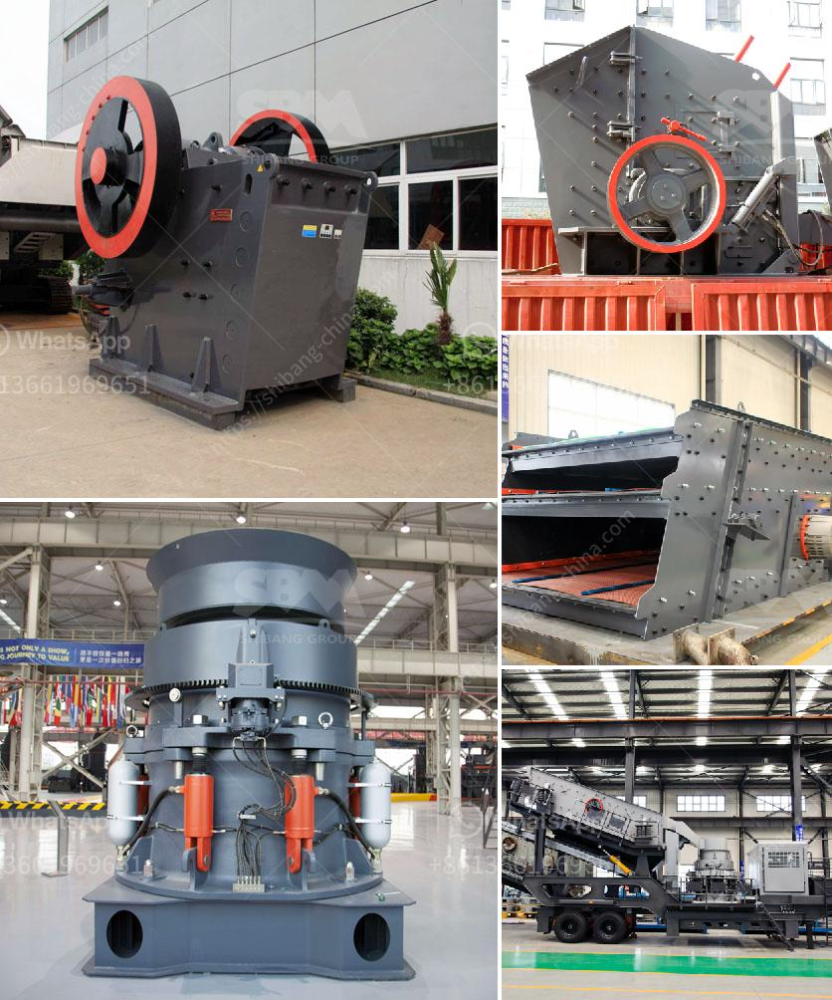

<h3>كسارة الفك PE 150x250</h3>
تعتبر كسارة الفك PE 150x250 واحدة من الكسارات الفكية الصغيرة التي تستخدم على نطاق واسع في مجال التعدين والبناء وصناعة المواد الكيميائية وغيرها. تتميز هذه الكسارة بتصميمها المدمج والقوة العالية وسهولة الاستخدام والصيانة.

تعتبر كسارة الفك PE 150x250 فعالة في سحق المواد ذات الصلابة المتوسطة والمنخفضة، حيث تتميز بقوة ضغط تصل إلى 320 ميجا باسكال. بفضل فكها القوي، يمكن أن تواجه هذه الكسارة مواد مختلفة مثل الحجر الجيري والجرانيت والبازلت والخامات الصخرية الأخرى.

تتميز كسارة الفك PE 150x250 أيضًا بحجم طاقة الإدخال الكبيرة، حيث تمتاز بفتحة تغذية تبلغ 150x250 مم. يعني ذلك أنه يمكنها معالجة المواد الكبيرة بكفاءة، مما يجعلها مناسبة للاستخدام في خطوط الإنتاج الكبيرة والصغيرة.

توفر كسارة الفك PE 150x250 أداءً ممتازًا في سحق المواد، حيث يُمكن إنتاج حجم جسيمات الناتج من 10 إلى 40 مم. وتعتمد سرعة الإنتاج على الخصائص الفيزيائية للمواد المطحونة والثيقة المطلوبة.

بالإضافة إلى الأداء القوي، تضمن كسارة الفك PE 150x250 أيضًا سهولة الصيانة والتشغيل. تتميز بتصميم تزييت مركزي ونظام تزييت موثوق به، مما يقلل من احتمالية حدوث الأعطال ويطيل عمر الخدمة.

وفي الختام، تعتبر كسارة الفك PE 150x250 خيارًا مثاليًا لمصانع التعدين ومحطات التكسير ومصانع الأسمنت وغيرها. فهي تجمع بين الأداء العالي والتشغيل السهل والتكلفة المنخفضة، مما يسهم في زيادة الإنتاجية وتحسين كفاءة العمل.
<h3>Contact us</h3><ul><li><strong>Whatsapp:&nbsp;<a href="https://wa.me/8613661969651">+8613661969651</a></strong></li><li><a href="https://swt.shibang-china.com/?git&amp;zhl&amp;كسارة الفك PE 150x250"><strong>Online Service(chat now)</strong></a></li></ul><h3>Related</h3><ul><li><a href='كيفية معالجة المعدن الكوارتز.md'>كيفية معالجة المعدن الكوارتز</a></li><li><a href='مصانع الكسارات تصنع.md'>مصانع الكسارات تصنع</a></li><li><a href='كسارة عينة صغيرة.md'>كسارة عينة صغيرة</a></li><li><a href='شراء كسارة الحجر sbm في الفلبين.md'>شراء كسارة الحجر sbm في الفلبين</a></li><li><a href='مصنع طحن الذهب في زيمبابوي.md'>مصنع طحن الذهب في زيمبابوي</a></li></ul>