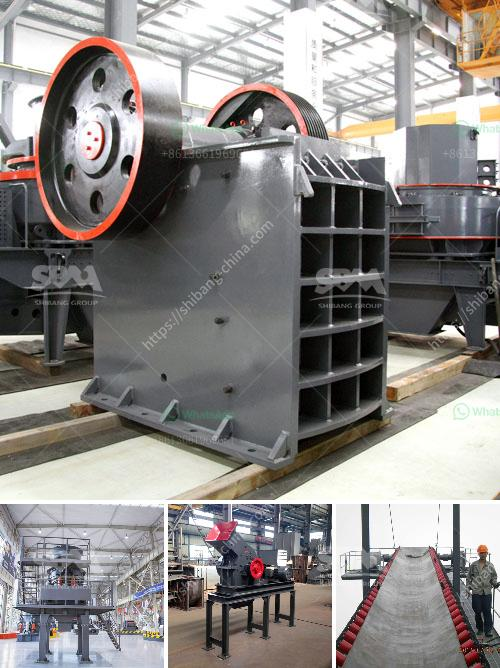

<h3>كسارة الفك bb 50 من ريتش</h3>
تعتبر كسارة الفك BB 50 من ريتش أحد الأجهزة الهامة في مجال الهندسة الميكانيكية وصناعة المعادن. تم تصميم هذا الجهاز خصيصًا لسحق الأحجار والخامات الصلبة بفعالية عالية وسهولة.

تتميز كسارة الفك BB 50 بحجمها الصغير ووزنها الخفيف، مما يجعلها محمولة ومرنة في الاستخدام. يمكن استخدامها في المعامل وورش العمل وحتى في مواقع البناء. تحتوي الكسارة على فكين يتحركان معًا لسحق المواد، وتتميز بقوة ضغط عالية وكفاءة عملية ممتازة.

تعمل كسارة الفك BB 50 بسهولة وسلاسة. يتم تشغيلها بواسطة محرك كهربائي قوي يوفر القوة اللازمة لسحق المواد. تحتوي الكسارة أيضًا على شبكة تنقية تساعد في فصل المواد الصغيرة والكبيرة، مما يسهم في الحفاظ على جودة المنتج النهائي.

تتميز كسارة الفك BB 50 بتصميمها المبتكر والعملي. تتميز بسهولة الصيانة والتنظيف، ويمكن فتح الكسارة بسهولة لتغيير الفكين أو تنظيف المكونات الداخلية. كما أنها تأتي مع مجموعة متنوعة من الفكين المختلفة، مما يسمح بتكييف العملية وفقًا لمتطلبات الإنتاج المختلفة.

بالإضافة إلى ذلك، توفر كسارة الفك BB 50 أداءً عاليًا ونتائج دقيقة. يتم تحقيق نتائج السحق المثلى بفضل آلية التحكم في الحجم الكبيرة، مما يسمح بضبط حجم الفتحة وتنظيم عملية السحق بشكل دقيق.

في الختام، تعتبر كسارة الفك BB 50 من ريتش جهازًا قويًا وفعالًا لسحق الأحجار والخامات الصلبة. تتميز بتصميمها المحمول والعملي، وتوفر أداءً ممتازًا ونتائج دقيقة. إن استخدام هذا الجهاز سيسهم بشكل كبير في تسريع وتحسين عملية سحق المواد في مجالات مختلفة.
<h3>Contact us</h3><ul><li><strong>Whatsapp:&nbsp;<a href="https://wa.me/8613661969651">+8613661969651</a></strong></li><li><a href="https://swt.shibang-china.com/?git&amp;zhl&amp;كسارة الفك bb 50 من ريتش"><strong>Online Service(chat now)</strong></a></li></ul><h3>Related</h3><ul><li><a href='مصنع كسارة للفحم.md'>مصنع كسارة للفحم</a></li><li><a href='رسم لآلات غسل الرمل كسارة مطحنة.md'>رسم لآلات غسل الرمل كسارة مطحنة</a></li><li><a href='موردين مطاحن الكرة في جنوب أفريقيا.md'>موردين مطاحن الكرة في جنوب أفريقيا</a></li><li><a href='شركة تصنيع كسارة الحصى.md'>شركة تصنيع كسارة الحصى</a></li><li><a href='كسارة الحجر غانا.md'>كسارة الحجر غانا</a></li></ul>