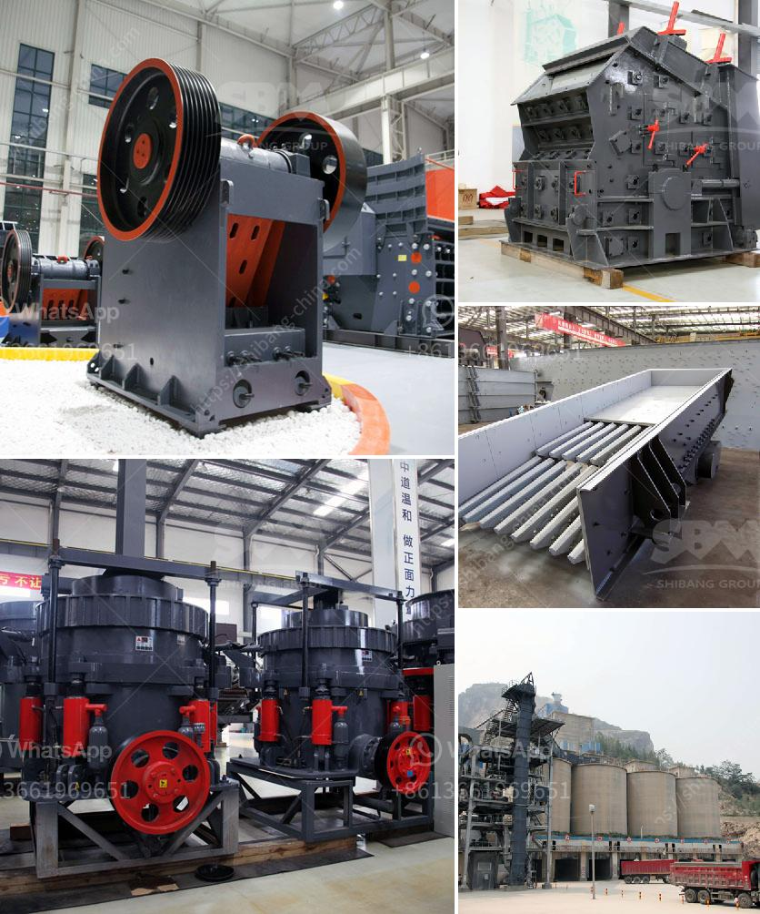

<h3>كسارة الفك الجديدة من نوع زينيث</h3>
تعد الكسارة الفكية الجديدة من نوع زينيث من الآلات الحديثة التي تستخدم في صناعة التعدين ومعالجة المواد الصلبة. تصمم هذه الكسارة الفكية بشكل فريد لتحقيق أداء ممتاز وكفاءة عالية في عملية التكسير.

تتميز الكسارة الفكية الجديدة بعدة ميزات رئيسية تجعلها تبرز في سوق الكسارات. فأولاً وقبل كل شيء، تأتي هذه الكسارة الفكية بنظام تشحيم مركزي متطور يضمن تشغيل سلس وقوة تحمل عالية للمحامل وعمر خدمة طويل. كما أنها مجهزة بنظام إزالة الغبار الفعال الذي يقلل بشكل كبير من انبعاث الأتربة وتلوث البيئة.

توفر الكسارة الفكية الجديدة مجموعة واسعة من السعات لتلبية احتياجات العملاء المختلفة. حيث تتوفر بسعات تتراوح بين 200 و 400 طن في الساعة. هذا يسمح للعملاء بتحقيق أقصى استفادة من عمليات التكسير وتحسين الإنتاجية.

تم تطوير هذه الكسارة الفكية الجديدة بتصميم فريد يضمن أداءً ممتازًا في عملية التكسير. فهي مجهزة بفتحة تغذية كبيرة تتيح تغذية المواد الكبيرة بسهولة، مما يقلل من الحاجة إلى عمليات التكسير المتكررة. كما أنها تعمل بنظام ضغط هيدروليكي قوي يمكن ضبطه بسهولة لتحقيق حجم التكسير المطلوب.

من الجدير بالذكر أن الكسارة الفكية الجديدة من نوع زينيث تستخدم تقنية متطورة في تصميم الفك المتحرك والفك الثابت. هذا التصميم المحسّن يسهم في توزيع الضغط بشكل متساوٍ على المواد المكسرة، مما يقلل من تآكل الأسطح ويزيد من عمر الخدمة.

في الختام، تُعد الكسارة الفكية الجديدة من نوع زينيث خيارًا مثاليًا لعمليات التكسير الثقيلة في صناعة التعدين. فهي تجمع بين الأداء الممتاز والفعالية العالية في استخدام الوقود، مما يساهم في تحقيق أقصى قدر من الإنتاجية وتحقيق معايير الجودة العالية. إذا كنت تبحث عن الكفاءة والموثوقية في عمليات التكسير، فإن الكسارة الفكية الجديدة من نوع زينيث هي الحل المثالي لك.
<h3>Contact us</h3><ul><li><strong>Whatsapp:&nbsp;<a href="https://wa.me/8613661969651">+8613661969651</a></strong></li><li><a href="https://swt.shibang-china.com/?git&amp;zhl&amp;كسارة الفك الجديدة من نوع زينيث"><strong>Online Service(chat now)</strong></a></li></ul><h3>Related</h3><ul><li><a href='شركة تصنيع كرات الكرة في مومباي.md'>شركة تصنيع كرات الكرة في مومباي</a></li><li><a href='مطحنة كبيرة القدرة في ماليزيا.md'>مطحنة كبيرة القدرة في ماليزيا</a></li><li><a href='كسارات محمولة في السعودية.md'>كسارات محمولة في السعودية</a></li><li><a href='حجم كسارة الفك pe 600x900.md'>حجم كسارة الفك pe 600x900</a></li><li><a href='شاشة اهتزاز للشبكة 14 شاشة اهتزاز.md'>شاشة اهتزاز للشبكة 14 شاشة اهتزاز</a></li></ul>