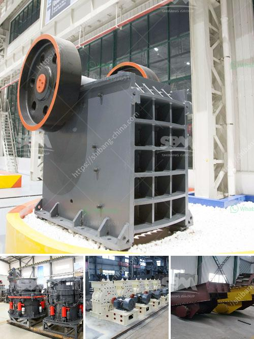

<h3>كسارة الفك الجرانيت</h3>
تعد كسارة الفك الجرانيت أحد المعدات الهامة والفعالة في صناعة تكسير وسحق الصخور الصلبة مثل الجرانيت. تستخدم هذه المعدة عادة في عمليات التعدين والإنشاءات وصناعة البناء.

تتميز كسارة الفك الجرانيت بعدة مميزات تجعلها اختيارًا مناسبًا لتكسير الجرانيت. أولاً، تتميز بقوتها العالية وقدرتها على مقاومة الضغوط العالية. فهي تتألف من جاوِزَيْن متوازيين، يقوم أحدهما بالتحرك نحو الأمام والخلف لضغط الصخرة وتكسيرها، بينما يكون الجاوِزُ الآخر ثابتًا. تعمل هذه الآلية على تحويل الجهد الميكانيكي إلى طاقة تكسير فعالة.

ثانيًا، توفر كسارة الفك الجرانيت أداءً موثوقًا واستهلاكًا منخفضًا للطاقة. فهي مصممة بشكل متقدم لتعمل بكفاءة عالية وتحتاج إلى طاقة أقل لتشغيلها. يتم تحسين تصميمها لضمان عمر أطول وتجنب حدوث أعطال مفاجئة.

بفضل قدرتها على تكسير الجرانيت بشكل فعال، تُستخدم كسارة الفك الجرانيت في العديد من التطبيقات الصناعية والإنشائية. ففي صناعة التعدين، يتم استخدامها لتكسير الجرانيت الذي يحتوي على المعادن القيمة مثل الذهب والنحاس.

أيضًا، يمكن استخدامها في صناعة البناء والإنشاءات لتكسير الجرانيت وتحويله إلى حصى ورمل. فتلك المواد الناتجة يمكن استخدامها في تشييد الطرق والمباني، وإعادة استخدامها في الأعمال الإنشائية الأخرى.

باختصار، تعد كسارة الفك الجرانيت أداة فعالة وفعالة من حيث التكلفة لتكسير وسحق الجرانيت. تتميز بأداء موثوق واستهلاك طاقة منخفض، كما توفر كفاءة عالية في عمليات التكسير والفحص. فهي تلبي احتياجات العديد من الصناعات والقطاعات مما يجعلها أداة أساسية في صناعة البناء والإنشاءات.
<h3>Contact us</h3><ul><li><strong>Whatsapp:&nbsp;<a href="https://wa.me/8613661969651">+8613661969651</a></strong></li><li><a href="https://swt.shibang-china.com/?git&amp;zhl&amp;كسارة الفك الجرانيت"><strong>Online Service(chat now)</strong></a></li></ul><h3>Related</h3><ul><li><a href='أسعار الشاشات الاهتزازية.md'>أسعار الشاشات الاهتزازية</a></li><li><a href='شركات آلات مصنع الأسمنت في كويمباتور.md'>شركات آلات مصنع الأسمنت في كويمباتور</a></li><li><a href='محطة كسارة محمولة من الهند.md'>محطة كسارة محمولة من الهند</a></li><li><a href='إنشاء محجر في نيجيريا.md'>إنشاء محجر في نيجيريا</a></li><li><a href='وكيل كسارة الفك في كينيا.md'>وكيل كسارة الفك في كينيا</a></li></ul>