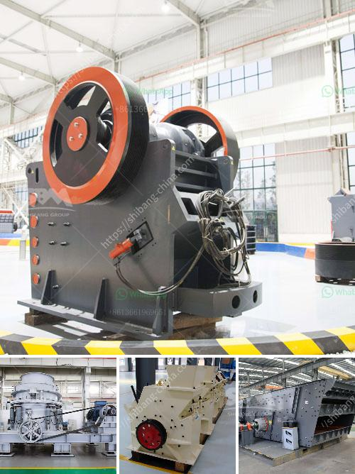

<h3>كسارة الفك الخرسانية</h3>
تعد كسارة الفك الخرسانية أحد الآلات الهامة في صناعة البناء والهدم. تستخدم هذه الكسارة لسحق الخرسانة إلى جزيئات صغيرة تستخدم في إعادة استخدامها في بناء مواد جديدة، مما يساهم في تقليل النفايات والحفاظ على الموارد الطبيعية.

تتميز كسارة الفك الخرسانية بعدة ميزات رئيسية. أولاً، فإنها تعمل بإزالة الخرسانة بطريقة فعالة وسريعة. فقط بعد توجيه الخرسانة إلى الكسارة، يتم سحقها وتحويلها إلى حجارة صغيرة يمكن التخلص منها بسهولة. ثانياً، فإن الكسارة تتمتع بمرونة وقابلية للتحرك. يمكن نقلها بسهولة إلى مواقع البناء المختلفة واستخدامها على نطاق واسع، مما يقلل من تكاليف النقل ويحسن الكفاءة.

يوفر استخدام كسارة الفك الخرسانية العديد من الفوائد الاقتصادية والبيئية. على الصعيد الاقتصادي، تقلل الكسارة من تكلفة شراء الركام الجديد، بحيث يمكن إعادة استخدام الخرسانة المكسورة في بناء مواد جديدة. هذا يوفر المال ويقلل من التبذير. من الناحية البيئية، يقلل استخدام الكسارة من كمية النفايات التي يتم إرسالها إلى المكبات العامة. ذلك لأن الخرسانة المكسورة يمكن استخدامها لإعادة تدويرها في مشاريع أخرى، مما يقلل من الحاجة إلى استخدام المصادر الطبيعية.

بصفة عامة، تعد كسارة الفك الخرسانية أداة هامة في صناعة البناء والهدم. توفر هذه الآلة فرصًا ممتازة لإعادة تدوير المواد وتحسين الاستدامة. يجب الاستفادة من فوائدها الاقتصادية والبيئية من خلال استخدامها بشكل واسع في مشاريع البناء والهدم المختلفة. على المستوى العالمي، يجب تشجيع استخدام هذه الطريقة لتقليل النفايات والحفاظ على الموارد الطبيعية للأجيال القادمة.
<h3>Contact us</h3><ul><li><strong>Whatsapp:&nbsp;<a href="https://wa.me/8613661969651">+8613661969651</a></strong></li><li><a href="https://swt.shibang-china.com/?git&amp;zhl&amp;كسارة الفك الخرسانية"><strong>Online Service(chat now)</strong></a></li></ul><h3>Related</h3><ul><li><a href='كسارة الفك والشاشة بتنسيق PDF.md'>كسارة الفك والشاشة بتنسيق PDF</a></li><li><a href='كيفية بدء عمل في مجال صناعة الكتل الخرسانية.md'>كيفية بدء عمل في مجال صناعة الكتل الخرسانية</a></li><li><a href='حساب دورة في الدقيقة التشغيلية لمطحنة الكرة.md'>حساب دورة في الدقيقة التشغيلية لمطحنة الكرة</a></li><li><a href='أنواع الجبس.md'>أنواع الجبس</a></li><li><a href='جهاز كسر الصخور في جنوب أفريقيا.md'>جهاز كسر الصخور في جنوب أفريقيا</a></li></ul>