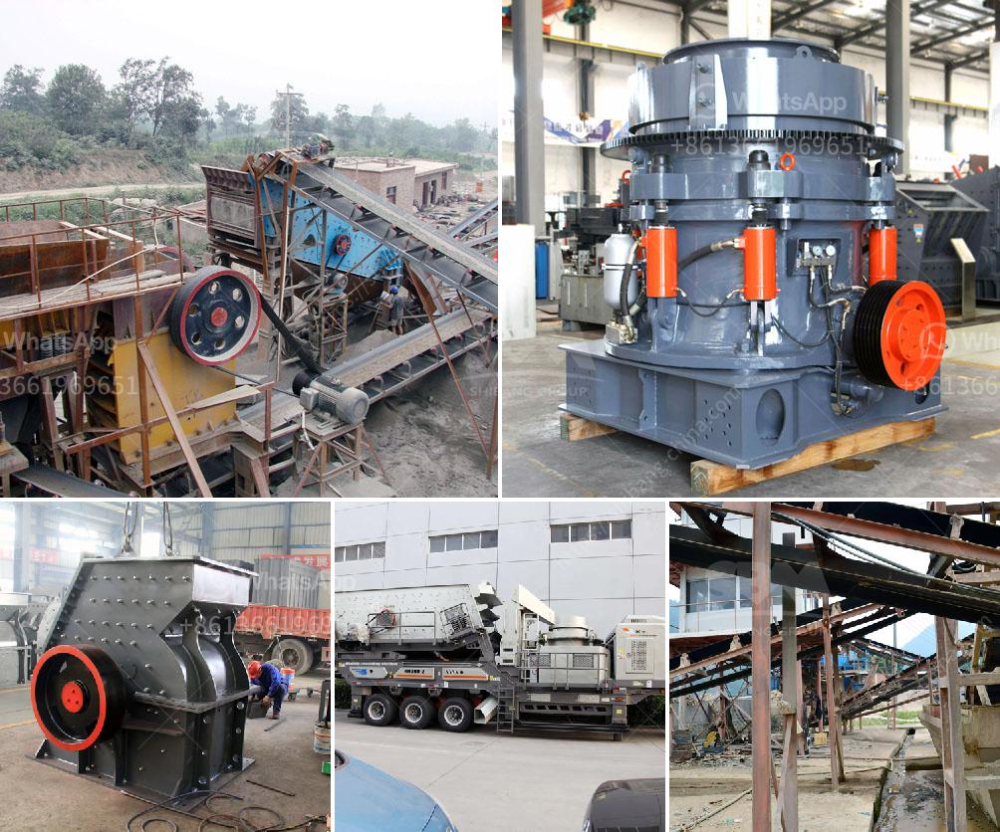

<h3>كسارة الفك المحمولة في غرب أفريقيا تجار</h3>
تعد كسارة الفك المحمولة من التكنولوجيات الحديثة التي ظهرت في قطاع التعدين والبناء في العقود الماضية، حيث تمثل حلاً مثاليًا للتعامل مع الصخور والمواد الصلبة الأخرى في أماكن البناء والتعدين التي يصعب الوصول إليها. وفي غرب أفريقيا، يعتبر هذا الجهاز أداة أساسية لتجار البناء والمقاولين الذين يعملون في المناطق النائية حيث يتعذر الوصول إلى معدات الكسارة الثابتة.

إن الكسارة الفكية المحمولة تتميز بقدرتها على سحق الصخور والحجارة الكبيرة إلى مواد أصغر الحجم دون الحاجة إلى نقلها إلى موقع آخر. يستخدم التكسير بواسطة الكسارة الفكية المحمولة لتوفير الوقت والجهد اللازمين لنقل المواد من موقع إلى آخر. ففي الماضي، كان التكسير يتم بواسطة الكسارات الثابتة وذلك بنقل المواد إلى موقع الكسارة ليتم تكسيرها ومن ثم نقلها إلى الموقع المراد استخدامها فيه. وهذا كان يحتاج إلى الكثير من الوقت والطاقة والمال.

تتميز كسارة الفك المحمولة بأنها سهلة التركيب والاستخدام، كما أنها تستخدم محركًا كهربائيًا يشغله الديزل أو البنزين. وبفضل هذه الميزات، فإن تجار البناء والمقاولين يستفيدون من الكسارة الفكية المحمولة، حيث يمكنهم استخدامها في العديد من التطبيقات مثل تكسير الأحجار والأحجار المعدنية والخرسانة القاسية والطوب والقواعد والأسفلت والكثير من المواد الأخرى.

علاوة على ذلك، فإن ميزة كبيرة للكسارة الفكية المحمولة هي تنقلها السهل والسريع. فبفضل العجلات المثبتة على الجهاز، يمكن نقلها بسهولة من موقع إلى آخر، حتى في الطرق الوعرة في الأماكن النائية. وهذا يوفر التنقل السريع بين المواقع ويسهل العمل في البيئات الصعبة.

في غرب أفريقيا، حيث تكثر المناطق النائية والبُعد عن مرافق البناء، أصبحت الكسارة الفكية المحمولة ضرورية جدًا لتجار البناء والمقاولين الذين يستخدمونها لتكسير الصخور والمواد الأخرى وإعادة استخدامها في بناء المباني والبنية التحتية المختلفة.

وبهذا الشكل، يمكن القول بأن كسارة الفك المحمولة تلعب دورًا حيويًا في صناعة البناء والتعدين في غرب أفريقيا. إنها تجعل العملية أسرع وأكثر سهولة، كما أنها تساهم في تقليل التكاليف وتوفير الموارد. لذا، فإن استخدام الكسارة الفكية المحمولة يجب أن يكون من بين الخيارات الأولى التي ينظر إليها عند البدء بمشاريع البناء أو التعدين في غرب أفريقيا.
<h3>Contact us</h3><ul><li><strong>Whatsapp:&nbsp;<a href="https://wa.me/8613661969651">+8613661969651</a></strong></li><li><a href="https://swt.shibang-china.com/?git&amp;zhl&amp;كسارة الفك المحمولة في غرب أفريقيا تجار"><strong>Online Service(chat now)</strong></a></li></ul><h3>Related</h3><ul><li><a href='معدات لإنتاج الحجر الطبيعي.md'>معدات لإنتاج الحجر الطبيعي</a></li><li><a href='كوماتسو بي آر كسارة للبيع.md'>كوماتسو بي آر كسارة للبيع</a></li><li><a href='آلات تكسير وفرز.md'>آلات تكسير وفرز</a></li><li><a href='تصنيع محطم المحمولة في ألمانيا.md'>تصنيع محطم المحمولة في ألمانيا</a></li><li><a href='أسعار كسارات الفك في جنوب أفريقيا.md'>أسعار كسارات الفك في جنوب أفريقيا</a></li></ul>