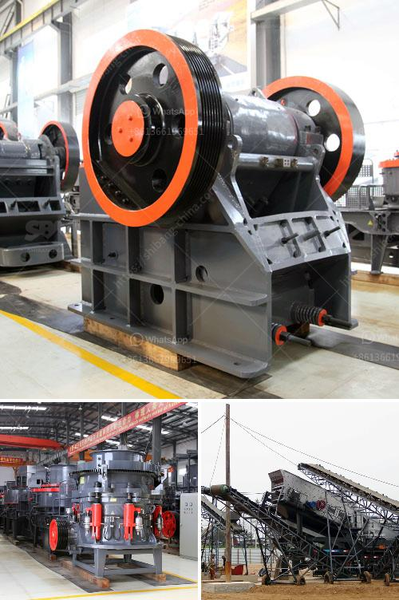

<h3>كسارة الفك المحمولة في ماليزيا</h3>
تعد كسارة الفك المحمولة من المعدات الحديثة التي تستخدم في صناعة التعدين وبناء الطرق. واحدة من الأمثلة البارزة لهذا النوع من المعدات هي كسارة الفك المحمولة في ماليزيا. تتميز هذه الكسارة بقدرتها على التحرك بين المواقع بسهولة ولديها القدرة على سحق الصخور والأحجار الكبيرة بفعالية.

يتكون الجزء الأساسي من كسارة الفك المحمولة من الفك الثابت والفك المتحرك. يتم استخدام الفك الثابت للضغط على المواد المراد سحقها ، بينما يتم استخدام الفك المتحرك لسحق المواد وتفريغها. يعمل نظام التشغيل المحكم والقوي بشكل جيد في تحقيق الكفاءة العالية وجعل عملية السحق أكثر سلاسة.

تتميز كسارة الفك المحمولة في ماليزيا بوزنها الخفيف وحجمها الصغير ، مما يجعلها مريحة للتنقل بين المواقع المختلفة. يمكن تزويد الكسارة بمحرك كهربائي أو بمحرك ديزل ، مما يجعلها قابلة للاستخدام في المناطق حيث لا تتوفر الكهرباء بسهولة.

تتميز كسارة الفك المحمولة في ماليزيا بقدرتها على سحق جميع أنواع المواد مثل الحجر الجيري والصخور الصلبة والخامات المعدنية. كما انها تعتبر خيارًا مثاليًا للمقاولين الذين يحتاجون إلى سحق المواد في الموقع ونقلها لاحقًا.

تأتي كسارة الفك المحمولة مع مجموعة متنوعة من المزايا والمواصفات التقنية. تحتوي الكسارة على محطة تكسير متنقلة مجهزة بناقلة مغناطيسية ونظام فحص. هذا يساعد على إزالة المواد الغريبة والمعدنية غير المرغوب فيها قبل العملية ، وبالتالي تحسين جودة الانتاج.

باستخدام كسارة الفك المحمولة في ماليزيا ، يمكن للشركات توفير تكاليف النقل والتشغيل ، والعمل بها بكفاءة عالية. بالإضافة إلى ذلك ، تعتبر الكسارة أداة مستدامة للبيئة بفضل استخدامها للطاقة الكهربائية أو الديزل.

في الختام ، تلعب كسارة الفك المحمولة دورًا حاسمًا في صناعة التعدين وبناء الطرق في ماليزيا. توفر هذه الكسارة القوية والفعالة طريقة مرنة لسحق المواد ونقلها. من المتوقع أن يزداد الاعتماد على هذا النوع من المعدات في المستقبل مع تطور صناعة التعدين والبناء.
<h3>Contact us</h3><ul><li><strong>Whatsapp:&nbsp;<a href="https://wa.me/8613661969651">+8613661969651</a></strong></li><li><a href="https://swt.shibang-china.com/?git&amp;zhl&amp;كسارة الفك المحمولة في ماليزيا"><strong>Online Service(chat now)</strong></a></li></ul><h3>Related</h3><ul><li><a href='مطحنة المطرقة لتركيز السعر.md'>مطحنة المطرقة لتركيز السعر</a></li><li><a href='آلة غسيل الرمل للبيع في سريلانكا.md'>آلة غسيل الرمل للبيع في سريلانكا</a></li><li><a href='للحصول على تصريح كسارة في الفلبين.md'>للحصول على تصريح كسارة في الفلبين</a></li><li><a href='شاشة اهتزازية للبيع في الفلبين.md'>شاشة اهتزازية للبيع في الفلبين</a></li><li><a href='مطحنة هامر للأسمنت.md'>مطحنة هامر للأسمنت</a></li></ul>