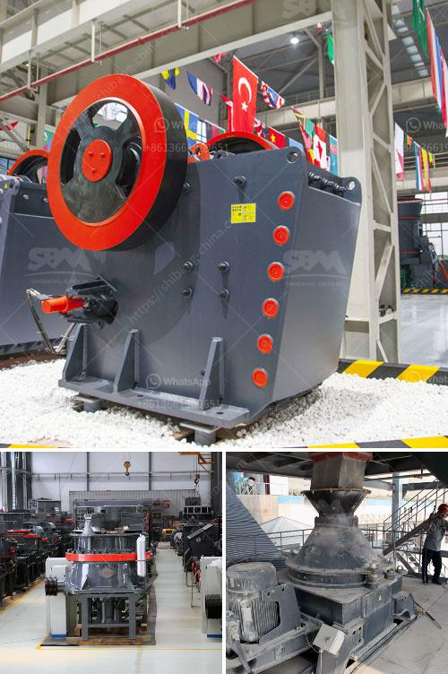

<h3>كسارة الفك المزدوجة بسعة 10 طن في الساعة</h3>
تُعد كسارة الفك المزدوجة واحدة من أكثر الأدوات فعالية في مجال صناعة التعدين ومحاجر الحجارة. تعمل هذه الكسارة على سحق المواد الصلبة بسحقها بين فكيها المتحركين، مما يجعلها منتجًا مرغوبًا فيه في العديد من الصناعات.

كسارة الفك المزدوجة تتميز بقدرتها على سحق المواد الخام بكفاءة عالية، حيث تتميز بتصميم فريد يسمح بسحق المواد بكميات كبيرة في وقت قصير. تتراوح سعة هذه الكسارة عادةً بين 10 إلى 1000 طن في الساعة، بناءً على احتياجات العميل. يتم تصنيع كسارات الفك المزدوجة بشكل عام من مواد قوية مثل الفولاذ عالي الجودة، مما يمنحها المتانة والقوة لمواجهة الاستخدام المستمر وصعوبات العمل.

تعتبر كسارة الفك المزدوجة تقنية متقدمة في صناعة التكسير، حيث تمكن المستخدمين من سحق المواد الخام بطريقة فعالة وتحقيق أداء عالي. تتميز بفتحة التغذية الكبيرة، مما يسمح بمرور المواد الكبيرة إلى داخل الكسارة والحد من حجم المادة المطروحة بعد السحق. كما تتميز الكسارة بتعديل سهل لحجم السحق المطلوب، حيث يمكن ضبطه بسهولة باستخدام مثبت سحق الأكوام.

إضافةً إلى ذلك، يمكن لكسارة الفك المزدوجة معالجة مجموعة متنوعة من المواد، بما في ذلك الحجر الجيري والجرانيت والرخام والحصى والخامات المعدنية الأخرى. تعمل سرعة وقوة الكسارة على سحق تلك المواد بشكل فعال، مما يجعلها مناسبة للاستخدام في عدة صناعات مثل صناعة البناء والتعدين والتشييد.

أخيرًا، يجب أن نلاحظ أن سعر وأداء كسارة الفك المزدوجة يمكن أن يختلف بناءً على عدة عوامل مثل الطراز والشركة المصنعة ودولة الصنع وقوة المحرك وغيرها. يعتبر سعر الكسارة ومتطلباتها التشغيلية عاملًا حاسمًا في اتخاذ قرار الشراء.

باختصار، تعتبر كسارة الفك المزدوجة بسعة 10 طن في الساعة أداة قوية وفعالة لسحق المواد الصلبة بكفاءة وسرعة. تحقق هذه الكسارة أداءًا عاليًا في صناعة التعدين والبناء، وتعد حلاً مثاليًا لتلبية احتياجاتك في عملية التكسير.
<h3>Contact us</h3><ul><li><strong>Whatsapp:&nbsp;<a href="https://wa.me/8613661969651">+8613661969651</a></strong></li><li><a href="https://swt.shibang-china.com/?git&amp;zhl&amp;كسارة الفك المزدوجة بسعة 10 طن في الساعة"><strong>Online Service(chat now)</strong></a></li></ul><h3>Related</h3><ul><li><a href='مطحنة رطبة في الصين.md'>مطحنة رطبة في الصين</a></li><li><a href='سعر كسارة الفك في جنوب أفريقيا.md'>سعر كسارة الفك في جنوب أفريقيا</a></li><li><a href='معدات كسارة الحجر.md'>معدات كسارة الحجر</a></li><li><a href='مورد سيور ناقلة للفحم من الهند.md'>مورد سيور ناقلة للفحم من الهند</a></li><li><a href='مخطط تدفق التعدين ومعالجة المعادن للنيكل.md'>مخطط تدفق التعدين ومعالجة المعادن للنيكل</a></li></ul>