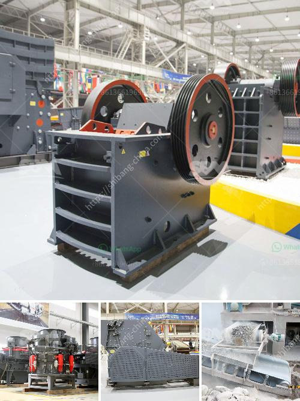

<h3>كسارة الفك بالديزل sp 60x100</h3>
تعتبر كسارة الفك بالديزل SP 60x100 أحد التجهيزات المهمة في صناعة التعدين والبناء. وتستخدم هذه الكسارة لسحق المواد الخام الكبيرة وتحويلها إلى قطع صغيرة قابلة للتعامل والاستخدام.

تتميز كسارة الفك بالديزل SP 60x100 بقدرتها الهائلة على سحق المواد الصلبة مثل الحجر والخرسانة والإسفلت والزجاج. تعمل الكسارة بواسطة محرك ديزل قوي يضمن تشغيلها بكفاءة عالية وقدرة كبيرة على السحق.

بفضل تصميمها المدمج والقوي ، يمكن نقل كسارة الفك بالديزل SP 60x100 بسهولة إلى الموقع المطلوب. وهذا يجعلها مثالية للاستخدام في المشروعات الكبيرة مثل الطرق والجسور والمحاجر.

تحتوي كسارة الفك بالديزل SP 60x100 على فك قوي ومحور دوار يعملان معًا لسحق المواد الخام بفعالية عالية. تحتوي الكسارة أيضًا على نظام ضبط الفجوة يسمح بتعديل حجم المخرج وفقًا لاحتياجات المستخدم.

بالنظر إلى المميزات المذكورة ، يمكن القول إن كسارة الفك بالديزل SP 60x100 هي آلة فعالة وموثوقة يمكنها تلبية احتياجات أي مشروع تعدين أو بناء. تتعامل هذه الكسارة مع مجموعة متنوعة من المواد وتساعد في تحقيق هدف سحق المواد الخام بكفاءة واقتصادية.

باختصار ، كسارة الفك بالديزل SP 60x100 هي وسيلة فعالة وقوية لسحق المواد الخام في صناعة التعدين والبناء. تعتبر مثالية للاستخدام في المشروعات الكبيرة وتوفر قدرة كبيرة على السحق وقدرة تنقل سهلة إلى الموقع المطلوب. إذا كنت تبحث عن جهاز قوي وفعال يمكنه سحق المواد الخام بكفاءة عالية ، فإن كسارة الفك بالديزل SP 60x100 هي الخيار المثالي لك.
<h3>Contact us</h3><ul><li><strong>Whatsapp:&nbsp;<a href="https://wa.me/8613661969651">+8613661969651</a></strong></li><li><a href="https://swt.shibang-china.com/?git&amp;zhl&amp;كسارة الفك بالديزل sp 60x100"><strong>Online Service(chat now)</strong></a></li></ul><h3>Related</h3><ul><li><a href='سعر كسارة الزحف المتنقلة.md'>سعر كسارة الزحف المتنقلة</a></li><li><a href='كسارة الحجر الهامر.md'>كسارة الحجر الهامر</a></li><li><a href='كسارة مخروط في أمريكا.md'>كسارة مخروط في أمريكا</a></li><li><a href='تعليم مطحنة الكرة.md'>تعليم مطحنة الكرة</a></li><li><a href='كسارة الفك تركيا.md'>كسارة الفك تركيا</a></li></ul>