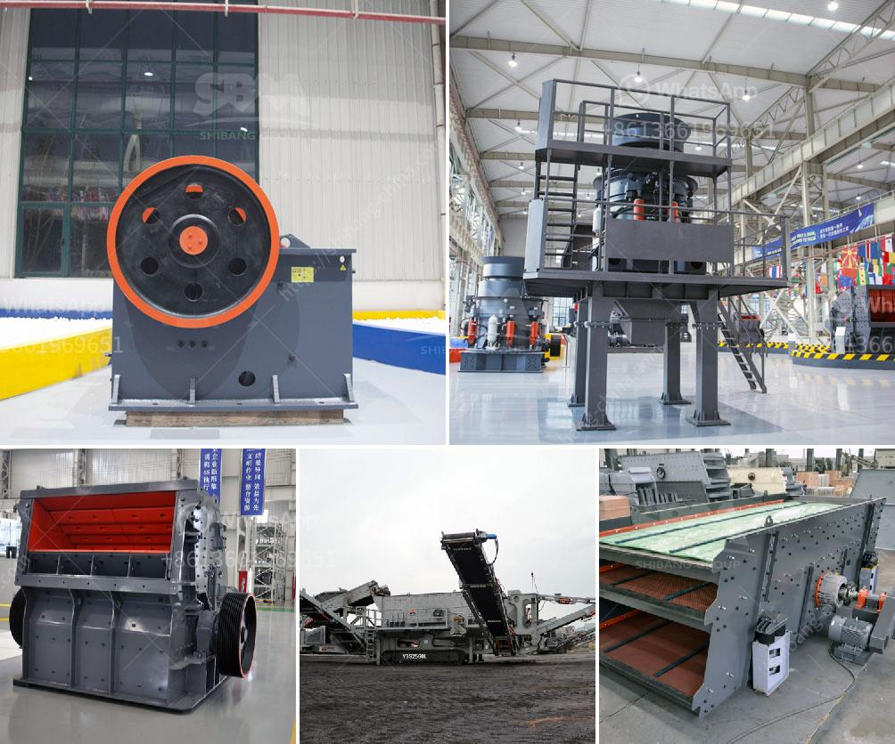

<h3>كسارة الفك تركيا</h3>
تعد كسارة الفك تركيا واحدة من أهم الأدوات التي تستخدم في صناعة التعدين والبناء. فهي تستخدم للتكسير الأولي والثانوي للمواد الصلبة ، مما يسهم في فتح المجال للاستخدامات الصناعية المتنوعة.

تتميز كسارة الفك ببنية بسيطة وموثوقة ، مما يجعل من السهل صيانتها وتشغيلها. تتكون الكسارة من جزء يسمى الفك الثابت وجزء يسمى الفك المتحرك. يتم وضع المادة المراد تكسيرها بين الفكين ، ومن ثم يتم تحريك الفك المتحرك لإسقاط المادة وتكسيرها بفعل القوة الواصلة إلى الفك الثابت.

تحظى كسارة الفك تركيا بشعبية كبيرة بسبب فوائدها المتعددة. فهي تستخدم لسحق مجموعة واسعة من المواد ، بما في ذلك الحجر الجيري والحصى والفحم والخامات المعدنية والرخام والجرانيت والبازلت والخرسانة المسلحة.

توفر كسارة الفك تركيا أداءً ممتازًا في عملية التكسير. فهي قادرة على تحقيق تكسير فعال وسريع ، مما يوفر الوقت والجهد للمشغلين. بالإضافة إلى ذلك ، فإنها تولد كمية قليلة من الغبار والضوضاء ، مما يحسن من ظروف العمل والصحة والسلامة للعمال.

تعد تركيا واحدة من أكبر منتجي كسارات الفك في العالم. فهي تقدم منتجات عالية الجودة بأسعار تنافسية. كما أنها تقدم خدمة ما بعد البيع الممتازة ، بما في ذلك التركيب والتدريب والصيانة.

من الواضح أن كسارة الفك تركيا تعد الحل المثالي للتكسير الفعال. فهي توفر أداءً ممتازًا وجودة عالية بأسعار مناسبة. إذا كنت تبحث عن طريقة فعالة لتكسير المواد الصلبة ، فإن كسارة الفك تركيا ستكون الخيار الأمثل بالتأكيد.
<h3>Contact us</h3><ul><li><strong>Whatsapp:&nbsp;<a href="https://wa.me/8613661969651">+8613661969651</a></strong></li><li><a href="https://swt.shibang-china.com/?git&amp;zhl&amp;كسارة الفك تركيا"><strong>Online Service(chat now)</strong></a></li></ul><h3>Related</h3><ul><li><a href='مصنع كسارة الحجر بسعة 100 طن.md'>مصنع كسارة الحجر بسعة 100 طن</a></li><li><a href='المعدات المطلوبة لتعدين الذهب على نطاق واسع.md'>المعدات المطلوبة لتعدين الذهب على نطاق واسع</a></li><li><a href='مطحنة نيجيريا.md'>مطحنة نيجيريا</a></li><li><a href='مطرقة فولاذية.md'>مطرقة فولاذية</a></li><li><a href='مطحنة صغيرة.md'>مطحنة صغيرة</a></li></ul>