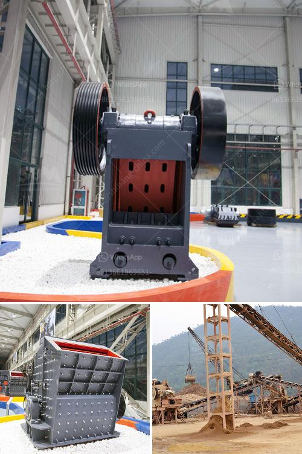

<h3>كسارة الفك تيرميناتور</h3>
يعد الحجر والصخور من المواد الصلبة التي يصعب تحطيمها وتكسيرها، وتستخدم عادة في العديد من الصناعات مثل صناعة البناء والتعدين. ومن أجل تحقيق هذا الهدف، تم تطوير العديد من الأدوات والآلات الثقيلة المستخدمة في مجال تكسير الحجارة، ومن ضمن هذه الآلات تقنية الكسارة الفك تيرميناتور.

تيرميناتور هو مصطلح يطلق على أحدث الكسارات التي تستخدم في صناعة تكسير الصخور. تم تصميم هذه التكنولوجيا المبتكرة لتكون قوية وفعالة في تحطيم الصخور بطريقة سريعة وفعالة. تمتاز كسارة الفك تيرميناتور بقدرتها العالية على تكسير الصخور الكبيرة والثقيلة، حيث يتم تشغيلها بواسطة محرك قوي يستطيع ضغط الصخور وكسرها بواسطة فكها القوي.

تعتمد كسارة الفك تيرميناتور على مبدأ العمل البسيط والفعال. يتم وضع الصخور التي ترغب في تكسيرها داخل الفك المتحرك والثابت، ومن ثم يتم تشغيل المحرك لتحريك الفك المتحرك للأعلى والأسفل مما يؤدي إلى تكسير الصخور بفضل القوة الضغطية الكبيرة التي تم تطبيقها من خلال الفك.

تتميز كسارة الفك تيرميناتور بعدة ميزات تجعلها الاختيار الأمثل للعديد من الشركات في صناعة التعدين والبناء. فمن أبرز هذه الميزات:

1- الكفاءة العالية: بفضل التكنولوجيا المستخدمة في تصميم الكسارة التيرميناتور، يمكنها تكسير الصخور بكفاءة عالية وبمعدل انتاجية كبيرة. وهذا يتيح للشركات تحسين عملياتها وزيادة الإنتاجية.

2- التحكم الدقيق: يمكن للعاملين التحكم في عمل الكسارة بسهولة ودقة من خلال لوحة التحكم المتاحة. يتيح ذلك ضبط القوة والسرعة المطلوبة لتحطيم الصخور بكفاءة عالية.

3- الصيانة السهلة: تم تصميم الكسارة بطريقة تسهل عمليات الصيانة والإصلاح. وهذا يعني أن الشركات لن تواجه صعوبة في صيانة الكسارات والاستمرار بتشغيلها لفترات طويلة دون توقف.

4- السلامة: تم اعتماد معايير السلامة العالية في تصميم الكسارة لضمان سلامة العاملين. وبفضل التحكم الدقيق والميزات الأمنية، يتم تقليل فرص حدوث حوادث العمل.

باختصار، تعتبر كسارة الفك تيرميناتور تكنولوجيا مبتكرة في مجال تكسير الصخور. تجمع بين الكفاءة العالية والصيانة السهلة والسلامة والتحكم الدقيق، مما يجعلها الاختيار المثالي للشركات التي تعمل في صناعة البناء والتعدين.
<h3>Contact us</h3><ul><li><strong>Whatsapp:&nbsp;<a href="https://wa.me/8613661969651">+8613661969651</a></strong></li><li><a href="https://swt.shibang-china.com/?git&amp;zhl&amp;كسارة الفك تيرميناتور"><strong>Online Service(chat now)</strong></a></li></ul><h3>Related</h3><ul><li><a href='مطحنة هامر للتركيز.md'>مطحنة هامر للتركيز</a></li><li><a href='كسارة تأثير VSI.md'>كسارة تأثير VSI</a></li><li><a href='كسارات محمولة في محجر جنوب أفريقيا.md'>كسارات محمولة في محجر جنوب أفريقيا</a></li><li><a href='آلة تكسير الحجر صنعت في باكستان.md'>آلة تكسير الحجر صنعت في باكستان</a></li><li><a href='خطة عمل عينية لكسارة الحجر في بوليفيا.md'>خطة عمل عينية لكسارة الحجر في بوليفيا</a></li></ul>