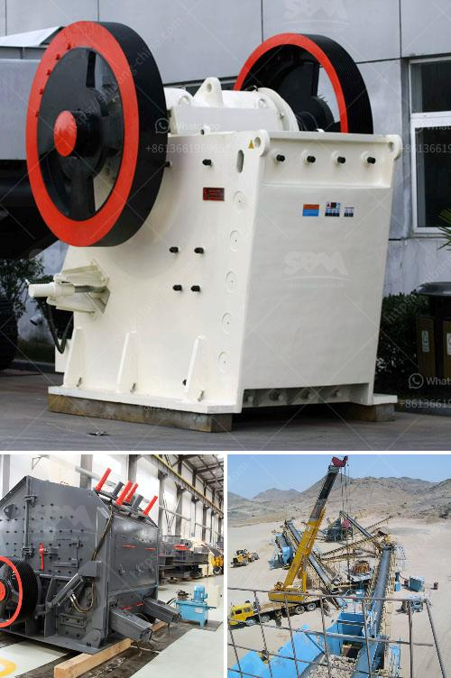

<h3>كسارة الفك فايما</h3>
تعتبر كسارة الفك فايما واحدة من أهم معدات التكسير المستخدمة في صناعة التعدين والبناء، وتستخدم لتكسير المواد الخام الكبيرة إلى قطع صغيرة قابلة للمعالجة. تتكون كسارة الفك فايما من جزئين رئيسيين، وهما الفك الثابت والفك المتحرك. تعمل الفك الثابت كنقطة تثبيت للمواد الخام، بينما يعمل الفك المتحرك على تحريك المواد الخام وتكسيرها بفعل القوة والضغط المستمرين.

تتمتع كسارة الفك فايما بعدة مزايا وفوائد. أولاً، فإنها تتميز بهيكل بسيط وموثوق به، مما يجعلها سهلة الصيانة والاستخدام. كما أنها تتميز بكفاءة عالية في عملية التكسير، مما يساهم في زيادة إنتاجية المصنع وتقليل تكاليف التشغيل. تتوفر كسارة الفك فايما بعدة أحجام وموديلات تناسب احتياجات العملاء المختلفة.

تتميز كسارة الفك فايما أيضًا بأداء ممتاز في تكسير المواد الصعبة والصلبة مثل الحجارة والخامات المعدنية. وبفضل قدرتها على تكسير المواد إلى حجم صغير جدًا، يتم تسهيل عمليات المعالجة اللاحقة، مثل الطحن والتحبيب. علاوة على ذلك، يمكن ضبط حجم الانتاج بسهولة عن طريق تعديل فتحة الخروج، مما يضمن الحصول على المنتج النهائي المطلوب.

بالإضافة إلى كل ذلك، فإن كسارة الفك فايما مصممة بشكل متقدم لتوفير سلامة العملاء والعمال. تحتوي على نظام حماية يمنع تلف الجهاز في حالة ارتفاع درجة الحرارة أو زيادة الضغط. كما تتميز بتصميم هادئ وخالي من الاهتزازات القوية، مما يضمن بيئة عمل هادئة ومريحة.

في الختام، يمكن القول إن كسارة الفك فايما هي عبارة عن معدات مهمة وفعالة في صناعة التعدين والبناء. توفر عدة مزايا وفوائد، مثل هيكل بسيط، كفاءة عالية، قدرة تكسير المواد الصعبة، سلامة العملاء والعمال، وسهولة الصيانة والاستخدام. تعد كسارة الفك فايما حلاً فعالاً لتكسير المواد الخام الكبيرة وتحويلها إلى قطع صغيرة وسهلة المعالجة.
<h3>Contact us</h3><ul><li><strong>Whatsapp:&nbsp;<a href="https://wa.me/8613661969651">+8613661969651</a></strong></li><li><a href="https://swt.shibang-china.com/?git&amp;zhl&amp;كسارة الفك فايما"><strong>Online Service(chat now)</strong></a></li></ul><h3>Related</h3><ul><li><a href='مصنع تحسين الكروميت في ماليزيا.md'>مصنع تحسين الكروميت في ماليزيا</a></li><li><a href='مطحنة طحن للكوارتز في الهند.md'>مطحنة طحن للكوارتز في الهند</a></li><li><a href='مصنع معدات تعدين الرخام.md'>مصنع معدات تعدين الرخام</a></li><li><a href='وحدة طحن الكلنكر الأسمنتي.md'>وحدة طحن الكلنكر الأسمنتي</a></li><li><a href='مصنع مطحنة ريموند في الهند.md'>مصنع مطحنة ريموند في الهند</a></li></ul>