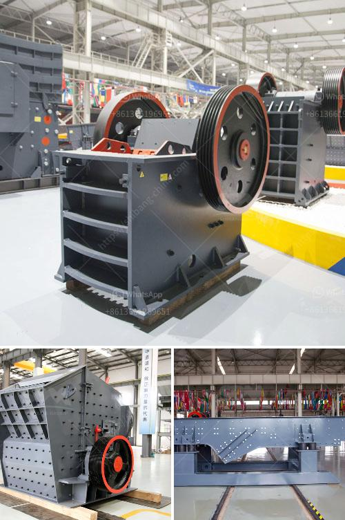

<h3>كسارة الفك في أوغندا</h3>
تعد كسارة الفك أحد أهم الآلات المستخدمة في صناعة التعدين والبناء، حيث تقوم بفرم المواد الخام لتحويلها إلى أحجام صغيرة مناسبة للاستخدام المستقبلي. وفي أوغندا، تعد كسارة الفك من الأدوات الهامة في هذه الصناعات.

تعتبر أوغندا، البلد الواقع في شرق أفريقيا، من المناطق الغنية بالموارد الطبيعية مثل المناجم والمحاجر. يتم استخراج العديد من المواد القيمة مثل المعادن والأحجار من هذه الأماكن، ويتم تكسيرها باستخدام كسارة الفك لاحقًا.

تتمتع كسارة الفك في أوغندا بعدة مزايا. أولاً، تتميز بالكفاءة والقدرة على التحمل في تكسير المواد الصلبة. يتم تصنيع الكسارة باستخدام مواد عالية الجودة وتكنولوجيا متقدمة، مما يضمن متانة الجهاز وقدرته على التعامل مع المواد الصعبة.

ثانيًا، تتميز كسارة الفك بالسرعة والتحكم الدقيق. تعمل الكسارة بواسطة محرك قوي يدفع الفك الثابت والفك المتحرك للأعلى والأسفل، مما يسمح بتكسير المواد بسرعة. كما يمكن ضبط حجم الناتج المراد الحصول عليه بدقة، مما يتيح التحكم الكامل في العملية.

وهناك العديد من التطبيقات لكسارة الفك في أوغندا. يتم استخدامها بشكل رئيسي في صناعة التعدين لتكسير المعادن مثل الذهب والماس والنحاس. كما يتم استخدامها في صناعة البناء لتكسير الصخور والأحجار الكبيرة لتحويلها إلى مواد أصغر.

ورغم أهمية كسارة الفك في أوغندا، إلا أن هذه الصناعة تواجه بعض التحديات. تشمل هذه التحديات قلة التمويل ونقص البنية التحتية. يعاني العديد من المستثمرين والعمال في هذا القطاع من صعوبة الحصول على التمويل اللازم لتطوير عمليات الإنتاج وتكنولوجيا المعدات. بالإضافة إلى ذلك، تفتقر البنية التحتية في بعض المناطق إلى الطرق الملائمة لنقل هذه المعدات الثقيلة.

باختصار، كسارة الفك تعتبر أداة أساسية في صناعة التعدين والبناء في أوغندا. وبفضل كفاءتها وقدرتها على التحمل والتحكم الدقيق، تستخدم الكسارة لتكسير المعادن والأحجار وتحويلها إلى أحجام أصغر ومناسبة للاستخدام العملي. وعلى الرغم من التحديات التي تواجهها هذه الصناعة في البلاد، إلا أن حاجة المجتمع للمواد الخام لا تتوقف، مما يجعل استخدام كسارة الفك ضروريًا لتلبية احتياجات التعدين والبناء.
<h3>Contact us</h3><ul><li><strong>Whatsapp:&nbsp;<a href="https://wa.me/8613661969651">+8613661969651</a></strong></li><li><a href="https://swt.shibang-china.com/?git&amp;zhl&amp;كسارة الفك في أوغندا"><strong>Online Service(chat now)</strong></a></li></ul><h3>Related</h3><ul><li><a href='مصنعي آلات المحجر.md'>مصنعي آلات المحجر</a></li><li><a href='أفضل علامات تجارية للآلات في المحجر.md'>أفضل علامات تجارية للآلات في المحجر</a></li><li><a href='البحث عن كسارة الحجر.md'>البحث عن كسارة الحجر</a></li><li><a href='سعة مطحنة الكرة 10 تف في ماليزيا.md'>سعة مطحنة الكرة 10 تف في ماليزيا</a></li><li><a href='الكسارة المحمولة ١٥٠ طن في الساعة.md'>الكسارة المحمولة ١٥٠ طن في الساعة</a></li></ul>