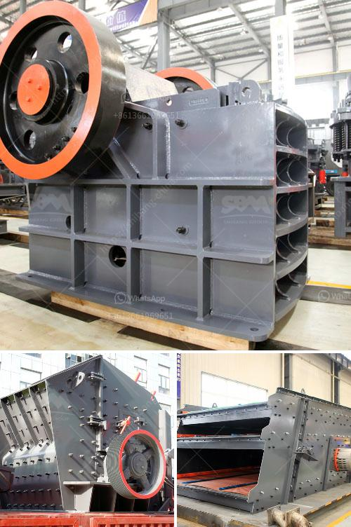

<h3>كسارة الفك في تايلاند</h3>
تعتبر كسارة الفك في تايلاند من الأدوات الهامة في صناعة التعدين ومعالجة المواد الخام. تستخدم هذه الكسارات لسحق الصخور والمعادن بطريقة فعالة لإنتاج مواد خام عالية الجودة.

تتكون كسارة الفك من جزء ثابت وجزء متحرك. يتحرك الجزء المتحرك لأعلى ولأسفل من خلال رمح غريب الأطوار، مما يسمح بإدخال الصخور المكسورة في الفك وسحقها بين الفك الثابت والمتحرك. تتوفر كسارات الفك في تايلاند بعدة أحجام وموديلات مع مجموعة متنوعة من قدرات الإنتاج.

توجد العديد من المزايا لاستخدام كسارة الفك في تايلاند. أولاً وقبل كل شيء، فهي قوية ومتينة، مما يجعلها قادرة على التعامل مع المواد الصلبة والمقاومة. تعتبر سهولة التشغيل والصيانة أيضًا واحدة من المزايا الهامة لهذه الكسارات. يمكن للمشغلين تشغيلها بشكل فعال وسهل دون الحاجة لخبرة كبيرة، مما يوفر وقتًا وجهودًا في عمليات الصيانة والإصلاح الروتينية.

تعتبر الكسارات الفك في تايلاند أيضًا ذات كفاءة عالية في الأداء. تمتاز بمعدل إنتاج عالٍ وتكسير فعال للصخور والمعادن. يتم تصميم هذه الكسارات بعناية لضمان تدفق مستمر وسريع للمواد الخام الداخلة والمنتجات النهائية الخارجة، مما يسهم في زيادة الإنتاجية وتحسين جودة المواد النهائية.

بالإضافة إلى ذلك، تتميز كسارات الفك في تايلاند بتوفيرها للطاقة. تم تصميم هذه الكسارات بأحدث التكنولوجيا لضمان تفوقها في الكفاءة الطاقوية. تم تجهيزها بمحركات قوية وفعالة في استهلاك الطاقة، مما يساهم في تقليل الفاقد وتوفير تكاليف التشغيل.

في النهاية، تُعتبر كسارة الفك في تايلاند أداة رئيسية في صناعة التعدين والمعالجة الصناعية. يُعتبر استخدامها جزءًا أساسيًا في خطوط الإنتاج للمواد الخام والمنتجات النهائية عالية الجودة. تتميز بسهولة التشغيل والصيانة والكفاءة العالية في الأداء، مما يجعلها خيارًا جيدًا للشركات والمشروعات التي تتطلب التعامل مع الصخور والمعادن بكفاءة.
<h3>Contact us</h3><ul><li><strong>Whatsapp:&nbsp;<a href="https://wa.me/8613661969651">+8613661969651</a></strong></li><li><a href="https://swt.shibang-china.com/?git&amp;zhl&amp;كسارة الفك في تايلاند"><strong>Online Service(chat now)</strong></a></li></ul><h3>Related</h3><ul><li><a href='صورة مطحنة رولر ريموند الموديل 30.md'>صورة مطحنة رولر ريموند الموديل 30</a></li><li><a href='فرق بين مطحنة ريموند وضغط عالي.md'>فرق بين مطحنة ريموند وضغط عالي</a></li><li><a href='موردين مطاحن الطحن في الصين.md'>موردين مطاحن الطحن في الصين</a></li><li><a href='كسارة متنقلة قابلة للنقل بسعة 200 طن.md'>كسارة متنقلة قابلة للنقل بسعة 200 طن</a></li><li><a href='كيفية اختيار كسارة مخروطية.md'>كيفية اختيار كسارة مخروطية</a></li></ul>