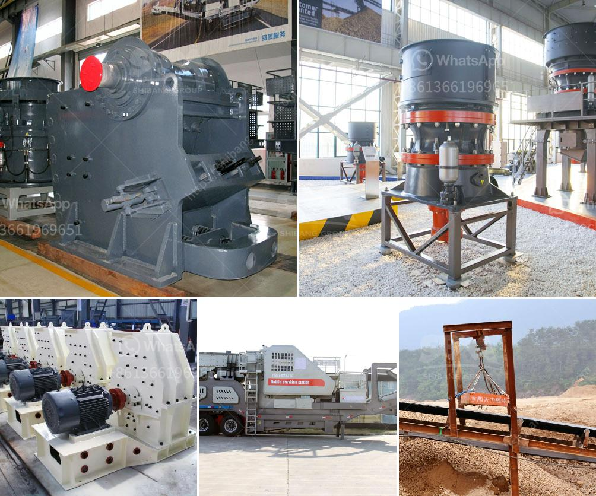

<h3>كسارة الفك في كينيا مصنعة</h3>
تعتبر كسارة الفك واحدة من أهم الأدوات في صناعة التعدين والبناء في جميع أنحاء العالم، وتستخدم بشكل واسع لسحق الصخور الكبيرة إلى حجم صغير أكثر مناسب للاستخدام في تشكيل المواد الأساسية والبناء. تعتبر كينيا واحدة من الدول التي تصنع كسارات الفك عالية الجودة بهدف دعم صناعة التعدين والبناء المحلية.

تعد صناعة التعدين والبناء من القطاعات الحيوية في كينيا، حيث تسهم في توفير فرص عمل ودخل للعديد من الشباب وتعزز التنمية الاقتصادية للبلاد. ومن أجل تحقيق أداء أفضل في هذه الصناعة، تحتاج الشركات والمشاريع إلى استخدام معدات عالية الجودة مثل كسارات الفك.

تصنع العديد من الشركات في كينيا كسارات الفك ذات الجودة العالية وذات التقنيات المتطورة، وتتوفر بمجموعة متنوعة من الأحجام والمواصفات لتناسب متطلبات العملاء المختلفة. تعتمد جودة كسارات الفك المصنعة في كينيا على الخامات المستخدمة في صنعها وعلى التكنولوجيا المستخدمة لتصميم وتصنيع الأجزاء الأساسية.

إحدى الشركات المصنعة لكسارات الفك في كينيا تؤكد على استخدامها للمواد الخام عالية الجودة وعلى توظيف فريق مؤهل من المهندسين والفنيين لتصميم وتصنيع الكسارات بأعلى مستويات الدقة والاتقان. تسعى هذه الشركة إلى تلبية متطلبات العملاء من خلال تقديم حلول مبتكرة وفعالة لأوجه الاحتياجات المختلفة في صناعة التعدين والبناء.

يوفر استخدام كسارات الفك في عمليات التعدين والبناء فوائد عديدة. فهي تقلل من تكلفة الإنتاج والوقت، حيث تستطيع كسارة الفك سحق الصخور بسرعة وسهولة بفضل تصميمها القوي وقدرتها على التكيف مع مختلف أنواع الصخور والمواد. كما تعطي هذه الكسارات دقة في الحجم النهائي للمواد المحطومة، مما يسهل الاستخدام في مشاريع البناء.

من الجدير بالذكر أن صناعة تصنيع الكسارات في كينيا تعزز التوجه نحو تطور صناعة التعدين المحلية وتحقق الاستدامة البيئية. فعند استخدام كسارات الفك، يمكن إعادة استخدام المواد المحطومة في عمليات أخرى، مما يقلل من الأثر البيئي الناتج عن استخراج المواد الخام.

لذا، يمكن القول إن كسارة الفك المصنعة في كينيا تلعب دورًا حاسمًا في تعزيز صناعة التعدين والبناء المحلية. تعمل هذه الكسارات على توفير مواد تصلح للاستخدام الفوري في البناء وتقليل تكلفة الإنتاج والوقت. ومن المتوقع أن تظل الطلبية على هذه الكسارات مستمرة في المستقبل المنظور، ما يسمح لصناعة التعدين والبناء في كينيا بالنمو المستدام والتطور المستمر.
<h3>Contact us</h3><ul><li><strong>Whatsapp:&nbsp;<a href="https://wa.me/8613661969651">+8613661969651</a></strong></li><li><a href="https://swt.shibang-china.com/?git&amp;zhl&amp;كسارة الفك في كينيا مصنعة"><strong>Online Service(chat now)</strong></a></li></ul><h3>Related</h3><ul><li><a href='موردين معدات سحق السيليكا.md'>موردين معدات سحق السيليكا</a></li><li><a href='سير الناقل في زامبيا.md'>سير الناقل في زامبيا</a></li><li><a href='آلة تكسير وطحن مناجم الذهب.md'>آلة تكسير وطحن مناجم الذهب</a></li><li><a href='آلة تكسير الحجر صنعت في باكستان.md'>آلة تكسير الحجر صنعت في باكستان</a></li><li><a href='مصانع التكسير والفحص.md'>مصانع التكسير والفحص</a></li></ul>