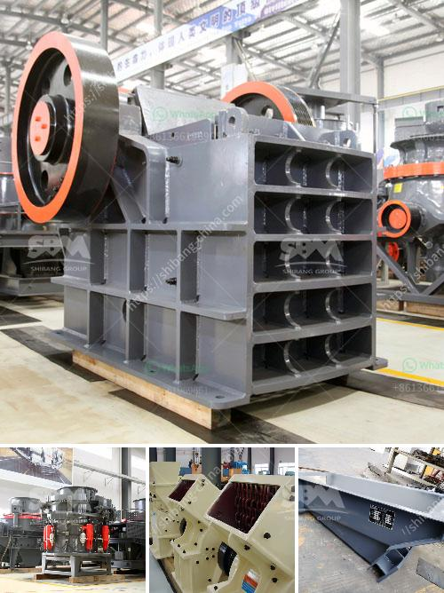

<h3>كسارة الفك في مصنع معالجة البوكسيت</h3>
تعد كسارة الفك من أهم الأجهزة في مصنع معالجة البوكسيت. تستخدم هذه الكسارة لسحق الصخور الكبيرة إلى قطع صغيرة، مما يسهل عمليات المعالجة اللاحقة. تتميز كسارة الفك بالقوة والكفاءة العالية، مما يجعلها الخيار المثالي لتلبية متطلبات الإنتاج في مصنع معالجة البوكسيت.

تتألف كسارة الفك من عدة أجزاء رئيسية، بما في ذلك الإطار والعجلة الدوارة والمطرقة الصغيرة وجهاز تعديل الفك. تتحرك العجلة الدوارة بسرعة عالية، مما يساعد على سحق الصخور بشكل فعال. كما يمكن ضبط فتحة الفك، ما يسمح بالتحكم في حجم المنتج النهائي.

تعتبر كسارة الفك متينة وقوية، مما يجعلها قادرة على مقاومة الصدمات والتآكل. كما تتميز بقدرتها على التعامل مع مواد مختلفة، بما في ذلك البوكسيت. تعد البوكسيت من المواد الخام الهامة في صناعة الألمنيوم، وتحتوي على مستويات عالية من الألومنيوم والسيليكا. وبفضل قوة كسارة الفك، يمكنها سحق البوكسيت بكفاءة، وتحويلها إلى قطع صغيرة مناسبة لمرحلة المعالجة التالية.

لا يمكن إنكار أن كسارة الفك تلعب دورًا حاسمًا في صناعة معالجة البوكسيت. يتم استخدام المنتجات المعالجة في صناعة الألمنيوم والسيراميك والزجاج وغيرها من الصناعات. بفضل الكفاءة العالية لكسارة الفك، يتم تحقيق إنتاجية مرتفعة وجودة ممتازة للمنتج النهائي.

بالاختصار، يجب أن تكون كسارة الفك موجودة في مصنع معالجة البوكسيت. يساهم استخدام هذه الكسارة في تحسين كفاءة الإنتاج وجودة المنتج النهائي. تعد كسارة الفك قوية، متينة، وتتميز بالقوة والكفاءة العالية. بالتالي، يمكن القول إن كسارة الفك تساهم في نجاح صناعة معالجة البوكسيت.
<h3>Contact us</h3><ul><li><strong>Whatsapp:&nbsp;<a href="https://wa.me/8613661969651">+8613661969651</a></strong></li><li><a href="https://swt.shibang-china.com/?git&amp;zhl&amp;كسارة الفك في مصنع معالجة البوكسيت"><strong>Online Service(chat now)</strong></a></li></ul><h3>Related</h3><ul><li><a href='آلة التكسير للبيع في نيجيريا.md'>آلة التكسير للبيع في نيجيريا</a></li><li><a href='آلة طحن الرخام.md'>آلة طحن الرخام</a></li><li><a href='كم تكلفة بناء مصنع الأسمنت بسعة 100 طن.md'>كم تكلفة بناء مصنع الأسمنت بسعة 100 طن</a></li><li><a href='تأجير معدات التعدين في إندونيسيا.md'>تأجير معدات التعدين في إندونيسيا</a></li><li><a href='حول شركة تكسير الفحم في إثيوبيا.md'>حول شركة تكسير الفحم في إثيوبيا</a></li></ul>