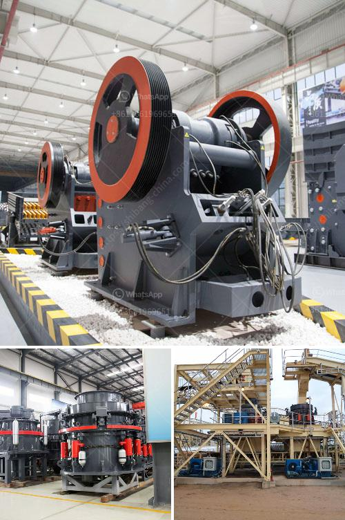

<h3>كسارة الفك في نيبال للبيع</h3>
تعتبر كسارة الفك واحدة من الآلات المستخدمة في صناعة التعدين والبناء لتكسير المواد الصلبة. وتعد نيبال واحدة من الدول التي تعتبر سوقًا واعدة للكسارات الفكية، حيث يتزايد الطلب على تلك الآلات في البنية التحتية ومشاريع البناء العامة.

توفر كسارات الفك التي يتم بيعها في نيبال أداءً عاليًا وموثوقية عالية. تصمم هذه الكسارات لتكسير المواد الصلبة مثل الصخور والحجارة والمعادن بطرق فعالة وسريعة. تتميز الكسارات الفكية بقدرتها على تحمل الأحمال الثقيلة والمقاومة للتآكل، مما يجعلها مثالية للاستخدام المستمر في البيئات القاسية.

بشكل عام، تشتمل الكسارات الفكية على هيكل قوي مصنوع من الفولاذ عالي الجودة، مما يجعلها متينة وقادرة على تحمل الضغوط العالية. تأتي هذه الكسارات بأحجام وموديلات مختلفة لتناسب احتياجات العملاء المختلفة. تحتوي بعض الكسارات الفكية على ميزات إضافية مثل نظام التبريد المائي ونظام الإزالة الذاتي للحديد، مما يزيد من كفاءة العمل ويقلل من التوقفات غير المخطط لها.

من المهم مراعاة بعض العوامل عند شراء كسارة فكية في نيبال، مثل قدرة التكسير، وقوة محرك الكسارة، وحجم المواد المراد تكسيرها. من الممكن أيضًا شراء كسارة فكية جديدة أو مستعملة، وذلك حسب احتياجات المشروع والميزانية المتاحة.

بالنسبة للأسعار، يتنوع السعر بين 200 إلى 400 دولار في نيبال حسب الموديل والحجم والشركة المصنعة للكسارة. من المستحسن أن يتعاون المشتري مع شركات موثوقة وذات سمعة جيدة لضمان الجودة وخدمة ما بعد البيع الممتازة.

بشكل عام، يعتبر شراء كسارة فكية في نيبال استثمارًا جيدًا لأي شخص يعمل في مجال التعدين أو البناء. تساهم تلك الآلات في زيادة الإنتاجية وتوفير الوقت والجهد في العملية التكسيرية. بالإضافة إلى ذلك، يمكن بيع المنتجات المكسرة بسعر أعلى، مما يجعلها استثمارًا مجديًا في المدى البعيد.

من الواضح أن كسارة الفك تعد واحدة من الآلات الرئيسية في صناعة التعدين والبناء في نيبال. يجب أن يكون اختيار الكسارة المناسبة مبنيًا على احتياجات المشروع والميزانية المتاحة، بالإضافة إلى التعاون مع شركة موثوقة وموثوقة.
<h3>Contact us</h3><ul><li><strong>Whatsapp:&nbsp;<a href="https://wa.me/8613661969651">+8613661969651</a></strong></li><li><a href="https://swt.shibang-china.com/?git&amp;zhl&amp;كسارة الفك في نيبال للبيع"><strong>Online Service(chat now)</strong></a></li></ul><h3>Related</h3><ul><li><a href='التكلفة الرأسمالية لمصنع تحسين خام الكروم.md'>التكلفة الرأسمالية لمصنع تحسين خام الكروم</a></li><li><a href='كسارة متنقلة بسعة 100 طن في الساعة.md'>كسارة متنقلة بسعة 100 طن في الساعة</a></li><li><a href='كسارة متنقلة في اليابان.md'>كسارة متنقلة في اليابان</a></li><li><a href='مصنع كسارة في كينيا.md'>مصنع كسارة في كينيا</a></li><li><a href='مسحوق الطين لصنع غانيشا.md'>مسحوق الطين لصنع غانيشا</a></li></ul>