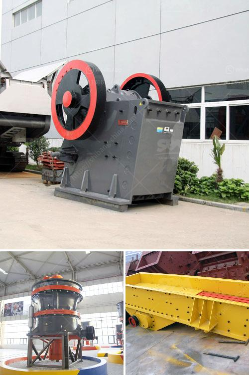

<h3>كسارة الفك لتعدين الفحم</h3>
تُعدّ كسارة الفك أحد الأدوات الهامة في عمليات تعدين الفحم، حيث تستخدم لسحق وطحن خام الفحم الخام إلى أحجام أصغر تسهل عملية استخراجه وتجهيزه.

تتكون كسارة الفك من مجموعة من الأجزاء المهمة التي تسهم في أداء وظائفها بكفاءة. تضم الأجزاء الرئيسية: الفك الثابت والفك المتحرك. يتم تثبيت الفك الثابت بشكل ثابت في الموقع ، بينما يمكن تحريك الفك المتحرك بحرية للأعلى والأسفل ويمكن تثبيته في الموقع المطلوب.

تعمل الكسارة الفك عن طريق وضع الفحم بين الفكين وتطبيق قوة ميكانيكية عليه لسحقه. وتسمح بفصل الجزء القابل للسحق من الفحم بفضل حركة الفك المتحرك. عند سحق الفحم ، يتم توليد ضغط عالٍ بين الفكين ، مما يؤدي إلى تكسير الجسيمات إلى أحجام صغيرة.

تحظى كسارة الفك بشعبية في صناعة تعدين الفحم بسبب العديد من المزايا التي توفرها. فمن الميزات الرئيسية لهذه الكسارة توفير أحجام منتظمة للفحم المسحوق ، مما يجعل عملية استخلاصه أفضل. كما أنها تقلل من تكوينات الغبار الناجمة عن عملية التكسير ، مما يعمل على تحسين ظروف العمل والسلامة. بالإضافة إلى ذلك ، فإن استخدام كسارة الفك يقلل من احتمالية حدوث تدهور الفحم أثناء الاستخلاص ، وهو أمر حاسم لتحسين الأداء العام لعملية التعدين.

وفي الختام ، يُمكن القول إن كسارة الفك لتعدين الفحم تعدّ أداة أساسية في صناعة التعدين. تساعد في سحق الفحم إلى أحجام منتظمة وتحسِّن عملية استخلاصه وتجهيزه. توفر الكسارة الفك العديد من المزايا مثل تقليل تكوين الغبار وتحسين السلامة، مما يجعلها الاختيار الأمثل للشركات التعدينية لتحقيق أقصى استفادة من عملياتها.
<h3>Contact us</h3><ul><li><strong>Whatsapp:&nbsp;<a href="https://wa.me/8613661969651">+8613661969651</a></strong></li><li><a href="https://swt.shibang-china.com/?git&amp;zhl&amp;كسارة الفك لتعدين الفحم"><strong>Online Service(chat now)</strong></a></li></ul><h3>Related</h3><ul><li><a href='كسارة الحجر الصخري في الفلبين.md'>كسارة الحجر الصخري في الفلبين</a></li><li><a href='آلة كسارة في الإمارات.md'>آلة كسارة في الإمارات</a></li><li><a href='كسارة الصخور للكوارتز.md'>كسارة الصخور للكوارتز</a></li><li><a href='عملية إنتاج لوحات الجبس.md'>عملية إنتاج لوحات الجبس</a></li><li><a href='آلة طحن مطحنة الرمل السيليكا.md'>آلة طحن مطحنة الرمل السيليكا</a></li></ul>