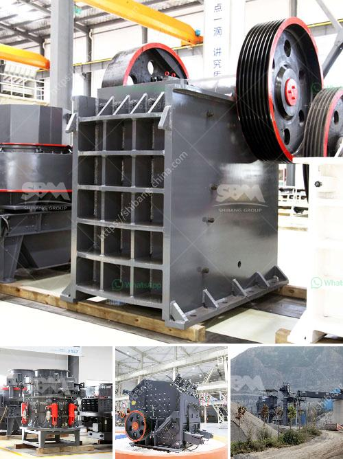

<h3>كسارة الفك للبيع في جنوب أفريقيا</h3>
تعتبر كسارة الفك من أهم المعدات اللازمة في صناعة التعدين ومعالجة المواد الصلبة. وبالنظر إلى التطور المتسارع في الاقتصاد العالمي ونمو الطلب على البنية التحتية والمواد الإنشائية، فإنه من الضروري توافر معدات تساهم في تلبية هذا الطلب المتزايد على المواد الأساسية. ومن هنا يأتي دور كسارة الفك التي باتت أحدث الحلول لتوفير المواد الأساسية وفقًا لاحتياجات السوق المتنامية.

تتميز كسارة الفك بقدرتها على سحق المواد الخام إلى حجم صغير بفضل القوة الضغطية المتولدة عند عملية السحق. وهي شائعة الاستخدام في صناعة التعدين، حيث تساهم في سحق الصخور والمعادن الصلبة وتحويلها إلى مواد صالحة للاستخدام في العديد من التطبيقات المختلفة.

إن كسارات الفك المستخدمة في جنوب أفريقيا تعتبر من أفضل الخيارات المتاحة حاليًا في سوق المعدات الثقيلة. تتوفر كسارات الفك في مختلف الأحجام والقدرات، مما يسهل على المستخدمين اختيار النموذج المناسب وفقًا لاحتياجاتهم ومواصفات المشروع.

تتميز كسارات الفك المتاحة في جنوب أفريقيا بجودتها العالية وأدائها المتميز. حيث تستخدم تقنيات متقدمة في تصميمها وتصنيعها، مما يضمن متانة وموثوقية عالية. كما تتوفر بأسعار تنافسية تتناسب مع ميزانية العملاء وتعتبر مستثمرًا جيدًا للمشاريع الكبيرة والصغيرة على حد سواء.

بالإضافة إلى ذلك، فإن كسارات الفك المتاحة في جنوب أفريقيا تتميز بسهولة الصيانة والتشغيل، مما يسهل على العاملين في الموقع الاستفادة منها وتحقيق أقصى كفاءة في عمليات السحق. كما يوجد العديد من الشركات المصنعة الرائدة التي توفر قطع الغيار والخدمات الفنية لدعم عمليات الصيانة والإصلاح عند الحاجة.

في الختام، يمكن القول إن كسارة الفك للبيع في جنوب أفريقيا تمثل حلاً مثاليًا لتلبية احتياجات مشاريع التعدين والبنية التحتية في المنطقة. فهي توفر أداءً ممتازًا واستدامة على المدى الطويل، إلى جانب سهولة الصيانة والتشغيل. وبالتالي، فإن اقتناء كسارة الفك من جنوب أفريقيا يعد استثمارًا مواتيًا يمكن أن يعزز كفاءة الإنتاج والأرباح في صناعة التعدين ومعالجة المواد الصلبة.
<h3>Contact us</h3><ul><li><strong>Whatsapp:&nbsp;<a href="https://wa.me/8613661969651">+8613661969651</a></strong></li><li><a href="https://swt.shibang-china.com/?git&amp;zhl&amp;كسارة الفك للبيع في جنوب أفريقيا"><strong>Online Service(chat now)</strong></a></li></ul><h3>Related</h3><ul><li><a href='كسارة الحجر المحجر.md'>كسارة الحجر المحجر</a></li><li><a href='سعر مصنع كربونات الكالسيوم.md'>سعر مصنع كربونات الكالسيوم</a></li><li><a href='قائمة أسعار كسارة الجرانيت.md'>قائمة أسعار كسارة الجرانيت</a></li><li><a href='عملية صنع الكوارتز.md'>عملية صنع الكوارتز</a></li><li><a href='تصميم مصانع التكسير الصناعية.md'>تصميم مصانع التكسير الصناعية</a></li></ul>