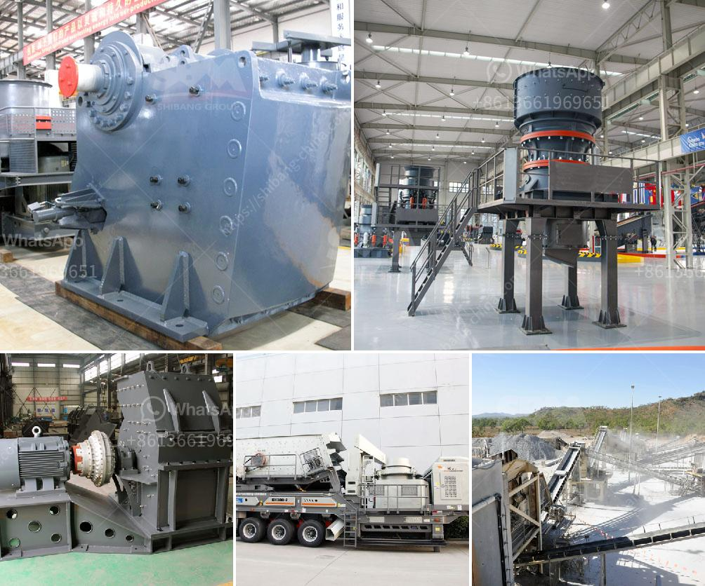

<h3>كسارة الفك من الصين</h3>
تعد كسارة الفك من الصين واحدة من الأدوات الرئيسية في صناعة التعدين وتكسير الأحجار. وهي تستخدم عادة لسحق المواد الخام إلى قطع صغيرة تسهل عملية المعالجة اللاحقة. جميع المواد التي تمر عبر الفك الكبيرة يتم سحقها وتجزئتها بشكل فعال، مما يجعلها أداة مهمة في مختلف صناعات التعدين.

تتميز كسارة الفك من الصين بالعديد من الخصائص التقنية المبتكرة والفريدة التي تساهم في تحسين جودة المنتج وزيادة كفاءة الإنتاج. واحدة من الخصائص المميزة لهذا الجهاز هي هندسة الحركة المتحكم بها المبتكرة، والتي تسمح بحجم تغذية كبيرة وتسهيل عملية التغذية. بالإضافة إلى ذلك، فإن كسارة الفك من الصين تعمل بتقنية الاهتزاز المزدوج، وهي تقنية تعمل على زيادة قوة الكسارة وفعالية العملية.

ومن أبرز الفوائد الخاصة بكسارة الفك من الصين هي قدرتها على معالجة المواد الخام الكبيرة بكفاءة عالية وسرعة. وهذا يعني أنها قادرة على سحق الحجارة والخامات ذات الصلابة العالية بنجاح، مما يوفر الوقت والجهد في عملية التكسير. بالإضافة إلى ذلك، يتمتع هذا الجهاز بتصميم مدمج، يوفر مساحة ويساهم في تسهيل عملية التركيب.

من الجدير بالذكر أن صناعة التعدين وتكسير الأحجار تعتبر مجالًا حساسًا جدًا بالنسبة للبيئة. ولذا، تم اعتماد كسارة الفك من الصين بتقنيات متقدمة للحد من التلوث البيئي والحفاظ على البيئة. فقد تم تصميم هذا الجهاز بحيث يتمتع بأداء منخفض الضجيج وصديق للبيئة، مما يقلل من التأثيرات السلبية على البيئة المحيطة به.

اختيار كسارة الفك من الصين يعد اختيارًا ذكيًا لأي شركة تعمل في صناعة التعدين وتكسير الأحجار. فهي تتميز بالتكنولوجيا الحديثة والأداء العالي والصيانة السهلة والبناء المتين. بالإضافة إلى ذلك، يتميز هذا الجهاز بالتحكم البصري والهيدروليكي، مما يجعله سهل الاستخدام وآمن. كما أنه يتوفر بأحجام وموديلات مختلفة لتلبية احتياجات العملاء المختلفة.

في النهاية، يجب الإشارة إلى أن كسارة الفك من الصين لديها مكانة عالية في صناعة التعدين وتكسير الأحجار، وذلك بفضل تصميمها المتطور والأداء الممتاز. تعد هذه الجهاز اختيارًا مثاليًا للشركات التي تسعى للحصول على كفاءة عالية في الإنتاج وجودة عالية في المنتج.

عليك أن تأخذ الوقت الكافي لاختيار الكسارة الملائمة وفقًا لاحتياجات الإنتاج الخاصة بك. وبالتأكيد، ستجد في كسارة الفك من الصين جهازًا يلبي توقعاتك ويحقق أهدافك بأفضل طريقة ممكنة.
<h3>Contact us</h3><ul><li><strong>Whatsapp:&nbsp;<a href="https://wa.me/8613661969651">+8613661969651</a></strong></li><li><a href="https://swt.shibang-china.com/?git&amp;zhl&amp;كسارة الفك من الصين"><strong>Online Service(chat now)</strong></a></li></ul><h3>Related</h3><ul><li><a href='من مصنع تصنيع البوكسيت في الصين.md'>من مصنع تصنيع البوكسيت في الصين</a></li><li><a href='عملية الحجر الجيري.md'>عملية الحجر الجيري</a></li><li><a href='آلة طحن الطين الصيني.md'>آلة طحن الطين الصيني</a></li><li><a href='سعر مصنع كسارة الفك.md'>سعر مصنع كسارة الفك</a></li><li><a href='كسارة الحجر المحمولة للبيع في الفلبين.md'>كسارة الحجر المحمولة للبيع في الفلبين</a></li></ul>